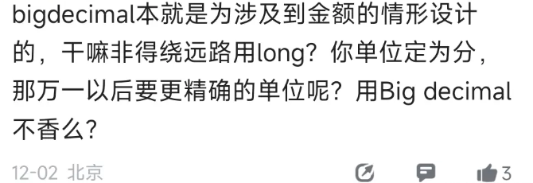
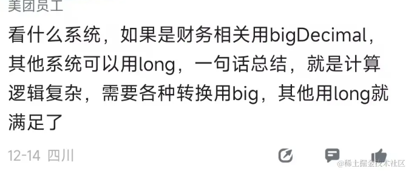
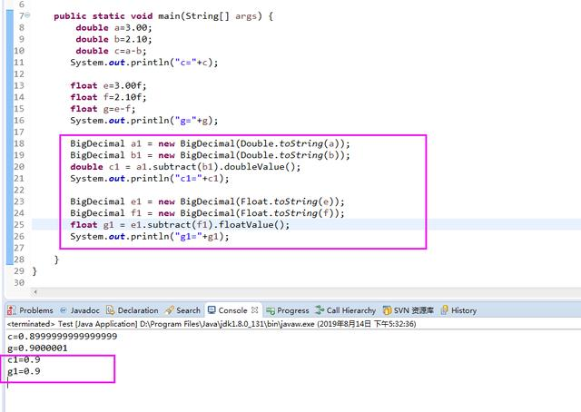
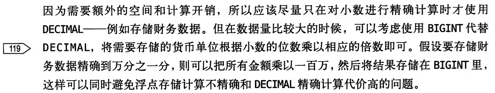

金额到底用Long还是Bigdecimal， 一直是一个有争议的话题：

我来说说我的观点， 大家也可以评论区说说你的观点：

 首先float和double肯定是排除的，因为它们内部使用科学计数法，转换二进制的时候有可能出现无限小数位的问题 

那么大家就会选择Long和BigDecimal， Long类型在存储时(比如保留2位小数点)x100,  取出来/100。

其实本质都是一样的，都是避免使用浮点数进行表达，只是Long属于隐式设定小数点，BigDecimal属于显示设定小数点。

那么这2种到底怎么选择呢？

我的建议是： 在代码层面用**BigDecimal ，**数据库层面可视情况定

 首先long性能更好：

+ 整数类型（如 **long**）通常在计算机硬件上的性能更好，因为它们的操作可以在硬件层面上更有效地执行。
+ **BigDecimal**  需要额外的空间和计算开销。

 

阿里的java开发手册是推荐用分存储的，希望大家都能用Long存储分，照顾一下彼此的开发体验。  
“8.【强制】任何货币金额，均以最小货币单位且为整型类型进行存储。”

但是对于一些金融系统要求小数点位数要求比较多， 比如精确后六位，  如果每次存x1000000   那long类型的内存开销也荡然无存了也会降低可读性即易用性，   不如用Decimal。

所以数据库在需求阶段能确定小数点位数可以用long， 如果位数不确定，或者要求太精准可以用DECIMAL

