# <font style="color:#FFFFFF;background-color:#E4495B;">一.索引</font>
##  
## <font style="color:rgb(255, 255, 255);background-color:rgb(239, 112, 96);">什么是索引</font>
:::tips
💡**什么是索引？**

 提到索引， 我们想到的是查询慢了 设置索引呗！但是索引为什么起作用？设置了索引为什么还是慢我们其实不是很清楚。

在关系数据库中，<font style="color:rgb(36, 41, 47);">索引是一种数据结构，他将数据提前按照一定的规则进行排序和组织， 能够</font>帮助<font style="color:rgb(36, 41, 47);">快速定位到数据记录的数据，加快数据库表中数据的查找和访问速度。</font>

<font style="color:rgb(36, 41, 47);">像书籍的目录、文件夹、标签 、房号....  都可以帮助我们快速定位，都可以视为索引。</font>

 

**能实现快速定位数据的一种存储结构，其设计思想是以空间换时间**。

:::


 


## <font style="color:rgb(255, 255, 255);background-color:rgb(239, 112, 96);"> 索引的种类</font>
在MySQL中索引是在存储引擎层实现的，而不是在服务器层实现的，所以不同存储引擎具有不同的索引类型和实现。常见的索引分类如下：

+ 按数据结构分类：**<font style="color:#DF2A3F;">B+tree索引</font>**、Hash索引、Full-text索引。
+ 按物理存储分类：聚集索引、非聚集索引。
+ 按字段特性分类：主键索引(PRIMARY KEY)、唯一索引(UNIQUE)、普通索引(INDEX)、全文索引(FULLTEXT)。
+ 按字段个数分类：单列索引、联合索引（也叫复合索引、组合索引）。

 


## <font style="color:rgb(255, 255, 255);background-color:rgb(239, 112, 96);">常见索引数据结构和区别</font>
    - <font style="color:rgb(57, 57, 57);">二叉树、红黑树、B树 、B+树 </font>
    - <font style="color:rgb(57, 57, 57);">区别：树的高度影响获取数据的性能（每一个树节点都是一次磁盘I/O)</font>


#### 二叉树：
<font style="color:rgb(18, 18, 18);">特点：每个节点最多有两个子节,大在右，小在左  ，数据随机性情况下树杈越明显。</font>

<font style="color:rgb(18, 18, 18);"></font>


如果数据是按顺序依次进入：

树的高度则会很高<font style="color:rgb(77, 77, 77);">（就是一个链表结构）</font>， <font style="color:rgb(77, 77, 77);">此时元素的查找效率就等于链表查询O(n)，</font>数据检索效率将极为低下。


<font style="color:rgb(77, 77, 77);"> 极端的情况下 就是一个链表结构（如下图），此时元素的查找效率就等于链表查询O(n)。</font>

#### 红黑树（平衡二叉树）
<font style="color:rgb(77, 77, 77);">虽通过自旋平衡，子节点会自动分叉为2个分支，从而减少树的高度，当数据有序插入时比二叉树数据检索性能更佳.     </font>

<font style="color:rgb(77, 77, 77);">但是如果 数据量过大，</font><font style="color:rgb(37, 41, 51);">节点个数就越多，树高度也会增高（也就是树的深度越深），增加磁盘I/O次数，影响查询效率。</font>


#### B-树 
<font style="color:rgb(77, 77, 77);"> </font>

B树的出现可以解决树高度的问题。之所以是B树，而并不是名称中"xxx二叉树"，就是它不再限制一个父节点中只能有两个子节点，而是允许 M 个子节点（M > 2）。不仅如此，B树的一个节点可以存储多个元素，相比较于前面的那些二叉树数据结构又将整体的树高度降低了。


<font style="color:rgb(37, 41, 51);">B 树的节点可以包含有多个字节点，所以 </font>**<font style="color:rgb(37, 41, 51);">B树是一棵多叉树</font>**<font style="color:rgb(37, 41, 51);">，它的每一个节点包含的最多子节点数量的称为B树的阶。如下图是一颗3阶的B树。</font>


当一颗3阶的B树查找 7这个的元素时的流程是怎么样的？

先从根节点出发 ，判断 7在4和8之间，根据P2存储指针6的节点，判断7大于6   最后指针找到叶子节点。也就找到有匹配7的键值。


可以发现一颗3阶的B树在查找叶子节点时，由于树高度只有 3，所以查找过程最多只需要3次的磁盘I/O操作。

数据量不大时可能不太真切。但当数据量大时，节点也会随着增多；此时如果还是前面的自平衡二叉树的场景下，由于二叉树只能最多2个叶子节点的约束，也只能纵向去的去扩展子节点，树的高度会很高，意味着需要更多的操作磁盘I/O次数。而B树则可以通过横向扩展节点从而降低树的高度，所以效率自然要比二叉树效率更高。（直白说就是变矮胖了）

看到这，相信你也知道如果B树这么适合，也就没有接下来B+树的什么事了。

接着，那为什么不用B树，而用了B+树呢？

你看啊，B树其实已经满足了我们最前面所要满足的条件，减少磁盘I/O操作，同时支持按区间查找。但注意，虽然B树支持按区间查找，但并不高效。例如上面的例子中，B树能高效的通过等值查询 15 这个值，但不方便查询出一个区间内3 ~ 10区间内所有数的结果。因为当B树做范围查询时需要使用中序遍历，那么父节点和子节点也就需要不断的来回切换涉及了多个节点会给磁盘I/O带来很多负担。

  

 

#### B+tree索引 
在MySQL中为什么会选用B+tree做索引结构呢？


B+tree 是在B树基础上的一种优化，其更适合做存储索引结构。在 B+tree 中，非叶子节点上仅存储键值，不存储数据；而所有数据记录均存储在叶子节点上，并且数据是按照顺序排列的。此外在 B+tree 中各个数据页之间是通过双向链表连接的。B+tree 的结构图如下：


### B树和B+树的区别，Mysql为什么要选择B+树作为默认索引的数据结构


B+tree 结构实现数据索引具有如下优点：


a. 非叶子节点上可以存储更多的键值，相应的树的阶数（节点的子节点树）就会更大，树也就会变得更矮更胖。这样一来我们查找数据进行磁盘I/O的次数就会大大减少，数据查询的效率也会更快。


b. 所有数据记录都有序存储在叶子节点上，就会使得范围查找，排序查找，分组查找以及去重查找变得异常简单。


c. 数据页之间、数据记录之间都是通过链表链接的，有了这个结构的支持就可以方便的在数据查询后进行升序或者降序操作。 

### <font style="color:rgb(0, 0, 0);">Hash索引</font>
<font style="color:rgb(0, 0, 0);">Hash索引其实用的不多，最主要是因为最常见的存储引擎InnoDB不支持显示地创建Hash索引，只支持自适应Hash索引。</font>

<font style="color:rgb(0, 0, 0);">虽然可以使用sql语句在InnoDB显示声明Hash索引，但是其实是不生效的</font>


<font style="color:rgb(0, 0, 0);">对name字段建立Hash索引，但是通过</font><font style="color:rgb(239, 112, 96);">show index from 表名</font><font style="color:rgb(0, 0, 0);">就会发现实际还是B+树</font>


<font style="color:rgb(0, 0, 0);">在存储引擎中，Memory引擎支持Hash索引</font>

<font style="color:rgb(0, 0, 0);">Hash索引其实有点像Java中的HashMap底层的数据结构，他也有很多的槽，存的也是键值对，键值为索引列，值为数据的这条数据的行指针，通过行指针就可以找到数据</font>

<font style="color:rgb(0, 0, 0);">假设现在</font><font style="color:rgb(239, 112, 96);">user</font><font style="color:rgb(0, 0, 0);">表用Memory存储引擎，对name字段建立Hash索引，表中插入三条数据</font>

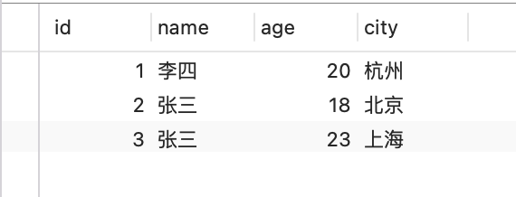

<font style="color:rgb(0, 0, 0);">Hash索引会对索引列name的值进行Hash计算，然后找到对应的槽下面，如下图所示</font>


<font style="color:rgb(0, 0, 0);">当遇到name字段的Hash值相同时，也就是Hash冲突，就会形成一个链表，比如有name=张三有两条数据，就会形成一个链表。</font>

<font style="color:rgb(0, 0, 0);">之后如果要查name=李四的数据，只需要对李四进行Hash计算，找到对应的槽，遍历链表，取出name=李四对应的行指针，然后根据行指针去查找对应的数据。</font>

**<font style="color:rgb(0, 0, 0);">Hash索引优缺点</font>**

+ <font style="color:rgb(1, 1, 1);">hash索引只能用于等值比较，所以查询效率非常高</font>
+ <font style="color:rgb(1, 1, 1);">不支持范围查询，也不支持排序，因为索引列的分布是无序的</font>

## <font style="color:rgb(255, 255, 255);background-color:rgb(239, 112, 96);">什么是聚簇索引与非聚集索引和区别？</font>


按物理存储分类：InnoDB的存储方式是聚集索引，MyISAM的存储方式是非聚集索引。


#### 聚簇索引


1. 聚簇索引将数据存储在索引树的叶子节点上。
2. 聚簇索引可以减少一次查询，因为查询索引树的同时就能获取到数据。
3. 聚簇索引的缺点是，对数据进行修改或删除操作时需要更新索引树，会增加系统的开销。
4. 聚簇索引通常用于数据库系统中，主要用于提高查询效率。


#### 非聚簇索引（又称二级索引 /  辅助索引）


1. 非聚簇索引不将数据存储在索引树的叶子节点上，而是存储在数据页中。
2. 非聚簇索引在查询数据时需要两次查询，一次查询索引树，获取数据页的地址，再通过数据页的地址查询数据（**通常情况下来说是的，但如果索引覆盖的话实际上是不用回表的**）。
3. 非聚簇索引的优点是，对数据进行修改或删除操作时不需要更新索引树，减少了系统的开销。
4. 非聚簇索引通常用于数据库系统中，主要用于提高数据更新和删除操作的效率。


## 
## <font style="color:rgb(255, 255, 255);background-color:rgb(239, 112, 96);">二级索引</font>


<font style="color:rgb(18, 18, 18);">在MySQL中，创建一张表时会默认为主键创建聚簇索引，B+树将表中所有的数据组织起来，即数据就是索引主键所以在InnoDB里，主键索引也被称为聚簇索引，索引的叶子节点存的是整行数据。而除了聚簇索引以外的所有索引都称为二级索引，二级索引的叶子节点内容是主键的值。</font>

```sql
例如创建如下一张表:

CREATE TABLE users(
  id INT NOT NULL,
  name VARCHAR(20) NOT NULL,
  age INT NOT NULL,
  PRIMARY KEY(id)
);
新建一个以age字段的二级索引:

ALTER TABLE users ADD INDEX index_age(age);
MySQL会分别创建主键id的聚簇索引和age的二级索引:
```

<font style="color:rgb(0, 0, 0);"></font>


<font style="color:rgb(18, 18, 18);">在MySQL中主键索引的叶子节点存的是整行数据，而二级索引叶子节点内容是主键的值.</font>

## <font style="color:rgb(255, 255, 255);background-color:rgb(239, 112, 96);">回表</font>
<font style="color:rgb(0, 0, 0);">讲完二级索引，接下来讲一讲如何使用二级索引查找数据。</font>

<font style="color:rgb(0, 0, 0);">这里假设对name字段创建了一个索引，并且表里就存了上面示例中的几条数据，这里我再把图拿过来</font>


<font style="color:rgb(0, 0, 0);">例如执行下面这条sql 则需要进行回表:</font>

```plain
SELECT * FROM users WHERE age=35;
```


<font style="color:rgb(0, 0, 0);">由于查询条件是</font><font style="color:rgb(239, 112, 96);">name = '赵六'</font><font style="color:rgb(0, 0, 0);">，所以会走name索引</font>

<font style="color:rgb(0, 0, 0);">整个过程大致分为以下几个步骤：</font>

+ <font style="color:rgb(1, 1, 1);"> </font>
+ 从根节点开始，21<35  定位右边存储指针，
+ <font style="color:rgb(1, 1, 1);">在索叶子节点找到</font><font style="color:rgb(239, 112, 96);">35</font><font style="color:rgb(1, 1, 1);">的第一条记录，也就是id=9的那条</font>
+ <font style="color:rgb(1, 1, 1);">由于是</font><font style="color:rgb(239, 112, 96);">select *</font><font style="color:rgb(1, 1, 1);">，还要查其它字段，此时就会根据id=9到聚簇索引（主键索引）中查找其它字段数据，这个查找过程前面说了很多次了，这个根据id=4到聚簇索引中查找数据的过程就被称为</font>**<font style="color:black;">回表</font>**


## <font style="color:rgb(255, 255, 255);background-color:rgb(239, 112, 96);">覆盖索引</font>
<font style="color:rgb(0, 0, 0);">上一节说当执行</font><font style="color:rgb(239, 112, 96);">select *  from `user` where age = 35;</font><font style="color:rgb(0, 0, 0);">这条sql的时候，会先从索引页中查出来</font><font style="color:rgb(239, 112, 96);">age = 35;</font><font style="color:rgb(0, 0, 0);">对应的主键id，之后再回表，到聚簇索引中查询其它字段的值。</font>

<font style="color:rgb(0, 0, 0);">那么当执行下面这条sql，又会怎样呢？</font>

```plain
select id from `user` where age = 35;
```

<font style="color:rgb(0, 0, 0);">这次查询字段从</font><font style="color:rgb(239, 112, 96);">select *</font><font style="color:rgb(0, 0, 0);">变成</font><font style="color:rgb(239, 112, 96);">select id</font><font style="color:rgb(0, 0, 0);">，查询条件不变，所以也会走age索引</font>


<font style="color:rgb(0, 0, 0);">所以还是跟前面一样了，先从索引页中查出来</font><font style="color:rgb(239, 112, 96);">age = 35;</font><font style="color:rgb(0, 0, 0);">对应的主键id之后，惊讶的发现，sql中需要查询字段的id值已经查到了，那次此时压根就不需要回表了，已经查到id了，还回什么表。</font>

<font style="color:rgb(0, 0, 0);">而这种需要查询的字段都在索引列中的情况就被称为</font>**<font style="color:rgb(0, 0, 0);">覆盖索引</font>**<font style="color:rgb(0, 0, 0);">，索引列覆盖了查询字段的意思。</font>

<font style="color:rgb(0, 0, 0);">当使用覆盖索引时会减少回表的次数，这样查询速度更快，性能更高。</font>

<font style="color:black;background-color:rgb(255, 249, 249);">所以，在日常开发中，尽量不要select * ，需要什么查什么，如果出现覆盖索引的情况，查询会快很多。</font>


## <font style="color:rgb(255, 255, 255);background-color:rgb(239, 112, 96);">单列索引</font>
ALTER TABLE `test`.`user`  ADD INDEX(`name`);

<font style="color:rgb(0, 0, 0);">假设，我们现在对name字段加了一个普通非唯一索引，那么name就是索引列，同时name这个索引也就是单列索引</font>

<font style="color:rgb(0, 0, 0);">此时如果往表中插入三条数据，那么name索引的叶子节点存的数据就如下图所示</font>


**<font style="color:rgb(0, 0, 0);">mysql会根据name字段的值进行排序，这里我假设张三排在李四前面，当索引列的值相同时，就会根据id排序，所以索引实际上已经根据索引列的值排好序了。</font>**

<font style="color:rgb(0, 0, 0);">这里肯定有小伙伴疑问，name字段存储的中文也可以排序么？</font>

<font style="color:rgb(0, 0, 0);">答案是可以的，并且mysql支持很多种排序规则，我们在建数据库或者是建表的时候等都可以指定排序规则，</font>**<font style="color:rgb(0, 0, 0);">并且后面文章涉及到的字符串排序都是我随便排的，实际情况可能不一样</font>**<font style="color:rgb(0, 0, 0);">。</font>


<font style="color:rgb(0, 0, 0);">对于单个索引列数据查找也是跟前面说的聚簇索引一样，也会对数据分组，之后可以根据二分查找在单个索引列来查找数据。</font>

<font style="color:rgb(0, 0, 0);">当数据不断增多，一个索引页存储不下数据的时候，也会用多个索引页来存储，并且索引页直接也会形成双向链表</font>


<font style="color:rgb(0, 0, 0);">当索引页不断增多是，为了方便在不同索引页中查找数据，也就会抽取一个索引页，除了存页中id，同时也会存储这个id对应的索引列的值</font>


<font style="color:rgb(0, 0, 0);">当数据越来越多越来越多，还会抽取，也会形成三层的一个B+树，这里我就不画了。</font>

## <font style="color:rgb(255, 255, 255);background-color:rgb(239, 112, 96);">联合索引</font>
```sql
ALTER TABLE `test`.`user` ADD INDEX(`name`, `age`, `id`);
```

<font style="color:rgb(0, 0, 0);">除了单列索引，联合索引其实也是一样的，只不过索引页存的数据就多了一些索引列</font>

<font style="color:rgb(0, 0, 0);">比如，在name和age上建立一个联合索引，此时单个索引页就如图所示</font>


<font style="color:rgb(85, 86, 102);"> </font>

**<font style="color:rgb(0, 0, 0);">先以name排序，name相同时再以age排序，如果再有其它列，依次类推，最后再以id排序。</font>**

<font style="color:rgb(0, 0, 0);">相比于只有name一个字段的索引来说，索引页就多存了一个索引列。</font>

<font style="color:rgb(0, 0, 0);">最后形成的B+树简化为如下图</font>

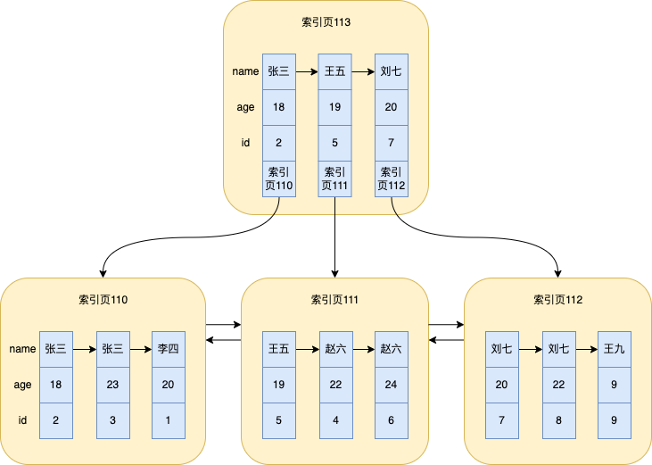

### <font style="color:rgb(79, 79, 79);">最左前缀原则</font>
<font style="color:rgb(79, 79, 79);">顾名思义是最左优先，以最左边的为起点任何连续的索引都能匹配上。</font>

<font style="color:rgb(85, 86, 102);">如果没有第一列的话，直接访问第二列，那第二列肯定是无序的，直接访问后面的列就用不到索引了</font>

<font style="color:rgb(79, 79, 79);">当创建(a,b,c)复合索引时，想要索引生效的话，只能使用 a和ab、ac和abc三种组合！</font>

<font style="color:rgb(79, 79, 79);"></font>

## <font style="color:rgb(255, 255, 255);background-color:rgb(239, 112, 96);">单列索引联合索引分别什么场景创建，优势是什么</font>
 

### 联合索引的优势
1. **减少开销**

建一个联合索引(a,b,c),实际相当于建了(a),(a,b),(a,b,c)三个索引.每多一个索引,都会增加写操作的开销和磁盘空间的开销.对于大量数据的表,使用联合索引会大大的减少开销!

 

2. **覆盖索引**

对联合索引(a,b,c),如果有如下sql的

select a,b,c from table where a='xxx' and b='xx';

那么mysql可以直接通过遍历索引取得数据,而无需回表,这减少了很多的随机io操作.减少io操作,特别是随机io其实DBA主要的优化策略.所以,在真正的实际应用中,覆盖索引是主要的提升性能的优化手段之一.

 

3. **效率高**

索引列多,通过联合索引筛选出的数据越少.比如有1000w条数据的表,有如下sql:

select col1,col2,col3 from table where col1=1 and col2=2 and col3=3;

假设:假设每个条件可以筛选出10%的数据

A:如果只有单列索引,那么通过该索引能筛选出1000w*10%=100w条数据,然后再回表从100w调数据中找到符合col2=2 and col3=3的数据,然后再排序,再分页,以此类推(递归);

B:如果是(col1,col2,col3)联合索引,通过三列索引筛选出1000w*10%*10%*10%=1w,效率提升可想

 

## <font style="color:rgb(255, 255, 255);background-color:rgb(239, 112, 96);">索引下推</font>
索引下推（INDEX CONDITION PUSHDOWN，简称 ICP）是在 MySQL 5.6 针对**扫描二级索引**的一项优化改进。 用来在范围查询时减少回表的次数 。ICP 适用于 MYISAM 和 INNODB。

```sql
ALTER TABLE `test`.`user`  ADD INDEX (`name`,`age`)
```

不使用索引下推实现  


```plsql
Explain SELECT * FROM user1 WHERE name LIKE 'A%' and age = 40;
```


使用索引下推实现  


```plsql
Explain SELECT * FROM user1 WHERE name LIKE 'A%' and age = 40;
```


<font style="color:rgb(0, 0, 0);">接下来要执行如下的sql</font>

```plain
select * from `user` where name > '王五' and age > 22;
```

<font style="color:rgb(0, 0, 0);">在MySQL5.6(不包括5.6)之前，整个sql大致执行步骤如下：</font>

+ <font style="color:rgb(1, 1, 1);">先根据二分查找，定位到</font><font style="color:rgb(239, 112, 96);">name > '王五'</font><font style="color:rgb(1, 1, 1);">的第一条数据，也就是id=4的那个赵六</font>
+ <font style="color:rgb(1, 1, 1);">之后就会根据id=4进行回表操作，到聚簇索引中查找id=4其它字段的数据，然后判断数据中的age是否大于22，是的话就说明是我们需要查找的数据，否则就不是</font>
+ <font style="color:rgb(1, 1, 1);">之后顺着链表，继续遍历，然后找到一条记录就回一次表，然后判断age，如此反复下去，直至结束</font>

<font style="color:rgb(0, 0, 0);">所以对于图上所示，整个搜索过程会经历5次回表操作，两个赵六，两个刘七，一个王九，最后符合条件的也就是id=6的赵六那条数据，其余age不符和。</font>

<font style="color:rgb(0, 0, 0);">虽然这么执行没什么问题，但是不知有没有发现其实没必要进行那么多次回表，因为光从上面的索引图示就可以看出，符合</font><font style="color:rgb(239, 112, 96);">name > '王五' and age > 22</font><font style="color:rgb(0, 0, 0);">的数据就id=6的赵六那条数据</font>

<font style="color:rgb(0, 0, 0);">所以在MySQL5.6之后，对上面的</font><font style="color:rgb(239, 112, 96);">age > 22</font><font style="color:rgb(0, 0, 0);">判断逻辑进行了优化</font>

<font style="color:rgb(0, 0, 0);">前面还是一样，定位查找到id=4的那个赵六，之后就</font>**<font style="color:rgb(0, 0, 0);">不回表</font>**<font style="color:rgb(0, 0, 0);">来判断age了，因为索引列有age的值了，那么直接根据索引中age判断是否大于22，如果大于的话，再回表查询剩余的字段数据（因为是</font><font style="color:rgb(239, 112, 96);">select *</font><font style="color:rgb(0, 0, 0);">），然后再顺序链表遍历，直至结束</font>

<font style="color:rgb(0, 0, 0);">所以这样优化之后，回表次数就成1了，相比于前面的5次，大大减少了回表的次数。</font>

<font style="color:rgb(0, 0, 0);">而这个优化，就被称为</font>**<font style="color:rgb(0, 0, 0);">索引下推</font>**<font style="color:rgb(0, 0, 0);">，就是为了减少回表的次数。</font>

<font style="color:black;background-color:rgb(255, 249, 249);">之所以这个优化叫索引下推，其实是跟判断</font><font style="color:rgb(239, 112, 96);background-color:rgb(255, 249, 249);">age > 22</font><font style="color:black;background-color:rgb(255, 249, 249);">逻辑执行的地方有关，这里就不过多赘述了。</font>

## <font style="color:rgb(255, 255, 255);background-color:rgb(239, 112, 96);">索引合并</font>
<font style="color:rgb(0, 0, 0);">索引合并（index merge）是从MySQL5.1开始引入的索引优化机制，在之前的MySQL版本中，一条sql多个查询条件只能使用一个索引，但是引入了索引合并机制之后，MySQL在</font>**<font style="color:rgb(0, 0, 0);">某些特殊</font>**<font style="color:rgb(0, 0, 0);">的情况下会扫描多个索引，然后将扫描结果进行合并</font>

<font style="color:rgb(0, 0, 0);">结果合并会为下面三种情况：</font>

+ <font style="color:rgb(1, 1, 1);">取交集（intersect）</font>
+ <font style="color:rgb(1, 1, 1);">取并集（union）</font>
+ <font style="color:rgb(1, 1, 1);">排序后取并集（sort-union）</font>

<font style="color:rgb(0, 0, 0);">为了不耽误演示，删除之前所有的索引，然后为name和age各自分别创建一个二级索引idx_name和idx_age</font>

#### <font style="color:rgb(0, 0, 0);">取交集（intersect）</font>
<font style="color:rgb(0, 0, 0);">当执行下面这条sql就会出现取交集的情况</font>

```plain
select * from `user` where name = '赵六' and age= 22;
```

<font style="color:rgb(0, 0, 0);">查看执行计划</font>


<font style="color:rgb(0, 0, 0);">type是</font><font style="color:rgb(239, 112, 96);">index_merge</font><font style="color:rgb(0, 0, 0);">，并且possible_key和key都是</font><font style="color:rgb(239, 112, 96);">idx_name</font><font style="color:rgb(0, 0, 0);">和</font><font style="color:rgb(239, 112, 96);">idx_age</font><font style="color:rgb(0, 0, 0);">，说明使用了索引合并，并且Extra有</font><font style="color:rgb(239, 112, 96);">Using intersect(idx_age,idx_name)</font><font style="color:rgb(0, 0, 0);">，intersect就是交集的意思。</font>

<font style="color:rgb(0, 0, 0);">整个过程大致是这样的，分别根据</font><font style="color:rgb(239, 112, 96);">idx_name</font><font style="color:rgb(0, 0, 0);">和</font><font style="color:rgb(239, 112, 96);">idx_age</font><font style="color:rgb(0, 0, 0);">取出对应的主键id，之后将主键id取交集，那么这部分交集的id一定同时满足查询</font><font style="color:rgb(239, 112, 96);">name = '赵六' and age= 22</font><font style="color:rgb(0, 0, 0);">的查询条件（仔细想想），之后再根据交集的id回表</font>

<font style="color:rgb(0, 0, 0);">不过要想使用取交集的联合索引，需要满足各自索引查出来的主键id是排好序的，这是为了方便可以快速的取交集</font>

<font style="color:rgb(0, 0, 0);">比如下面这条sql就无法使用联合索引</font>

```plain
select * from `user` where name = '赵六' and age > 22;
```


<font style="color:rgb(0, 0, 0);">只能用name这个索引，因为</font><font style="color:rgb(239, 112, 96);">age > 22</font><font style="color:rgb(0, 0, 0);">查出来的id是无序的，前面在讲索引的时候有说过索引列的排序规则</font>

<font style="color:rgb(0, 0, 0);">由此可以看出，使用联合索引条件还是比较苛刻的。</font>

#### <font style="color:rgb(0, 0, 0);">取并集（union）</font>
<font style="color:rgb(0, 0, 0);">取并集就是将前面例子中的</font><font style="color:rgb(239, 112, 96);">and</font><font style="color:rgb(0, 0, 0);">换成</font><font style="color:rgb(239, 112, 96);">or</font>

```plain
select * from `user` where name = '赵六' or age = 22;
```

<font style="color:rgb(0, 0, 0);">前面执行的情况都一样，根据条件到各自的索引上去查，之后对查询的id取并集去重，之后再回表</font>

<font style="color:rgb(0, 0, 0);">同样地，取并集也要求各自索引查出来的主键id是排好序的，如果查询条件换成</font><font style="color:rgb(239, 112, 96);">age > 22</font><font style="color:rgb(0, 0, 0);">时就无法使用取并集的索引合并</font>

```plain
select * from `user` where name = '赵六' or age > 22;
```

#### <font style="color:rgb(0, 0, 0);">排序后取并集（sort-union）</font>
<font style="color:rgb(0, 0, 0);">虽然取并集要求各自索引查出来的主键id是排好序的，但是如果遇到没排好序的情况，mysql会自动对这种情况进行优化，会先对主键id排序，然后再取并集，这种情况就叫 排序后取并集（sort-union）。</font>

<font style="color:rgb(0, 0, 0);">比如上面提到的无法直接取并集的sql就符合排序后取并集（sort-union）这种情况</font>

select * from `user` where name = '赵六' or age > 22;


## <font style="color:rgb(255, 255, 255);background-color:rgb(239, 112, 96);">为什么Mysql默认 InnoDB, 而不是 MyISAM ？</font>
**<font style="color:rgb(51, 51, 51);">MyISAM 与 InnoDB</font>**

<font style="color:rgb(51, 51, 51);">众所周知，MySQL 有两种常见的存储引擎。一种是 MyISAM，一种是 InnoDB。</font>

_**<font style="color:rgb(51, 51, 51);">一、它们是什么？</font>**_

<font style="color:rgb(51, 51, 51);">先来看看官网对 </font>MyISAM<font style="color:rgb(51, 51, 51);"> 的描述，只有一句话，看来官方也不想多加解释。</font>

<font style="color:rgb(102, 102, 102);background-color:rgb(248, 248, 248);">MyISAM is based on the older (and no longer available) ISAM storage engine but has many useful extensions.</font>

<font style="color:rgb(51, 51, 51);">大意：MyISAM 是一款青出于蓝而胜于蓝的存储引擎，它在 ISAM 基础上作了一些扩展和加工。关于 ISAM ，我只告诉你它是 Indexed Sequential Access Method 的缩写，翻译为“有索引的顺序访问方法”。</font>

<font style="color:rgb(51, 51, 51);">而对</font><font style="color:rgb(51, 51, 51);"> </font>[InnoDB](https://link.juejin.cn/?target=https%3A%2F%2Fdev.mysql.com%2Fdoc%2Frefman%2F8.0%2Fen%2Finnodb-introduction.html)<font style="color:rgb(51, 51, 51);"> </font><font style="color:rgb(51, 51, 51);">的描述，就更 professional 一些了。</font>

:::info
<font style="color:rgb(102, 102, 102);">InnoDB is a general-purpose storage engine that balances high reliability and high performance. In MySQL 8.0, InnoDB is the default MySQL storage engine. Unless you have configured a different default storage engine, issuing a CREATE TABLE statement without an ENGINE= clause creates an InnoDB table.</font>

:::

<font style="color:rgb(102, 102, 102);background-color:rgb(248, 248, 248);"></font>

<font style="color:rgb(51, 51, 51);">大意：InnoDB 是一种通用的存储引擎，在高可靠和高性能上作了均衡。MySQL 8.0 中，它是默认的存储引擎（其实在5.5之后的版本就是了），当你执行 CREATE TABLE 建表语句并且不带 “ENGINE = ”子句时，默认帮你创建的就是 InnoDB 表了。</font>

_**<font style="color:rgb(51, 51, 51);">二、两者有什么区别？</font>**_

<font style="color:rgb(51, 51, 51);">拿官网两者的 Features 来作一个分析对比吧：</font>


<font style="color:rgb(51, 51, 51);">1、InnoDB 是聚集索引，数据文件是和索引绑在一起的，必须要有主键，通过主键索引效率很高，但是辅助索引需要两次查询，先查询到主键，然后再通过主键查询到数据。因此，主键不应该过大，否则其他索引也会很大。而 MyISAM 是非聚集索引，数据文件是分离的，索引保存的是数据文件的指针，主键索引和辅助索引是独立的。</font>

<font style="color:rgb(51, 51, 51);">2、InnoDB 支持外键，而 MyISAM 不支持。对一个包含外键的 InnoDB 表转为 MYISAM 会失败。</font>

<font style="color:rgb(51, 51, 51);">3、InnoDB 在 MySQL 5.6 之前不支持全文索引，而 MyISAM 一直都支持，如果你用的是老版本，查询效率上 MyISAM 要高。</font>

<font style="color:rgb(51, 51, 51);">4、InnoDB 锁粒度是行锁，而 MyISAM 是表锁。</font>

<font style="color:rgb(51, 51, 51);">5、InnoDB 支持事务，MyISAM 不支持，对于 InnoDB 每一条 SQL 语言都默认封装成事务，自动提交，这样会影响速度，所以最好把多条 SQL 语言放在 begin 和 commit 之间，组成一个事务。</font>

<font style="color:rgb(51, 51, 51);">6、InnoDB 不保存表的具体行数，执行 select count(*) from table 时需要全表扫描。而 MyISAM 用一个变量保存了整个表的行数，执行上述语句时只需要读出该变量即可，速度很快，但如果上述语句还包含了 where 子句，那么两者执行效率是一样的。</font>

 

[<font style="color:rgb(51, 51, 51);">https://blogs.oracle.com/mysql/post/still-using-myisam-it-is-time-to-switch-to-innodb</font>](https://blogs.oracle.com/mysql/post/still-using-myisam-it-is-time-to-switch-to-innodb)

[<font style="color:rgb(51, 51, 51);">https://tecadmin.net/choosing-between-innodb-myisam-and-memory-storage-engines/</font>](https://tecadmin.net/choosing-between-innodb-myisam-and-memory-storage-engines/)

[<font style="color:rgb(51, 51, 51);">http://dimitrik.free.fr/blog/archives/2015/12/mysql-performance-revisiting-innodb-vs-myisam-with-mysql-57.html</font>](http://dimitrik.free.fr/blog/archives/2015/12/mysql-performance-revisiting-innodb-vs-myisam-with-mysql-57.html)

<font style="color:rgb(51, 51, 51);"></font>

## <font style="color:rgb(255, 255, 255);background-color:rgb(239, 112, 96);">如果一个表没有主键索引那还会创建B+树吗？</font>


**答案是会的！！！**


InnoDB是MySQL中的一种存储引擎，它会为每个表创建一个主键索引。如果表没有明确的主键索引，InnoDB会使用一个隐藏的、自动生成的主键来创建索引。这个隐藏的主键索引使用的就是B+树结构。因此，在InnoDB中，即使表没有明确的主键索引，也会创建一个B+树索引。


<font style="color:rgb(102, 102, 102);">  
</font>

## <font style="color:rgb(255, 255, 255);background-color:rgb(239, 112, 96);">索引的优缺点，什么时候该用和不该用</font>
<font style="color:rgb(102, 102, 102);">优点：</font>

<font style="color:rgb(102, 102, 102);">1. 提高检索效率</font>

<font style="color:rgb(102, 102, 102);">2. 降低排序成本，索引对应的字段是会有一个自动排序功能的，默认是升序asc。</font>

<font style="color:rgb(102, 102, 102);"></font>

<font style="color:rgb(102, 102, 102);"> 它缺点是</font>

1. <font style="color:rgb(51, 51, 51);">创建索引和维护索引要耗费时间，这种时间随着数据量的增加而增加。</font>
2. <font style="color:rgb(51, 51, 51);">索引需要占用物理空间，数据量越大，占用空间越大</font>
3. <font style="color:rgb(51, 51, 51);">会降低表的增删改的效率，因为每次增删改索引，都需要进行动态维护</font>

<font style="color:rgb(102, 102, 102);"></font>

<font style="color:rgb(102, 102, 102);"></font>

### <font style="color:rgb(102, 102, 102);">竟然索引有坏有好，什么时候需要索引，什么时候不需要？</font>
<font style="color:rgb(102, 102, 102);">适合：</font>

<font style="color:rgb(102, 102, 102);">1. 较频繁的作为查询条件的字段应该创建索引</font>

<font style="color:rgb(102, 102, 102);">不适合：</font>

<font style="color:rgb(102, 102, 102);">1. 字段值的唯一性太差不适合</font><font style="color:rgb(102, 102, 102);">单独</font><font style="color:rgb(102, 102, 102);">做索引</font>

<font style="color:rgb(102, 102, 102);">2. 更新非常频繁的字段不适合</font>

<font style="color:rgb(102, 102, 102);">3. 不会出现在where句中的字段不适合。</font>

# <font style="color:#FFFFFF;background-color:#ED740C;">二.优化</font>
## <font style="color:#FFFFFF;background-color:#ED740C;">1、优化方法</font>


 

关于SQL优化方法，包括5点

1）创建索引减少扫描量；

2）调整索引减少计算量；

3）索引覆盖（减少不必访问的列，避免回表查询）； 

4）干预执行计划；  

5）SQL改写； 


## 2、通过Explain干预执行计划
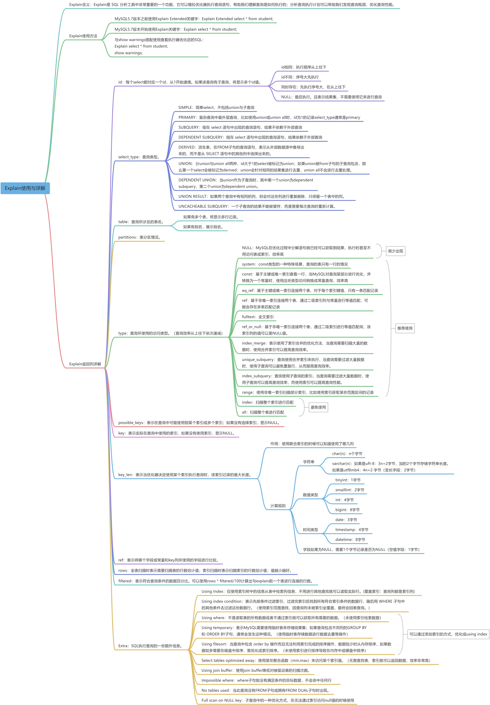

### 1.Explain含义
Explain是 SQL 分析工具中非常重要的一个功能，它可以模拟优化器执行查询语句，帮助我们理解查询是如何执行的；分析查询执行计划可以帮助我们发现查询瓶颈，优化查询性能。

### 2.Explain作用
+ <font style="color:rgb(18, 18, 18);">表的读取顺序</font>
+ <font style="color:rgb(18, 18, 18);">SQL执行时查询操作类型</font>
+ <font style="color:rgb(18, 18, 18);">可以使用哪些索引</font>
+ <font style="color:rgb(18, 18, 18);">实际使用哪些索引</font>
+ <font style="color:rgb(18, 18, 18);">每张表有多少行记录被扫描</font>
+ **<font style="color:rgb(18, 18, 18);">SQL语句性能分析</font>**

### 3.Explain用法
```sql
drop table orders;
drop table products;
drop table users;
CREATE TABLE users (  
  id INT PRIMARY KEY AUTO_INCREMENT,  
  name VARCHAR(50) NOT NULL,  
  email VARCHAR(100) NOT NULL,  
  password VARCHAR(100) NOT NULL  
) ENGINE=InnoDB DEFAULT CHARSET=utf8;

CREATE TABLE products (  
  id INT PRIMARY KEY AUTO_INCREMENT,  
  name VARCHAR(50) NOT NULL,  
  price FLOAT NOT NULL  
) ENGINE=InnoDB DEFAULT CHARSET=utf8;

CREATE TABLE orders (  
  id INT PRIMARY KEY AUTO_INCREMENT,  
  user_id INT NOT NULL,  
  order_date DATETIME NOT NULL,  
  total_price FLOAT NOT NULL,  
  product_id INT NOT NULL,  
  FOREIGN KEY (user_id) REFERENCES users(id),  
  FOREIGN KEY (product_id) REFERENCES products(id)  
) ENGINE=InnoDB DEFAULT CHARSET=utf8;

alter table users add index index_name_email (name,email);

INSERT INTO users (name, email, password)     
VALUES ('张三', 'zhangsan@example.com', 'password123'),     
('李四', 'lisi@example.com', 'password123'),     
('王五', 'wangwu@example.com', 'password123'),     
('赵六', 'zhaoli@example.com', 'password123'),     
('钱七', 'qianqi@example.com', 'password123');   

INSERT INTO products (name, price)     
VALUES ('产品 1', 10.00),     
('产品 2', 15.00),     
('产品 3', 20.00),     
('产品 4', 12.00),     
('产品 5', 18.00); 

INSERT INTO orders (user_id, order_date, total_price, product_id)     
VALUES (1, '2023-02-18 10:00:00', 100.00, 1),     
(2, '2023-02-18 11:00:00', 50.00, 2),     
(3, '2023-02-18 12:00:00', 20.00, 3),     
(4, '2023-02-18 13:00:00', 15.00, 4),     
(5, '2023-02-18 14:00:00', 25.00, 5); 
```

MySQL5.7版本之前，使用Explain Extended在Explain的基础上额外多返回filtered列与extra列；

```sql
Explain Extended select * from users;
```


MySQL5.7版本之前，使用Explain Partitions在Explain的基础上额外多返回partitions列；

```sql
Explain Partitions select * from users;
```


MySQL5.7版本引入了这两个特性，直接使用Explain关键字可以将partitions列、filtered列、extra列直接查询出来。

```sql
Explain select * from users;
```


Explain语句返回列的各列含义：

| **列名** | **含义** |
| --- | --- |
| id | 每个select都有一个对应的id号，并且是从1开始自增的 |
| select_type | 查询语句执行的查询操作类型 |
| table | 表名 |
| partitions | 表分区情况 |
| type | 查询所用的访问类型 |
| possible_keys | 可能用到的索引 |
| key | 实际查询用到的索引 |
| key_len | 所使用到的索引长度 |
| ref | 使用到索引时，与索引进行等值匹配的列或者常量 |
| rows | 预计扫描的行数（索引行数或者表记录行数） |
| filtered | 表示符合查询条件的数据百分比 |
| Extra | SQL执行的额外信息 |


这些查询列大家先留一个印象，后续会详细讲解。

### 4.Explain返回列详解
接下来我们将展示Explain中每个列的信息

#### 1. id列：每个select都有一个对应的id号，并且是从1开始自增的。
+ 如果id序号相同，从上往下执行。
+ 如果id序号不同，序号大先执行。
+ 如果两种都存在，先执行序号大，在同级从上往下执行。
+ 如果显示NULL，最后执行。表示结果集，并且不需要使用它来进行查询。

```sql
explain 
SELECT users.name, orders.total_price, products.price    
FROM users    
INNER JOIN orders ON users.id = orders.user_id    
INNER JOIN products ON orders.product_id = products.id;
```


```sql
explain
select * from orders where product_id =  (select id from products where products.price = 10);
```


```sql
set session optimizer_switch='derived_merge=off'; #关闭MySQL5.7对衍生表合并优化

explain 
select orders.* 
from (select id from products) as temp inner join orders on temp.id = orders.product_id;

set session optimizer_switch='derived_merge=on'; #还原配置
```


```sql
explain
select id from users
union
select id from products;
```

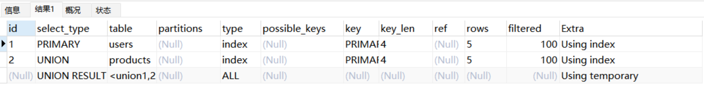


优化器会针对子查询进行一定的优化重写SQL：

```plain
EXPLAIN select * from users WHERE id in (select user_id from orders where id = 1);
show WARNINGS;
```

#### 2.select_type列：表示查询语句执行的查询操作类型
##### 2.1.simple：简单select，不包括union与子查询
```sql
Explain select * from users;
```


```sql
Explain select * from users inner join orders on users.id = orders.user_id;
```

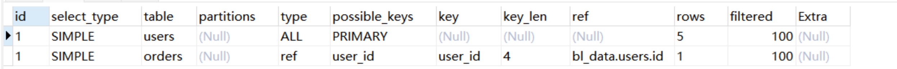

##### 2.2.primary：复杂查询中最外层查询，比如使用union或union all时，id为1的记录select_type通常是primary
```sql
explain
select id from users
union
select id from products;
```


##### 2.3.subquery：指在 select 语句中出现的子查询语句,结果不依赖于外部查询（不在from语句中）
```sql
explain
select orders.*,(select name from products where id = 1) from orders;
```

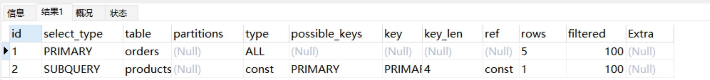


##### 2.4.dependent subquery：指在 select 语句中出现的查询语句，结果依赖于外部查询
```sql
explain
select orders.*,(select name from products where products.id = orders.user_id) from orders;
```


##### 2.5.derived：派生表，在FROM子句的查询语句，表示从外部数据源中推导出来的，而不是从 SELECT 语句中的其他列中选择出来的。
```sql
set session optimizer_switch='derived_merge=off'; #关闭MySQL5.7对衍生表合并优化

explain
select * from (select user_id from orders where id = 1) as temp;

set session optimizer_switch='derived_merge=on'; #还原配置
```


##### 2.6.union：分union与union all两种，若第二个select出现在union之后，则被标记为union；如果union被from子句的子查询包含，那么第一个select会被标记为derived；union会针对相同的结果集进行去重，union all不会进行去重处理。
```sql
explain 
select * from (
select id from products where price = 10
union
select id from orders where user_id in (1,2)
union 
select id from users where name = '张三' ) as temp;
```


```sql
explain 
select * from (
select id from products where price = 10
union all
select id from orders where user_id in (1,2)
union all
select id from users where name = '张三' ) as temp;
```

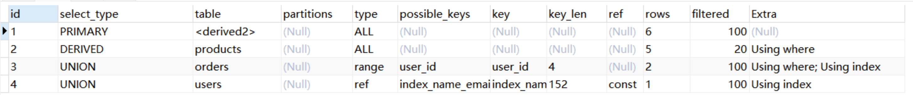


##### 2.7.dependent union：当union作为子查询时，其中第一个union为dependent subquery，第二个union为dependent union。
```sql
explain 
select * from orders where id in (
select id from products where price = 10
union
select id from orders where user_id = 2
union 
select id from users where name = '张三' );
```


##### 2.8.union result：如果两个查询中有相同的列，则会对这些列进行重复删除，只保留一个表中的列。
```sql
explain
select id from users
union
select id from products;
```

  


#### 3.table列：查询所涉及的表名。如果有多个表，将显示多行记录
#### 4.partitions列：表分区情况
查询语句所涉及的表的分区情况。具体来说，它会显示出查询语句在哪些分区上执行，以及是否使用了分区裁剪等信息。如果没有分区，该项为NULL。

#### 5.type列：查询所使用的访问类型
效率从高到低分别为：**system > const > eq_ref > ref** > fulltext > ref_or_null **> range > index > ALL，**一般来说保证range级别，最好能达到ref级别。

##### 5.1.system：const类型的一种特殊场景，查询的表只有一行记录的情况，并且该表使用的存储引擎的统计数据是精确的
InnoDb存储引擎的统计数据不是精确的，虽然只有一条数据但是type类型为ALL；

```sql
DROP TABLE t;
CREATE TABLE t(i INT) ENGINE=InnoDb;
INSERT INTO t VALUES(1);
explain select * from t;
```


Memory存储引擎的统计数据是精确的，所以当只有一条记录的时候type类型为system。

```sql
DROP TABLE tt;
CREATE TABLE tt(i INT) ENGINE=memory;
INSERT INTO tt VALUES(1);
explain select * from tt;
```


##### 5.2.const：基于主键或唯一索引查看一行，当MySQL对查询某部分进行优化，并转换为一个常量时，使用这些类型访问转换成常量查询，效率高
```sql
explain
select * from orders where id = 1;
```


##### 5.3.eq_ref：基于主键或唯一索引连接两个表，对于每个索引键值，只有一条匹配记录，被驱动表的类型为'eq_ref'
```sql
explain
select users.* from users inner join orders on users.id = orders.id;
```


##### 5.4.ref：基于非唯一索引连接两个表或通过二级索引列与常量进行等值匹配，可能会存在多条匹配记录
1.关联查询，使用非唯一索引进行匹配。

```sql
explain
select users.* from users inner join orders on users.id = orders.user_id;
```

  
2.简单查询，使用二级索引列匹配。

```sql
explain
select * from orders where user_id = 1;
```


##### 5.5.range：使用非唯一索引扫描部分索引，比如使用索引获取某些范围区间的记录
```sql
explain
select * from orders where user_id > 3;
```

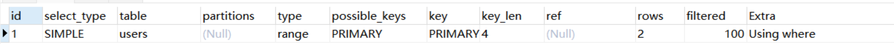

##### 5.6.index：扫描整个索引就能拿到结果，一般是二级索引，这种查询一般为使用覆盖索引（需优化，缩小数据范围）
```sql
explain
select user_id from orders;
```


##### 5.7.all：扫描整个表进行匹配，即扫描聚簇索引树（需优化，添加索引优化）
```sql
explain
select * from users;
```


##### 5.8.NULL：MySQL在优化过程中分解语句就已经可以获取到结果，执行时甚至不用访问表或索引。
```sql
explain 
select min(id) from users;
```


#### 6.possible_keys列：表示在查询中可能使用到某个索引或多个索引；如果没有选择索引，显示NULL
#### 7.key列：表示在查询中实际使用的索引，如果没有使用索引，显示NULL。
#### 8.key_len列：表示当优化器决定使用某个索引执行查询时，该索引记录的最大长度（主要使用在联合索引）
联合索引可以通过这个值算出具体使用了索引中的哪些列。

使用单例索引：

```sql
explain  
select * from users where id = 1;
```


使用联合索引：

```sql
explain 
select * from users where name = '张三' and email = 'zhangsan@example.com';
```

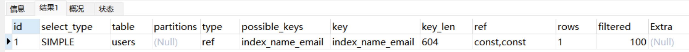  
计算规则：

+ 字符串：

char(n)：n个字节 

varchar(n)：如果是uft-8：3n+2字节，加的2个字节存储字符串长度。如果是utf8mb4：4n+2字节。

+ 数值类型：

tinyint：1字节

smaillint：2字节

int：4字节

bigint：8字节

+ 时间类型：

date：3字节

timestamp：4字节

datetime：8字节  
字段如果为NULL，需要1个字节记录是否为NULL

#### 
#### 9.ref列：表示将哪个字段或常量和key列所使用的字段进行比较。
当使用索引列等值查询时，与索引列进行等值匹配的对象信息。

1.常量：

```sql
explain 
select * from users where name = '张三' and email = 'zhangsan@example.com';
```

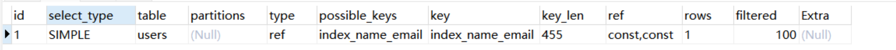


2.字段：

```sql
explain
select users.* from users inner join orders on users.id = orders.id;
```


3.函数

```sql
explain
select users.* from users inner join orders on users.id = trim(orders.id);
```


#### 10.rows列：全表扫描时表示需要扫描表的行数估计值；索引扫描时表示扫描索引的行数估计值；值越小越好（不是结果集中的行数）
1.全表扫描

```sql
explain
select * from orders where user_id >= 3 and total_price = 25;
```

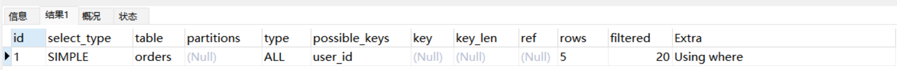


2.索引扫描

```sql
explain
select * from orders where user_id > 3;
```


#### 11.filtered列：表示符合查询条件的数据百分比。可以使用rows * filtered/100计算出与**<font style="color:rgb(17, 17, 17);">explain</font>**前一个表进行连接的行数。
前一个表指 explain 中的id值比当前表id值小的表，id相同的时候指后执行的表。

```sql
explain
select users.* from users inner join orders on users.id = orders.id;
```


#### 12.Extra列：SQL执行查询的一些额外信息
##### 12.1.Using Index：使用非主键索引树就可以查询所需要的数据。一般是覆盖索引，即查询列都包含在辅助索引树叶子节点中，不需要回表查询。
```sql
explain
select user_id,id from orders where user_id = 1;
```


##### 12.2.Using where：不通过索引查询所需要的数据
```sql
explain
select * from orders where total_price = 100;

explain
select * from orders where user_id = 1 and total_price = 100;
```


##### 12.3.Using index condition：表示查询列不被索引覆盖，where 条件中是一个索引范围查找，过滤完索引后回表找到所有符合条件的数据行。
```sql
explain
select * from orders where user_id > 3;
```

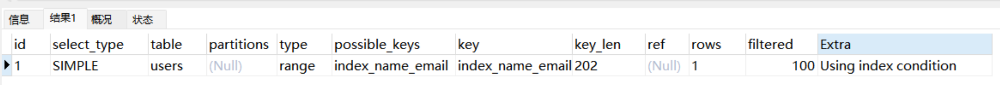

##### 12.4.Using temporary：表示需要使用临时表来处理查询；
1.total_price列无索引，需要创建一张临时表进行去重

```sql
explain
select distinct total_price from orders;
```

  
2.name列有联合索引

```sql
explain
select distinct name from users;
```


##### 12.5.Using filesort：当查询中包含 order by 操作而且无法利用索引完成的排序操作，数据较少时从内存排序，如果数据较多需要在磁盘中排序。	需优化成索引排序。
1.total_price列无索引，无法通过索引进行排序。需要先保存total_price与对应的主键id，然后在排序total_price查找数据。

```sql
explain
select total_price from orders order by total_price;
```

  
2.name列有索引，因索引已经是排好序的所以直接读取就可以了。

```sql
explain
select name from users order by name;
```


##### 12.6.Select tables optimized away：使用某些聚合函数（min,max）来访问某个索引值。
```sql
explain 
select min(id) from users;

explain 
select min(password) from users;
```


###   

### <font style="background-color:#FFFFFF;">5.索引优化最佳实践</font>  

示例表： 

```abap
CREATE TABLE `employees` (
  `id` int(11) NOT NULL AUTO_INCREMENT,
  `name` varchar(24) NOT NULL DEFAULT '' COMMENT '姓名',
  `age` int(11) NOT NULL DEFAULT '0' COMMENT '年龄',
  `position` varchar(20) NOT NULL DEFAULT '' COMMENT '职位',
  `hire_time` timestamp NOT NULL DEFAULT CURRENT_TIMESTAMP COMMENT '入职时间',
  `remark` varchar(255) DEFAULT NULL COMMENT '备注',
  PRIMARY KEY (`id`),
  KEY `idx_name_age_position` (`name`,`age`,`position`) USING BTREE
) ENGINE=InnoDB AUTO_INCREMENT=10 DEFAULT CHARSET=utf8 COMMENT='员工记录表';

INSERT INTO `test`.`employees`(`id`, `name`, `age`, `position`, `hire_time`, `remark`) VALUES (2, '张三', 18, 'beijing', '2023-06-11 20:51:35', '测试');
INSERT INTO `test`.`employees`(`id`, `name`, `age`, `position`, `hire_time`, `remark`) VALUES (3, '张三', 23, 'shanghai', '2023-06-11 20:51:35', '测试2');
INSERT INTO `test`.`employees`(`id`, `name`, `age`, `position`, `hire_time`, `remark`) VALUES (1, '李四', 20, 'shanghai', '2023-06-11 20:51:35', '测试3');
INSERT INTO `test`.`employees`(`id`, `name`, `age`, `position`, `hire_time`, `remark`) VALUES (5, '王五', 19, 'beijing', '2023-06-12 14:32:15', NULL);
INSERT INTO `test`.`employees`(`id`, `name`, `age`, `position`, `hire_time`, `remark`) VALUES (4, '赵六', 22, 'shenzheng', '2023-06-12 14:33:00', NULL);
INSERT INTO `test`.`employees`(`id`, `name`, `age`, `position`, `hire_time`, `remark`) VALUES (6, '赵六', 24, 'beijing', '2023-06-12 14:37:50', NULL);
INSERT INTO `test`.`employees`(`id`, `name`, `age`, `position`, `hire_time`, `remark`) VALUES (7, '刘七', 20, 'shanghai', '2023-06-12 14:38:27', NULL);
INSERT INTO `test`.`employees`(`id`, `name`, `age`, `position`, `hire_time`, `remark`) VALUES (8, '刘七', 22, 'beijing', '2023-06-12 14:38:41', NULL);
INSERT INTO `test`.`employees`(`id`, `name`, `age`, `position`, `hire_time`, `remark`) VALUES (9, '王九', 9, 'shanghai ', '2023-06-12 14:40:17', NULL);

```

  


#### 1.全值匹配
MySQL全值匹配是指在使用复合索引时，查询条件要包含索引的所有列，才能最大程度地利用索引。

 


```sql
EXPLAIN SELECT * FROM employees WHERE name= '张三'; 
```

<font style="color:rgb(51, 51, 51);">查看索引长度是74=(3*24+2),可以算出联合索引中只使用了name前缀索引.</font> 

  


```sql
EXPLAIN SELECT * FROM employees WHERE name= '张三' AND age = 18; 
```

<font style="color:rgb(51, 51, 51);">查看索引长度是78=(3*24+2)+4,可以算出联合索引中只使用了name和age前缀索引.</font>

  


```sql
EXPLAIN SELECT * FROM employees WHERE name= '张三' AND age = 18 AND position ='beijing'; 
```

<font style="color:rgb(51, 51, 51);">查看索引长度是140=(3*24+2)+4+(3*20+2),可以算出联合索引中只使用了完整的联合索引</font>

  


#### 2.最左前缀法则
 如果索引了多列，要遵守最左前缀法则。指的是查询从索引的最左前列开始并且不跳过索引中的列。

**<font style="color:rgb(35, 38, 59);">——带头大哥不能死，中间兄弟不能断；</font>**

```sql
-- name 74   +age 78 + position 140
EXPLAIN SELECT * FROM employees WHERE name= '张三' and age = 18 AND position = 'beijing' ; 
-- 带头大哥不能死
EXPLAIN SELECT * FROM employees WHERE age = 18 AND position = 'beijing';
-- 中间兄弟不能断
EXPLAIN SELECT * FROM employees WHERE name= '张三' AND position = 'beijing'; 
```

  


#### 3.不在索引列上做任何操作（计算、函数、（自动or手动）类型转换），会导致索引失效而转向全表扫描
####  
```sql
EXPLAIN SELECT * FROM employees WHERE name = '张三';
EXPLAIN SELECT * FROM employees WHERE left(name,3) = '张三';
```


给hire_time增加一个普通索引：

```sql
ALTER TABLE `employees` ADD INDEX `idx_hire_time` (`hire_time`) USING BTREE ; 
```

```sql
EXPLAIN select * from employees where date(hire_time) ='2018-09-30'; 
```


转化为日期范围查询，有可能会走索引：

```sql
EXPLAIN select * from employees where hire_time >='2018-09-30 00:00:00' and hire_time <='2018-09-30 23:59:59'; 
```


还原最初索引状态

```sql
ALTER TABLE `employees` DROP INDEX `idx_hire_time`; 
```


  


#### 4.存储引擎不能使用索引中范围条件右边的列
<font style="color:rgb(77, 77, 77);">范围查询会使</font>**<font style="color:rgb(77, 77, 77);">后面字段无序，</font>**<font style="color:rgb(77, 77, 77);">造成部分索引失效。</font>

**——****<font style="color:rgb(35, 38, 59);">范围之后全失效；</font>**

```sql
EXPLAIN SELECT * FROM employees WHERE name= '张三' AND age = 18 AND position ='beijing';
EXPLAIN SELECT * FROM employees WHERE name= '张三' AND age > 18 AND position ='beijing';
```

  


#### 5.尽量使用覆盖索引（只访问索引的查询（索引列包含查询列）），减少 select * 语句
**——****<font style="color:rgb(35, 38, 59);">覆盖索引不写星；</font>**

```sql
EXPLAIN SELECT name,age FROM employees WHERE name= '张三' AND age = 18 AND position ='beijing'; 
```


```sql
EXPLAIN SELECT * FROM employees WHERE name= 'LiLei' AND age = 23 AND position ='manager'; 
```

  


#### 6.<font style="color:rgb(35, 38, 59);">不等空值还有or，索引失效要少用；</font>
**mysql在使用不等于（！=或者<>），not in ，not exists 的时候无法使用索引会导致全表扫描**

**< 小于、 > 大于、 <=、>= 这些，****mysql内部优化器会根据检索比例、表大小等多个因素整体评估是否使用索引**

 

```sql
EXPLAIN SELECT * FROM employees WHERE name != '张三'; 
```

  


**is null,is not null 一般情况下也无法使用索引**

```sql
EXPLAIN SELECT * FROM employees WHERE name is null 
```

  
**少用or或in，用它查询时，mysql不一定使用索引，mysql内部优化器会根据检索比例、表大小等多个因素整体评估是否使用索引，详见范围查询优化**

```sql
EXPLAIN SELECT * FROM employees WHERE name = 'LiLei' or name = 'HanMeimei'; 
```

  


#### 7.<font style="color:rgb(35, 38, 59);">Like百分写最右</font>
**——****<font style="color:rgb(35, 38, 59);">Like百分写最右</font>**

```sql
EXPLAIN SELECT * FROM employees WHERE name like '%三' 
```


```sql
EXPLAIN SELECT * FROM employees WHERE name like '张%' 
```

  


问题：解决like'%字符串%'索引不被使用的方法？

a）使用覆盖索引，查询字段必须是建立覆盖索引字段

```sql
EXPLAIN SELECT name,age,position FROM employees WHERE name like '%Lei%'; 
```


b）如果不能使用覆盖索引则可能需要借助搜索引擎

  


#### 8.字符串不加单引号索引失效
**——****<font style="color:rgb(35, 38, 59);">VAR引号不可丢</font>**

```sql
EXPLAIN SELECT * FROM employees WHERE name = '1000'; 
EXPLAIN SELECT * FROM employees WHERE name = 1000; 
```

  


#### 9.范围查询优化
给年龄添加单值索引

```sql
ALTER TABLE `employees` ADD INDEX `idx_age` (`age`) USING BTREE ; 
```

```sql
explain select * from employees where age >=1 and age <=2000; 
```


没走索引原因：mysql内部优化器会根据检索比例、表大小等多个因素整体评估是否使用索引。比如这个例子，可能是由于单次数据量查询过大导致优化器最终选择不走索引

优化方法：可以将大的范围拆分成多个小范围

 

```sql
explain select * from employees where age >=1 and age <=1000;
explain select * from employees where age >=1001 and age <=2000;
```


还原最初索引状态

```sql
ALTER TABLE `employees` DROP INDEX `idx_age`; 
```

  


#### 索引使用总结：
**<font style="color:rgb(35, 38, 59);">全值匹配我最爱，最左前缀要遵守；  
</font>****<font style="color:rgb(35, 38, 59);">带头大哥不能死，中间兄弟不能断；  
</font>****<font style="color:rgb(35, 38, 59);">索引列上少计算，范围之后全失效；  
</font>****<font style="color:rgb(35, 38, 59);">Like百分写最右，覆盖索引不写星；  
</font>****<font style="color:rgb(35, 38, 59);">不等空值还有or，索引失效要少用；  
</font>****<font style="color:rgb(35, 38, 59);">VAR引号不可丢，SQL高级也不难！</font>**  


###  6. **trace工具用法：**
 

```sql
trace工具用法：
mysql> set session optimizer_trace="enabled=on",end_markers_in_json=on;  --开启trace
mysql> select * from employees where name > 'a' order by position;
mysql> SELECT * FROM information_schema.OPTIMIZER_TRACE;

查看trace字段：
{
  "steps": [
    {
      "join_preparation": {    --第一阶段：SQL准备阶段，格式化sql
        "select#": 1,
        "steps": [
          {
            "expanded_query": "/* select#1 */ select `employees`.`id` AS `id`,`employees`.`name` AS `name`,`employees`.`age` AS `age`,`employees`.`position` AS `position`,`employees`.`hire_time` AS `hire_time` from `employees` where (`employees`.`name` > 'a') order by `employees`.`position`"
          }
        ] /* steps */
      } /* join_preparation */
    },
    {
      "join_optimization": {    --第二阶段：SQL优化阶段
        "select#": 1,
        "steps": [
          {
            "condition_processing": {    --条件处理
              "condition": "WHERE",
              "original_condition": "(`employees`.`name` > 'a')",
              "steps": [
                {
                  "transformation": "equality_propagation",
                  "resulting_condition": "(`employees`.`name` > 'a')"
                },
                {
                  "transformation": "constant_propagation",
                  "resulting_condition": "(`employees`.`name` > 'a')"
                },
                {
                  "transformation": "trivial_condition_removal",
                  "resulting_condition": "(`employees`.`name` > 'a')"
                }
              ] /* steps */
            } /* condition_processing */
          },
          {
            "substitute_generated_columns": {
            } /* substitute_generated_columns */
          },
          {
            "table_dependencies": [    --表依赖详情
              {
                "table": "`employees`",
                "row_may_be_null": false,
                "map_bit": 0,
                "depends_on_map_bits": [
                ] /* depends_on_map_bits */
              }
            ] /* table_dependencies */
          },
          {
            "ref_optimizer_key_uses": [
            ] /* ref_optimizer_key_uses */
          },
          {
            "rows_estimation": [    --预估表的访问成本
              {
                "table": "`employees`",
                "range_analysis": {
                  "table_scan": {     --全表扫描情况
                    "rows": 10123,    --扫描行数
                    "cost": 2054.7    --查询成本
                  } /* table_scan */,
                  "potential_range_indexes": [    --查询可能使用的索引
                    {
                      "index": "PRIMARY",    --主键索引
                      "usable": false,
                      "cause": "not_applicable"
                    },
                    {
                      "index": "idx_name_age_position",    --辅助索引
                      "usable": true,
                      "key_parts": [
                        "name",
                        "age",
                        "position",
                        "id"
                      ] /* key_parts */
                    }
                  ] /* potential_range_indexes */,
                  "setup_range_conditions": [
                  ] /* setup_range_conditions */,
                  "group_index_range": {
                    "chosen": false,
                    "cause": "not_group_by_or_distinct"
                  } /* group_index_range */,
                  "analyzing_range_alternatives": {    --分析各个索引使用成本
                    "range_scan_alternatives": [
                      {
                        "index": "idx_name_age_position",
                        "ranges": [
                          "a < name"      --索引使用范围
                        ] /* ranges */,
                        "index_dives_for_eq_ranges": true,
                        "rowid_ordered": false,    --使用该索引获取的记录是否按照主键排序
                        "using_mrr": false,
                        "index_only": false,       --是否使用覆盖索引
                        "rows": 5061,              --索引扫描行数
                        "cost": 6074.2,            --索引使用成本
                        "chosen": false,           --是否选择该索引
                        "cause": "cost"
                      }
                    ] /* range_scan_alternatives */,
                    "analyzing_roworder_intersect": {
                      "usable": false,
                      "cause": "too_few_roworder_scans"
                    } /* analyzing_roworder_intersect */
                  } /* analyzing_range_alternatives */
                } /* range_analysis */
              }
            ] /* rows_estimation */
          },
          {
            "considered_execution_plans": [
              {
                "plan_prefix": [
                ] /* plan_prefix */,
                "table": "`employees`",
                "best_access_path": {    --最优访问路径
                  "considered_access_paths": [   --最终选择的访问路径
                    {
                      "rows_to_scan": 10123,
                      "access_type": "scan",     --访问类型：为scan，全表扫描
                      "resulting_rows": 10123,
                      "cost": 2052.6,
                      "chosen": true,            --确定选择
                      "use_tmp_table": true
                    }
                  ] /* considered_access_paths */
                } /* best_access_path */,
                "condition_filtering_pct": 100,
                "rows_for_plan": 10123,
                "cost_for_plan": 2052.6,
                "sort_cost": 10123,
                "new_cost_for_plan": 12176,
                "chosen": true
              }
            ] /* considered_execution_plans */
          },
          {
            "attaching_conditions_to_tables": {
              "original_condition": "(`employees`.`name` > 'a')",
              "attached_conditions_computation": [
              ] /* attached_conditions_computation */,
              "attached_conditions_summary": [
                {
                  "table": "`employees`",
                  "attached": "(`employees`.`name` > 'a')"
                }
              ] /* attached_conditions_summary */
            } /* attaching_conditions_to_tables */
          },
          {
            "clause_processing": {
              "clause": "ORDER BY",
              "original_clause": "`employees`.`position`",
              "items": [
                {
                  "item": "`employees`.`position`"
                }
              ] /* items */,
              "resulting_clause_is_simple": true,
              "resulting_clause": "`employees`.`position`"
            } /* clause_processing */
          },
          {
            "reconsidering_access_paths_for_index_ordering": {
              "clause": "ORDER BY",
              "steps": [
              ] /* steps */,
              "index_order_summary": {
                "table": "`employees`",
                "index_provides_order": false,
                "order_direction": "undefined",
                "index": "unknown",
                "plan_changed": false
              } /* index_order_summary */
            } /* reconsidering_access_paths_for_index_ordering */
          },
          {
            "refine_plan": [
              {
                "table": "`employees`"
              }
            ] /* refine_plan */
          }
        ] /* steps */
      } /* join_optimization */
    },
    {
      "join_execution": {    --第三阶段：SQL执行阶段
        "select#": 1,
        "steps": [
        ] /* steps */
      } /* join_execution */
    }
  ] /* steps */
}

结论：全表扫描的成本低于索引扫描，所以mysql最终选择全表扫描

mysql> select * from employees where name > 'zzz' order by position;
mysql> SELECT * FROM information_schema.OPTIMIZER_TRACE;

查看trace字段可知索引扫描的成本低于全表扫描，所以mysql最终选择索引扫描

mysql> set session optimizer_trace="enabled=off";    --关闭trace
```

## 3、SQL改写


#### 1.1. 准备工作：
##### 1.1.1. 创建student表：
```sql
DROP TABLE IF EXISTS student;
CREATE TABLE student (
  id int(10) NOT NULL AUTO_INCREMENT COMMENT '序号',
  student_id INT NOT NULL COMMENT '学号',
  name varchar(20) COMMENT '姓名',
  department varchar(20) COMMENT '院系',
  remarks varchar(400) COMMENT '备注',
  PRIMARY KEY (id)
) ENGINE=InnoDB DEFAULT CHARSET=utf8mb4;
```

##### 1.1.2. 创建scores表：
```sql
DROP TABLE IF EXISTS scores;
CREATE TABLE scores (
   id INT NOT NULL PRIMARY KEY AUTO_INCREMENT COMMENT '序号',
   student_id INT NOT NULL COMMENT '学号',
   course_name VARCHAR(50) NOT NULL COMMENT '课程名称',
   score INT NOT NULL COMMENT '分数',
   remarks varchar(400) COMMENT '备注'
) ENGINE=InnoDB DEFAULT CHARSET=utf8mb4;
```

##### 1.1.3. 添加索引：
```sql
ALTER TABLE student ADD index idx_name_department (name, department);
```

##### 1.1.4. 插入数据：
```sql
INSERT INTO `student` (`name`,`student_id`,`department`,`remarks`) values ('刘零',1,'美术','备注0');
INSERT INTO `student` (`name`,`student_id`,`department`,`remarks`) values ('郑一',2,'土木','备注1');
INSERT INTO `student` (`name`,`student_id`,`department`,`remarks`) values ('吴二',3,'数学','备注2');
INSERT INTO `student` (`name`,`student_id`,`department`,`remarks`) values ('张三',4,'中文','备注3');
INSERT INTO `student` (`name`,`student_id`,`department`,`remarks`) values ('李四',5,'英语','备注4');
INSERT INTO `student` (`name`,`student_id`,`department`,`remarks`) values ('王五',6,'美术','备注5');
INSERT INTO `student` (`name`,`student_id`,`department`,`remarks`) values ('钱六',7,'土木','备注6');
INSERT INTO `student` (`name`,`student_id`,`department`,`remarks`) values ('孙七',8,'数学','备注7');
INSERT INTO `student` (`name`,`student_id`,`department`,`remarks`) values ('赵八',9,'英语','备注8');
INSERT INTO `student` (`name`,`student_id`,`department`,`remarks`) values ('周九',10,'数学','备注9');
```

```sql
BEGIN
	DECLARE v_name VARCHAR(20);
  DECLARE v_department VARCHAR(200);
	DECLARE i INT DEFAULT 0;
	DECLARE n INT DEFAULT 100000;
	DECLARE v_max_id INT DEFAULT 1;
	set autocommit = 0;
	select max(id) into v_max_id from student;
	REPEAT
		set i = i + 1;
		set v_max_id = v_max_id + 1;
		set v_name = CONCAT('mock_name',i);
		set v_department = CONCAT('mock_department',i);
		INSERT INTO `student` (`student_id`,`name`,`department`,`remarks`) values (v_max_id,v_name,v_department,'mock_remarks_mock_remarks_mock_remarks_mock_remarks_mock_remarks_mock_remarks_mock_remarks_mock_remarks_mock_remarks_mock_remarks_mock_remarks');

		INSERT INTO `scores` (`student_id`,`course_name`,`score`,`remarks`) values (v_max_id,CONCAT('mock_Chinese',i),RAND()*(100-50)+50,'mock_remarks_mock_remarks_mock_remarks_mock_remarks_mock_remarks_mock_remarks_mock_remarks_mock_remarks_mock_remarks_mock_remarks_mock_remarks');
		INSERT INTO `scores` (`student_id`,`course_name`,`score`,`remarks`) values (v_max_id,CONCAT('mock_Math',i),RAND()*(100-50)+50,'mock_remarks_mock_remarks_mock_remarks_mock_remarks_mock_remarks_mock_remarks_mock_remarks_mock_remarks_mock_remarks_mock_remarks_mock_remarks');
		INSERT INTO `scores` (`student_id`,`course_name`,`score`,`remarks`) values (v_max_id,CONCAT('mock_English',i),RAND()*(100-50)+50,'mock_remarks_mock_remarks_mock_remarks_mock_remarks_mock_remarks_mock_remarks_mock_remarks_mock_remarks_mock_remarks_mock_remarks_mock_remarks');

		UNTIL i = n
	END REPEAT;
	COMMIT;
	set autocommit = 1;
END
```

#### 1.2. SQL优化最佳实践：
##### 1.2.1. 避免使用select *
阿里规范：

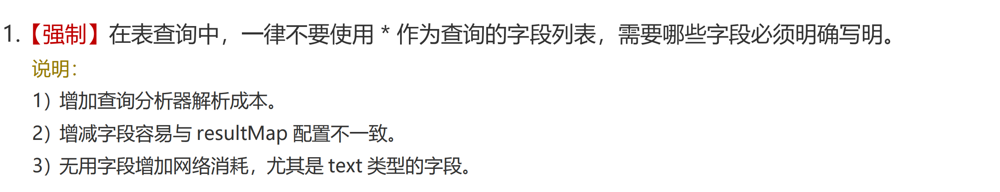

分析：

查看执行计划，select *<font style="color:rgb(38, 38, 38);"> 走全表扫描，没有用到任何索引，查询效率非常低；查询列都是索引列那么这些列被称为覆盖索引。这种情况下查询的相关字段都能走索引，索引查询的效率相对较高。</font>

```sql
EXPLAIN select * from student where name like 'mock_name%';--不走索引
EXPLAIN select name, department from student where name like 'mock_name%';--走索引
```

通过show warnings语句查看查询列*号替换成<font style="color:rgb(38, 44, 49);">表所有字段。</font>

```sql
EXPLAIN select * from student where name like 'mock_name%';--替换成表对应的字段
SHOW WARNINGS;
```


总结：

+ 查询时需要先将星号解析成表的所有字段然后在查询，**增加查询解析器的成本**；
+ select  * 查询一般**不走覆盖索引**会产生大量的回表查询；
+ 在实际应用中我们通常只需要使用某几个字段，其他不需要使用的字段也查出来**浪费CPU、内存资源**；
+ 文本数据、大字段数据数据传输**增加网络消耗**。

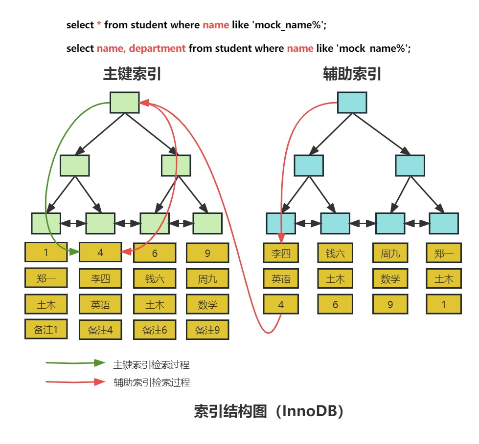


#####  1.2.2. 小表驱动大表
小表驱动大表就是指用数据量较小、索引比较完备的表，然后使用其索引和条件对大表进行数据筛选，从而减少数据计算量，提高查询效率。比如说student表有30条数据，scores表有80w条数据。

```sql

EXPLAIN
select * from student left join scores on student.id = scores.student_id;
```

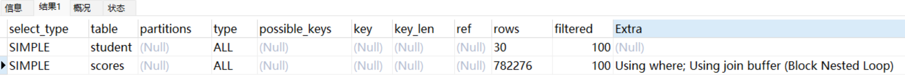

```sql
EXPLAIN
select * from scores left join student on student.id = scores.student_id;
```


Join Buffer（连接缓冲区）是优化器用于处理连接查询操作时的临时缓冲区。简单来说当我们需要比较两个或多个表的数据进行Join操作时，Join Buffer可以帮助MySQL临时存储结果，以减少磁盘读取和CPU负担，提高查询效率。需要注意的是每个join都有一个单独的缓冲区。

Block nested-loop join（BNL算法）会将驱动表数据加载到join buffer里面，然后再批量与非驱动表进行匹配；如果驱动表数据量较大，join buffer无法<font style="color:rgb(77, 77, 77);">一次性装载驱动表的结果集，将会分阶段与被驱动表进行批量数据匹配，会增加被驱动表的扫描次数，从而降低查询效率。所以开发中要遵守小表驱动大表的原则。</font>

分阶段匹配过程如下：

1、先把student表前15条数据读到join buffer中。

2、然后用scores表去匹配join buffer中的前15条。

3、记录下匹配结果。

4、清空join buffer。

5、再把<font style="color:rgb(38, 38, 38);">student</font>表后15条读取join buffer中。

6、然后用<font style="color:rgb(38, 38, 38);">scores</font>表去匹配join buffer中的后15条。

7、记录下匹配结果。


##### 1.2.3. 用连接查询代替子查询
mysql需要在两张表以上获取数据的方式有两种：第一种通过连表查询获取，第二种通过子查询获取。

模拟一个真实场景，同样student表有30条数据，scores表有80w条数据，我们想查看学号小于15的学员各科分数信息：

```sql
ALTER TABLE scores ADD index idx_student_id (student_id);

EXPLAIN
SELECT
	(SELECT student.NAME FROM student WHERE student.id = scores.student_id),
	scores.course_name,
	scores.score
FROM
	scores;
```

因为子查询需要执行两次数据库查询，一次是外部查询，一次是嵌套子查询。因此，使用连接查询可以减少数据库查询的次数，提高查询的效率。

连接查询可以更好地利用数据库索引，提高查询的性能。子查询通常会使用临时表或内存表，而连接查询可以直接利用表上的索引。这意味着连接查询可以更快地访问表中的数据，减少查询的资源消耗。

对于大型数据集，使用连接查询通常比使用子查询更高效。子查询通常需要扫描整个表，而连接查询可以利用索引加速读取操作。

```sql
EXPLAIN
SELECT
	student.NAME,
	scores.course_name,
	scores.score
FROM
	student inner JOIN scores ON student.id = scores.student_id;
```

使用连接查询可以更快地执行查询操作，减少数据库的负载，提高查询的性能和效率。

##### 1.2.4. 提升group by的效率
+ 创建索引：如果你使用group by的列没有索引，那么查询可能会变得很慢。因此，可以创建一个或多个适当的索引来加速查询。

```sql
select remarks from scores group by remarks;
```

添加索引前：


添加索引后：


+ 调整查询：查询的写法也会影响group by的效率。可以尝试不使用子查询或临时表，或者可以使用JOIN或EXISTS来代替IN子查询。
+ 限制结果集的数量：如果你只需要查看一小部分结果，可以在查询中添加LIMIT子句，以便只返回一定数量的结果。

##### 1.2.5. 批量操作
批量插入或批量删除数据，比如说现在需要将1w+数据插入到数据库，大家是一条一条处理还是批量操作呢？建议是批量操作，逐个处理会频繁的与数据库交互，损耗性能。

反例：


```java
for(Order order: list){   
 
     orderMapper.insert(order):
 
}
```

在循环中逐条插入数据。


```sql
insert into order(id,code,user_id)  values(123,'001',100)
```

该操作需要多次请求数据库，才能完成这批数据的插入。


但众所周知，我们在代码中，每次远程请求数据库，是会消耗一定性能的。而如果我们的代码需要请求多次数据库，才能完成本次业务功能，势必会消耗更多的性能。


那么如何优化呢？


正例：

```java
orderMapper.insertBatch(List<User> users): 
```

提供一个批量插入数据的方法。

```sql
insert into order(id,code,user_id)  values(123,'001',100),(124,'002',100),(125,'003',101);
```


这样只需要远程请求一次数据库，sql性能会得到提升，数据量越多，提升越大。


但需要注意的是，不建议一次批量操作太多的数据，如果数据太多数据库响应也会很慢。批量操作需要把握一个度，建议每批数据尽量控制在500以内。如果数据多于500，则分多批次处理。

 

##### 1.2.6. 使用limit
+ 提高查询效率：一个查询返回成千上万的数据行，不仅占用了大量的系统资源，也会占用更多的网络带宽，影响查询效率。使用LIMIT可以限制返回的数据行数，减轻了系统负担，提高了查询效率。
+ 避免过度提取数据：对于大型数据库系统，从数据库中提取大量的数据可能会导致系统崩溃。使用LIMIT可以限制提取的数据量，避免过度提取数据，保护系统不受影响。
+ 优化分页查询：分页查询需要查询所有的数据才能进行分页处理，这会浪费大量的系统资源和时间。使用LIMIT优化分页查询可以只查询需要的数据行，缩短查询时间，减少资源的浪费。
+ 简化查询结果：有时我们只需要一小部分数据来得出决策，而不是整个数据集。使用LIMIT可以使结果集更加精简和易于阅读和理解。

限制行数非常有用，因为它可以提高查询性能、减少处理需要的时间，并且只返回我们关心的列。


**<font style="color:rgb(0, 0, 0);">百万级表Limit翻页越往后越慢咋办</font>**

<font style="color:rgb(51, 51, 51);">为什么 offset 偏大之后 limit 查找会变慢？这需要了解 limit 操作是如何运作的，以下面这句查询为例：</font>


```javascript
select * from table_name limit 10000,10
```

<font style="color:rgb(255, 255, 255);background-color:rgb(105, 113, 145);"></font>

<font style="color:rgb(51, 51, 51);">这句 SQL 的执行逻辑是</font>

+ <font style="color:rgb(51, 51, 51);">1.从数据表中读取第N条数据添加到数据集中</font>
+ <font style="color:rgb(51, 51, 51);">2.重复第一步直到 N = 10000 + 10</font>
+ <font style="color:rgb(51, 51, 51);">3.根据 offset 抛弃前面 10000 条数</font>
+ <font style="color:rgb(51, 51, 51);">4.返回剩余的 10 条数据</font>


**<font style="color:rgb(0, 0, 0);">第一次优化</font>**

<font style="color:rgb(51, 51, 51);">根据数据库这种查找的特性，就有了一种想当然的方法，利用自增索引（假设为id）：</font>


```javascript
select * from table_name where (id >= 10000) limit 10
```


**<font style="color:rgb(0, 0, 0);">第二次优化</font>**

<font style="color:rgb(51, 51, 51);">说起数据库查询优化，第一时间想到的就是索引，所以便有了第二次优化：先查找出需要数据的索引列（假设为 id），再通过索引列查找出需要的数据。</font>


```javascript
Select * From table_name Where id in (Select id From table_name where ( user = xxx )) limit 10000, 10;

select * from table_name where( user = xxx ) limit 10000,10
```

<font style="color:rgb(255, 255, 255);background-color:rgb(105, 113, 145);"></font>

<font style="color:rgb(51, 51, 51);">相比较结果是（500w条数据）：第一条花费平均耗时约为第二条的 1/3 左右。</font>

<font style="color:rgb(51, 51, 51);">同样是较大的 offset，第一条的查询更为复杂，为什么性能反而得到了提升？</font>

<font style="color:rgb(51, 51, 51);">这涉及到 mysql 主索引的数据结构 b+Tree ，这里不展开，基本原理就是：</font>

+ <font style="color:rgb(51, 51, 51);">子查询只用到了索引列，没有取实际的数据，所以不涉及到磁盘IO，所以即使是比较大的 offset 查询速度也不会太差。</font>
+ <font style="color:rgb(51, 51, 51);">利用子查询的方式，把原来的基于 user 的搜索转化为基于主键（id）的搜索，主查询因为已经获得了准确的索引值，所以查询过程也相对较快。</font>

**<font style="color:rgb(0, 0, 0);">第三次优化</font>**

<font style="color:rgb(51, 51, 51);">在数据量大的时候 in 操作的效率就不怎么样了，我们需要把 in 操作替换掉，使用 join 就是一个不错的选择。</font>


```javascript
select * from table_name inner join ( select id from table_name where (user = xxx) limit 10000,10) b using (id)
```

 

 

##### 1.2.7. 用union all代替union
+ union all：获取所有数据但是数据不去重，包含重复数据；
+ union：获取所有数据且数据去重，不包含重复数据；

```sql
select id,name,department from student
union all
select id,student_id,score from scores
```


```sql
select id,name,department from student
union
select id,student_id,score from scores
```


那么union all与union如果当然它业务数据容许出现重复的记录，我们更推荐使用union all，因为union去重数据需要遍历、排序和比较，它更耗时，更消耗cpu资源，但是数据结果最完整。

##### 1.2.8. join的表不宜过多
+ 查询效率下降：多表JOIN查询数据对比时间边长
+ 系统负载增加：JOIN操作需要进行大量的计算，因此会导致系统负载增加。
+ 维护难度加大：在一个连接了多个表的查询中，如果需要修改其中一个表的结构或内容，就可能会需要同时修改其他表的结构或内容。

因此，在数据库设计时，应该尽量减少JOIN操作的使用频率，并且简化表之间的关系，以提高查询效率和系统的性能。  
除上述优化之外，通常在建表还需要注意以下内容：

+ 控制索引数量
+ 选择合理的字段类型

### 2. 总结
SQL优化是提高数据库性能的重要方法，在实际开发中我们的SQL要尽量遵守以下几点原则，避免留下技术债：

1. 减少数据扫描
2. 返回更少数据
3. 减少交互次数
4. 减少服务器CPU及内存开销

#  
