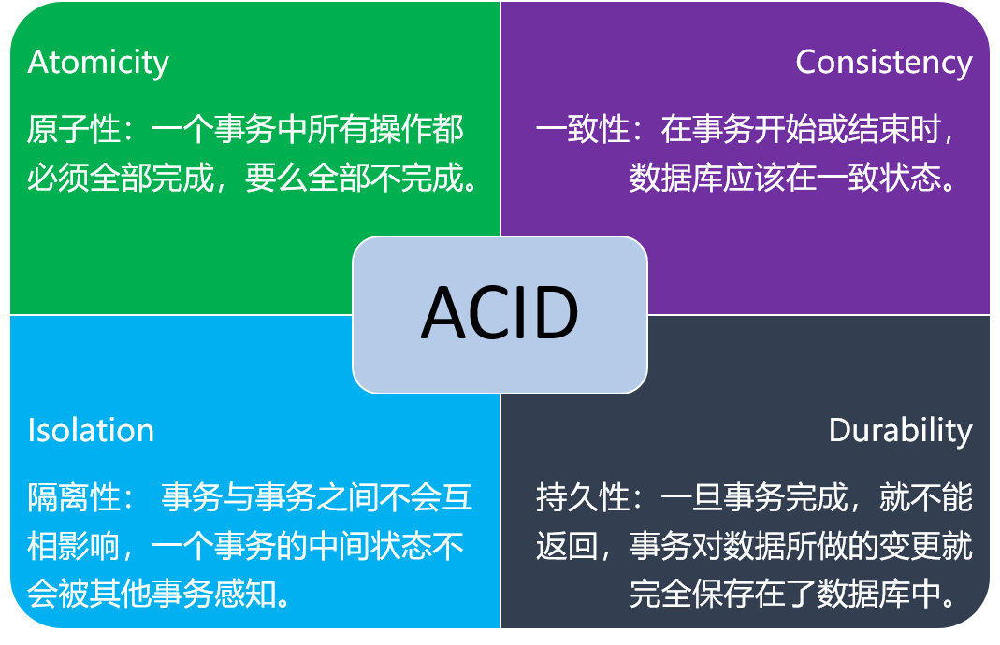
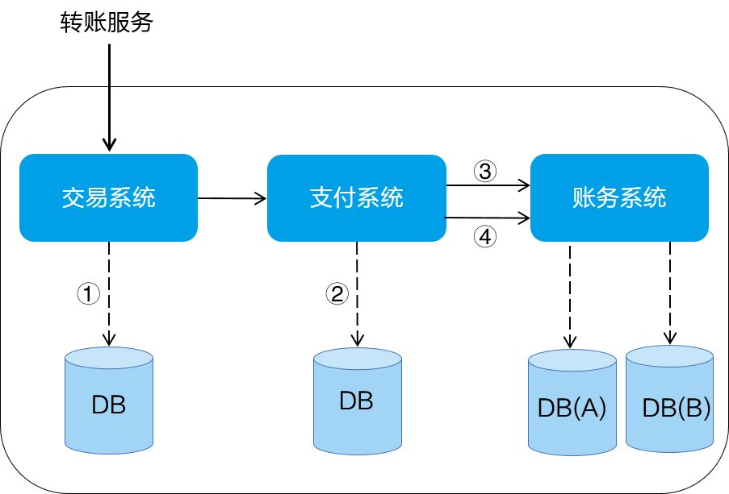

分布式事务是相对本地事务而言的，对于本地事务，利用数据库本身的事务机制，就可以保证事务的ACID特性。

ACID

而在分布式环境下，会涉及到多个数据库。

多数据库

分布式事务其实就是将对同一库事务的概念扩大到了对多个库的事务。目的是为了保证分布式系统中的数据一致性。

分布式事务处理的关键是：

1. **需要记录事务在任何节点所做的所有动作；**
2. **事务进行的所有操作要么全部提交，要么全部回滚。**

