## 1.课程介ç»
2024 年给大家带æ¥ä¸€ä¸ªå¿«é€Ÿå…¥é—¨ MySQL 的超详细教程，帮助还没有使用过 MySQL çš„å°ä¼™ä¼´å¿«é€ŸæŒæ¡ MySQL 的安装ä¸å…¥é—¨ä½¿ç”¨ï¼Œæ¥ä¸‹æ¥å°±å¼€å§‹ MySQL 的扫盲行动å§ã€‚

## 2.MySQL简介
MySQL是一个开æºçš„关系å‹æ•°æ®åº“管ç†ç³»ç»Ÿï¼Œå¹¿æ³›åº”用äºWeb应用程åºçš„æ•°æ®å­˜å‚¨å’Œç®¡ç†ã€‚它支æŒå¤šç”¨æˆ·å¹¶å‘访问，具有高性能ã€ç¨³å®šå¯é ã€æ˜“äºä½¿ç”¨å’Œç®¡ç†ç­‰ç‰¹ç‚¹ã€‚

MySQL官网æ供了详细的文档ã€ä¸‹è½½ã€ç¤¾åŒºæ”¯æŒç­‰èµ„æºï¼Œå®˜ç½‘地å€ä¸º[https://www.mysql.com/。在官网上，你å¯ä»¥æ‰¾åˆ°å„ç§ç‰ˆæœ¬çš„MySQL，包括社区版ã€ä¼ä¸šç‰ˆç­‰ï¼Œä»¥åŠé€‚用äºä¸åŒæ“作系统的安装包。](https://www.mysql.com/%E3%80%82%E5%9C%A8%E5%AE%98%E7%BD%91%E4%B8%8A%EF%BC%8C%E4%BD%A0%E5%8F%AF%E4%BB%A5%E6%89%BE%E5%88%B0%E5%90%84%E7%A7%8D%E7%89%88%E6%9C%AC%E7%9A%84MySQL%EF%BC%8C%E5%8C%85%E6%8B%AC%E7%A4%BE%E5%8C%BA%E7%89%88%E3%80%81%E4%BC%81%E4%B8%9A%E7%89%88%E7%AD%89%EF%BC%8C%E4%BB%A5%E5%8F%8A%E9%80%82%E7%94%A8%E4%BA%8E%E4%B8%8D%E5%90%8C%E6%93%8D%E4%BD%9C%E7%B3%BB%E7%BB%9F%E7%9A%84%E5%AE%89%E8%A3%85%E5%8C%85%E3%80%82)

安装MySQLçš„æ–¹å¼å¤šæ ·åŒ–，å¯ä»¥æ ¹æ®éœ€æ±‚选择åˆé€‚çš„æ–¹å¼è¿›è¡Œå®‰è£…。一ç§å¸¸è§çš„æ–¹å¼æ˜¯é€šè¿‡Linux的工具包管ç†å™¨è¿›è¡Œå®‰è£…，比如使用apt-getã€yum等。å¦å¤–，你也å¯ä»¥ä½¿ç”¨Docker容器æ¥å¿«é€Ÿéƒ¨ç½²MySQL，这ç§æ–¹å¼æ–¹ä¾¿çµæ´»ï¼Œèƒ½å¤Ÿåœ¨ä¸åŒçš„ç¯å¢ƒä¸­å¿«é€Ÿéƒ¨ç½²MySQLæœåŠ¡ã€‚åœ¨æœ¬æ•™ç¨‹ä¸­ï¼Œå°†ä¼šè¯¦ç»†ä»‹ç» Linux 安装ã€Windows 安装两ç§å¸¸è§çš„安装方å¼ã€‚

## 3.Windows安装
### 3.1 软件下载
打开 MySQL 官网，选择 DownLoads，在点击下方 Community DownLoads，然åä¾æ¬¡æŒ‰ç…§å›¾ç¤ºè¿›è¡Œæ“作下载，如下：

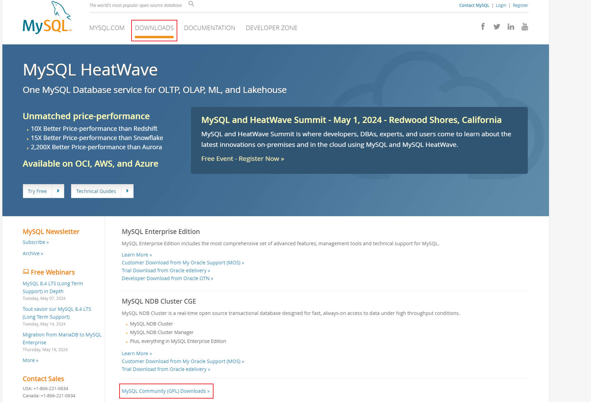


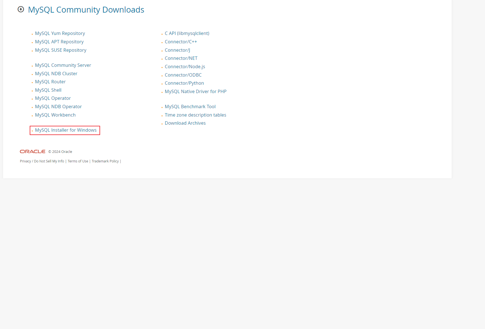

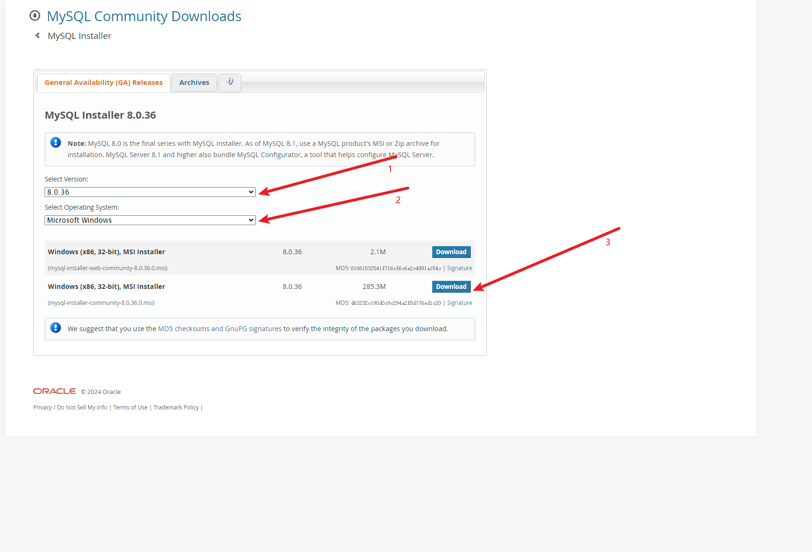

### 3.2 安装
Windows 的安装有图形化界é¢ï¼Œé常的方便快æ·ï¼Œç›´æ¥è¿è¡Œä¸‹è½½å¥½çš„ msi 文件，大多数都是下一步，æ少步骤需è¦å¤„ç†ï¼Œéœ€è¦å•ç‹¬å¤„ç†çš„步骤æ到了å‰é¢ï¼Œå¤§å®¶ç¨å¾®è®°ä¸€ä¸‹å°±è¡Œï¼Œå…¶ä»–无脑下一步。需è¦æ³¨æ„如下图示： **完整的过程图å†æ–‡æœ«ã€‚**

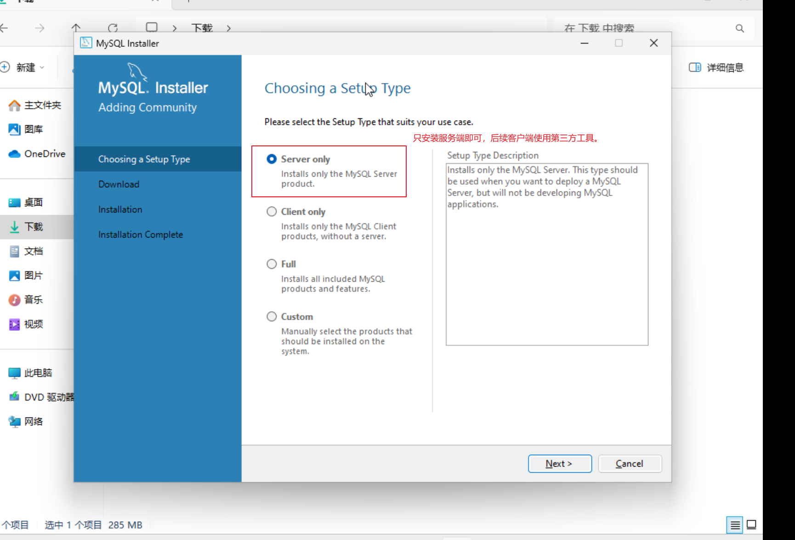


### 3.3 测试是å¦å®‰è£…æˆåŠŸ
相信安装过程没什么问题，æ“作完æˆå，使用 cmd 进行简å•æµ‹è¯•ã€‚

#### 3.3.1 win + R 输入 cmd 或者 win æœç´¢ cmd 打开命令窗å£ç™»å½• MySQL。
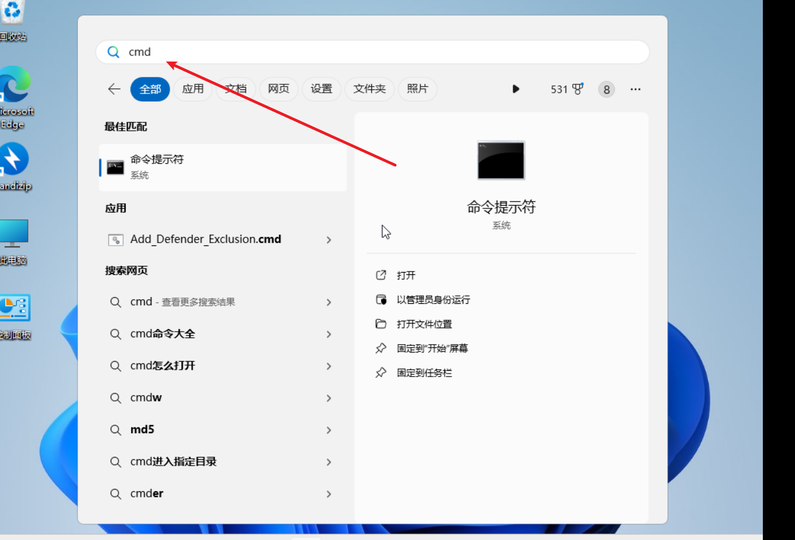

输入登录 MySQL 命令：**mysql -u root -p** ,如æœå‡ºç°ä»¥ä¸‹æŠ¥é”™ï¼Œåˆ™éœ€è¦é…置下 MySQL ç¯å¢ƒå˜é‡ã€‚

```plsql
mysql -u root -p
```

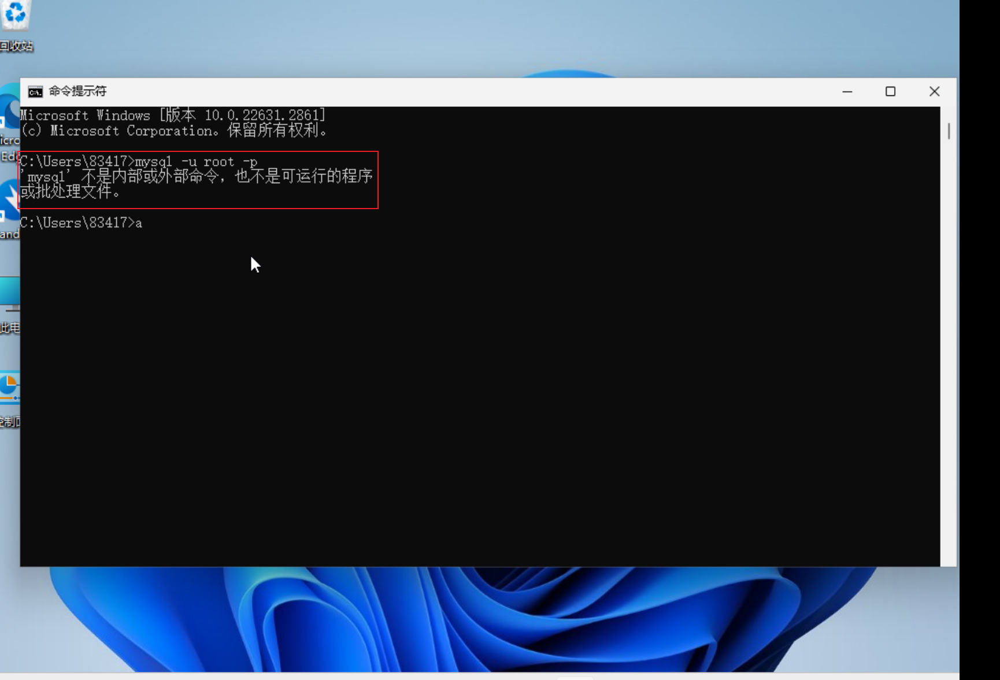

### 3.3.2 é…ç½® MySQL ç¯å¢ƒå˜é‡
#### 3.3.2.1 进入 MySQL 安装目录，打开 bin 目录，å¤åˆ¶ bin 所在目录链æ¥
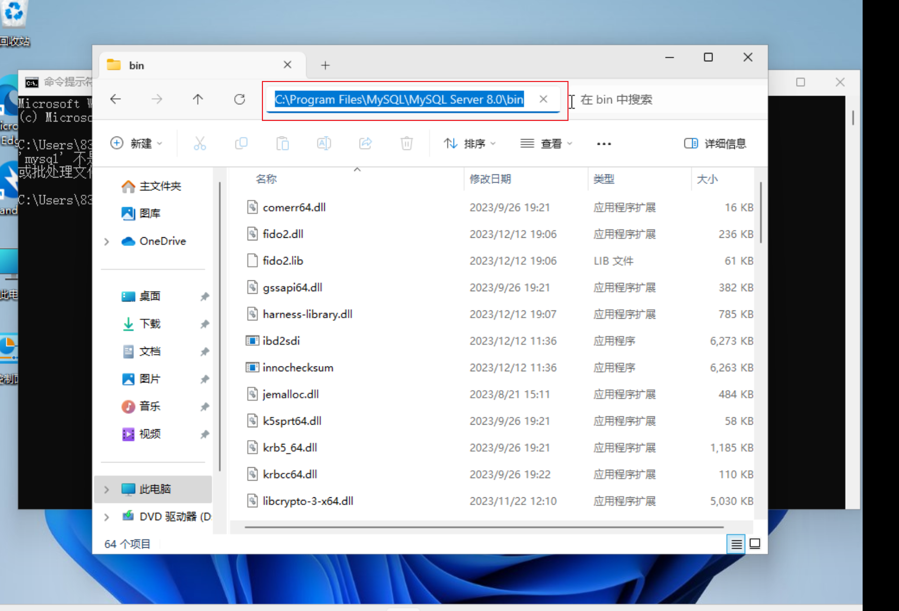

#### 3.3.2.2 打开我的电脑å±æ€§ --> 高级系统设置 --> ç¯å¢ƒå˜é‡ ······ 按图示æ“作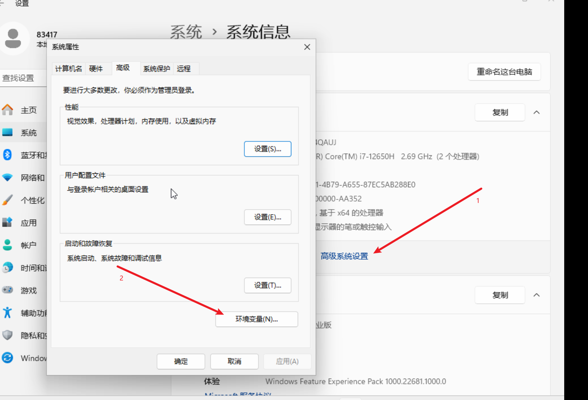
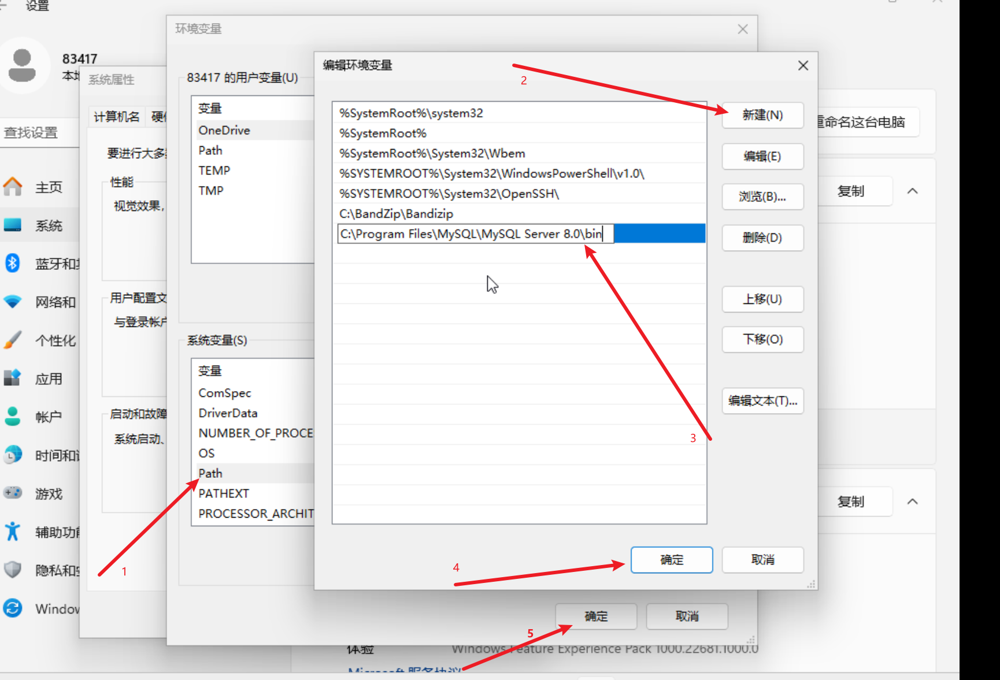

#### 3.3.2.3 需è¦æ³¨æ„，é…ç½®ç¯å¢ƒå˜é‡å，需è¦é‡æ–°æ‰“开一个 cmd 窗å£æ‰èƒ½ç”Ÿæ•ˆã€‚效æœå¦‚下，输入安装时的 root 密ç å，出下 MySQL æ示，则代表安装æˆåŠŸï¼Œå¯ä»¥ç®€å•æµ‹è¯•ä¸‹ï¼š
```plsql
mysql -u root -p
show databases;
show tables;
quit;
```

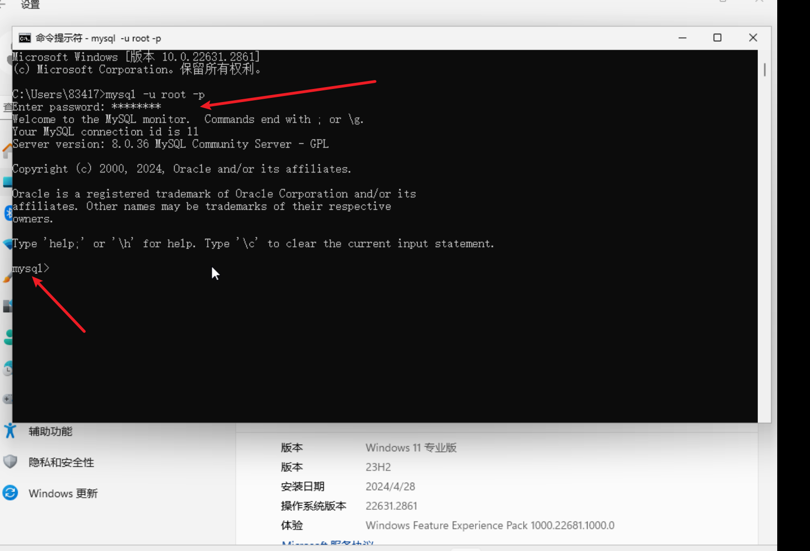


## 4.Linux安装
**使用 Centos7 安装 MySQL8.0**

### 4.1 检查系统是å¦å·²ç»å®‰è£…æ•°æ®åº“
```shell
[root@localhost ~]# rpm -qa | grep mysql
[root@localhost ~]# rpm -qa | grep mariabd
```

### 4.2 如æœå­˜åœ¨å¸è½½ç›¸åº”æ•°æ®åº“
```shell
[root@localhost ~]# rpm -e --nodeps mysql/mariabd（已ç»å®‰è£…程åºå称）
```

### 4.3 <font style="color:rgb(79, 79, 79);">安装下载工具wget</font>
#### <font style="color:rgb(77, 77, 77);">4.3.1 查看安装情况</font>
```shell
[root@localhost ~]# wget -V
GNU Wget 1.14 在 linux-gnu 上编译。
······
[root@localhost ~]# rpm -qa wget
wget-1.14-18.el7_6.1.x86_64
```

#### 4.3.2 如æœæ²¡æœ‰å®‰è£…
```shell
[root@localhost ~]# yum install -y wget
```

### 4.4 <font style="color:rgb(79, 79, 79);">下载阿里云 yum æºæ–‡ä»¶</font>
```shell
[root@localhost ~]# wget -O /etc/yum.repos.d/CentOS-Base.repo http://mirrors.aliyun.com/repo/Centos-7.repo
```

### 4.5 <font style="color:rgb(79, 79, 79);">清ç†yum缓存</font>
```shell
[root@localhost ~]# yum clean all
[root@localhost ~]# yum makecache
```

### 4.6 <font style="color:rgb(79, 79, 79);">下载 mysql æºå®‰è£…包</font>
```shell
[root@localhost ~]# wget http://dev.mysql.com/get/mysql80-community-release-el7-8.noarch.rpm
```

### 4.7 安装 MySQL æº
```shell
[root@localhost ~]# yum localinstall -y mysql80-community-release-el7-8.noarch.rpm
```

### 4.8 安装 MySQL
```shell
[root@localhost ~]# yum -y install mysql-community-server --nogpgcheck
```

### 4.9 检查是å¦å®‰è£…æˆåŠŸ
```shell
[root@localhost ~]# rpm -qa |grep mysql
mysql-community-common-8.0.37-1.el7.x86_64
mysql-community-server-8.0.37-1.el7.x86_64
mysql-community-libs-8.0.37-1.el7.x86_64
mysql-community-libs-compat-8.0.37-1.el7.x86_64
mysql80-community-release-el7-8.noarch
mysql-community-client-8.0.37-1.el7.x86_64
mysql-community-icu-data-files-8.0.37-1.el7.x86_64
mysql-community-client-plugins-8.0.37-1.el7.x86_64
```

### 4.10 å¯åŠ¨ MySQL & è®¾ç½®å¼€æœºè‡ªå¯ & é‡æ–°åŠ è½½é…置文件
```shell
[root@localhost ~]# systemctl start mysqld
[root@localhost ~]# systemctl enable mysqld
[root@localhost ~]# systemctl daemon-reload
```

### 4.11 å¸è½½é˜²ç«å¢™
```shell
[root@localhost ~]# yum remove firewalld
```

### 4.12 <font style="color:rgb(79, 79, 79);">查看mysql密ç </font>
```shell
[root@localhost ~]# cat /var/log/mysqld.log | grep password
2024-04-30T13:41:28.767968Z 6 [Note] [MY-010454] [Server] A temporary password is generated for root@localhost: Nle-H4q:-%zp
```

其中"**Nle-H4q:-%zp**"为 root åˆå§‹å¯†ç ï¼Œå¤åˆ¶å‡†å¤‡ç™»å½•ã€‚

### 4.13 登录 MySQL
```shell
[root@localhost ~]# mysql -u root -p
Enter password: 
```

### 4.14 修改 root 密ç 
```shell
mysql> ALTER USER 'root'@'localhost' IDENTIFIED WITH mysql_native_password BY '1qaz@WSX';
mysql> quit;
[root@localhost ~]# mysql -u root -p
Enter password: 
```

修改å退出é‡æ–°ç™»å½•

### 4.15 修改 root 账户登录设置
```shell
mysql> use mysql;
mysql> update user set host='%' where user='root';
mysql> flush privileges;
```

### 4.16 完结撒花
至此 MySQL8.0 的安装完æˆï¼Œè¿œç¨‹ç™»å½•ä¹Ÿæ定（就是步骤 4.15）。

需è¦æ³¨æ„通过这ç§æ–¹å¼å®‰è£…çš„ MySQL，并没有加载 my.cnf 这个é…置文件，修改方å¼ç‚¹å‡»è¿™ä¸ª[链æ¥](https://www.yuque.com/tulingzhouyu/db22bv/ugdfg4q0ccqo0r28?singleDoc# 《👠一å°æ—¶å¿«é€Ÿå…¥é—¨æ•°æ®åŒæ­¥ç¥å™¨-Canal》 密ç ï¼šilps)，å‚考第四章节

## 5.HeidiSQL
MySQL æœåŠ¡å·²ç»å®‰è£…完æˆï¼Œç”±äºå‘½ä»¤æ–¹å¼è¾“入比较å¤æ‚，所以我们还需è¦ä¸€æ¬¾å›¾å½¢åŒ–软件æ¥è¿›è¡Œæ“作 MySQL，æ¨è大家使用 HeidiSQL，完全å…费。下载地å€ï¼š[https://www.heidisql.com/download.php](https://www.heidisql.com/download.php)

### 5.1 选择 64 å°±å¯ä»¥äº†
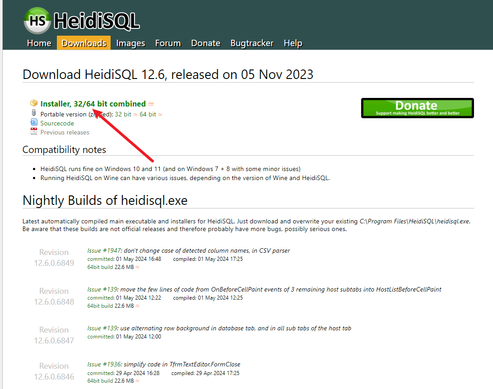

### 5.2 然å就正常下一步，安装完æˆå打开软件。è¿æ¥æ•°æ®åº“，如下是è¿æ¥äº†æœ¬æœºã€è™šæœº windowsã€è™šæœº Linux 三个机器的 MySQL æœåŠ¡ï¼Œç¡®è®¤å¥½ ip 地å€ï¼Œå¡«å…¥è´¦å·å¯†ç å³å¯ã€‚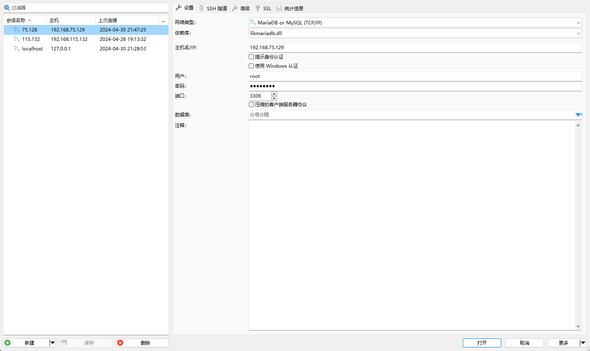
### 5.3 è¿æ¥ Linux 机器 MySQL
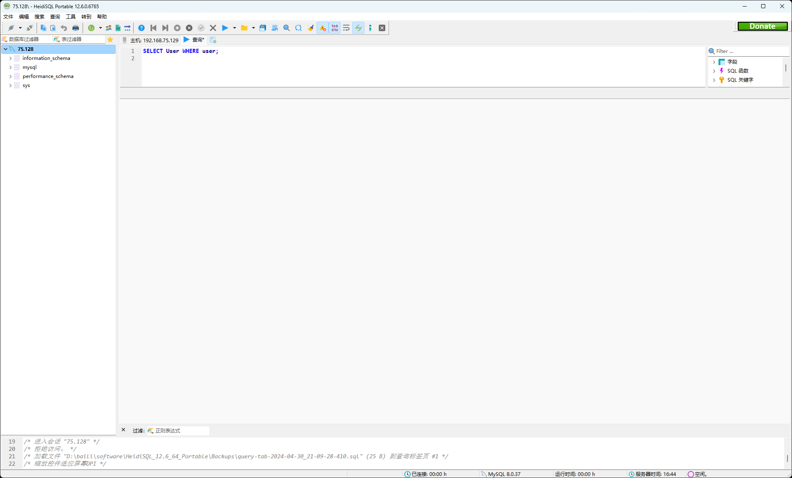

### 5.4 至此图形化客户端处ç†å®Œæˆ
## 6.创建数æ®åº“
### 6.1 使用命令方å¼åˆ›å»º
如æœæ˜¯ä½¿ç”¨å‘½ä»¤æ–¹å¼åˆ›å»ºè¡¨ï¼Œé¦–先我们å¯ä»¥é€šè¿‡:

```shell
show database;
```

查看ç°æœ‰å·²ç»å­˜åœ¨çš„库。

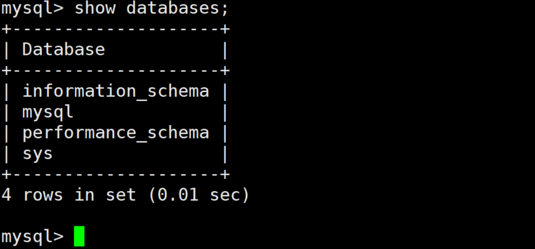

**创建表使用命令**

```shell
create database test;
```

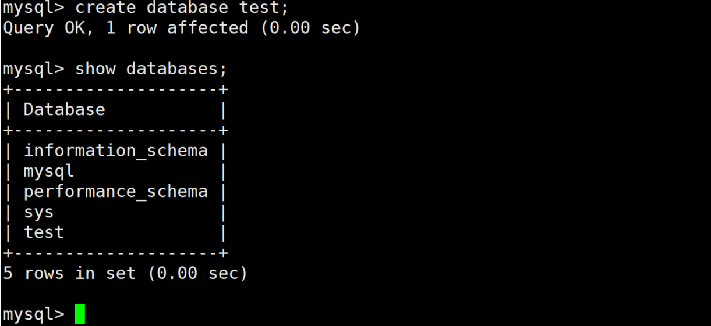

**删除数æ®åº“使用**

```shell
drop database test;
```

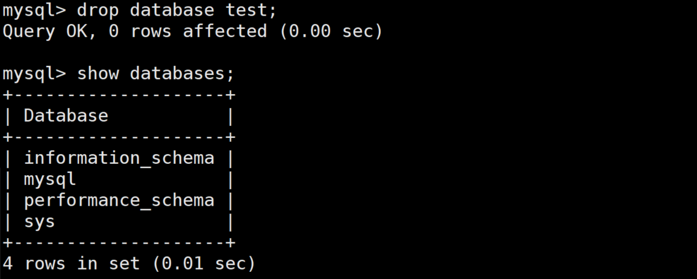

### 6.2 使用 HeidiSQL 创建
**选中è¿æ¥çš„æ•°æ®åº“，然åå³é”®-->创建新的-->æ•°æ®åº“**

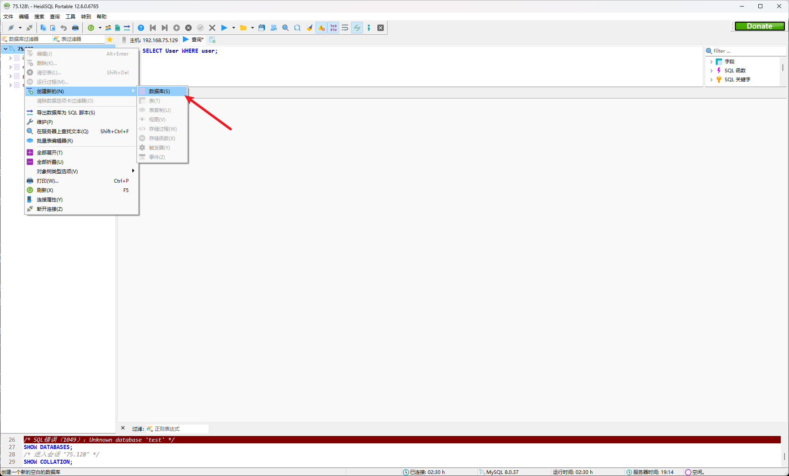

填入数æ®åº“å称，这样就创建完æˆäº†

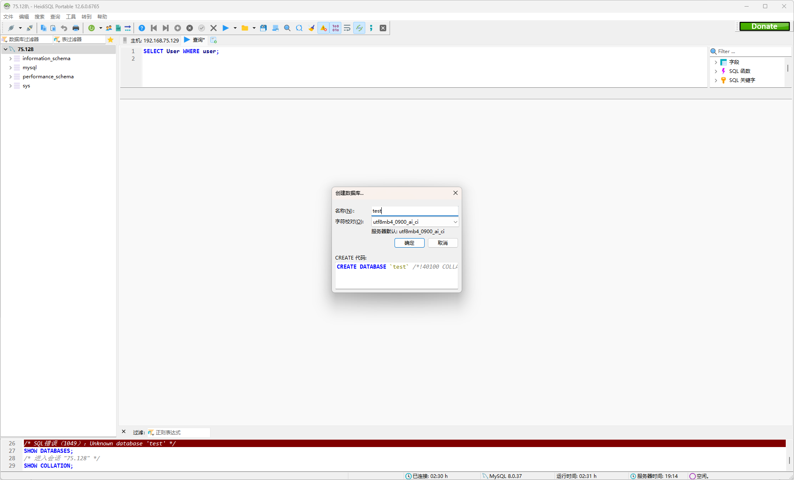

**删除数æ®åº“，很简å•ï¼Œç›´æ¥é€‰ä¸­æ•°æ®åº“å³é”®åˆ é™¤å³å¯**

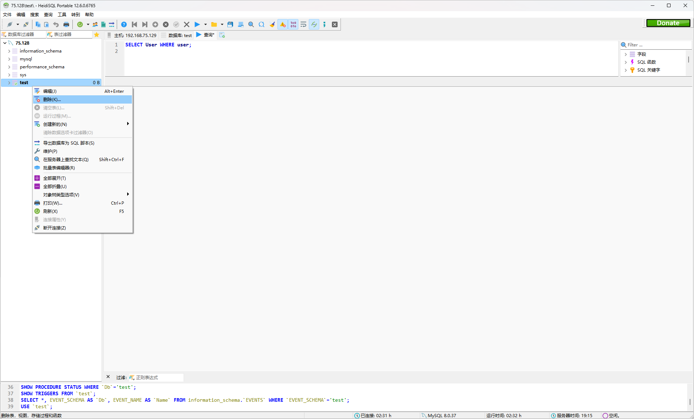

**细心的å°ä¼™ä¼´åº”该已ç»å‘ç°äº†ï¼Œæˆ‘们在图形化æ“作时，HeidiSQL 都生æˆäº†å¯¹åº”的命令，因此我们æ¥ä¸‹æ¥éƒ½åœ¨ HeidiSQL 中完æˆå¤„ç†ã€‚**

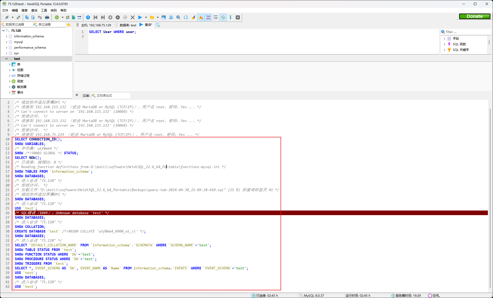

## 7.创建表
### 7.1 <font style="color:rgb(36, 41, 47);">创建测试表</font>
```plsql
-- 创建一个å为 "test" 的简å•è¡¨ï¼Œå…¶ä¸­åŒ…å«ä¸‰ä¸ªå­—段
CREATE TABLE test (
  id INT AUTO_INCREMENT PRIMARY KEY, -- 主键
  name VARCHAR(50),  -- 字符串字段
  age INT            -- 整数字段
);
```

### 7.2 <font style="color:rgb(36, 41, 47);">添加新的字段</font>
```plsql
-- 添加一个新的 "email" 字段
ALTER TABLE test
ADD email VARCHAR(100); -- 添加一个新的VARCHAR字段
```

### <font style="color:rgb(36, 41, 47);">7.3 修改字段å称</font>
```plsql
-- å°† "name" 字段é‡å‘½å为 "full_name"
ALTER TABLE test
RENAME COLUMN name TO full_name;
```

### <font style="color:rgb(36, 41, 47);">7.4 修改字段类å‹</font>
```plsql
-- å°† "age" å­—æ®µä» INT 修改为 SMALLINT 使用 MODIFY
ALTER TABLE test
MODIFY COLUMN age SMALLINT;
```

### <font style="color:rgb(36, 41, 47);">7.5 为字段设置默认值</font>
```plsql
-- 为 "age" 字段设置默认值 18
ALTER TABLE test
ALTER COLUMN age SET DEFAULT 18;
```

### <font style="color:rgb(36, 41, 47);">7.6 删除字段</font>
```plsql
-- 删除 "email" 字段
ALTER TABLE test
DROP COLUMN email;
```

### <font style="color:rgb(36, 41, 47);">7.7 删除表</font>
```plsql
-- 删除整个表
DROP TABLE test;
```

### 7.8 æ•°æ®åº“常è§æ•°æ®ç±»å‹æ±‡æ€»
**æ•°å­—ç±»å‹**

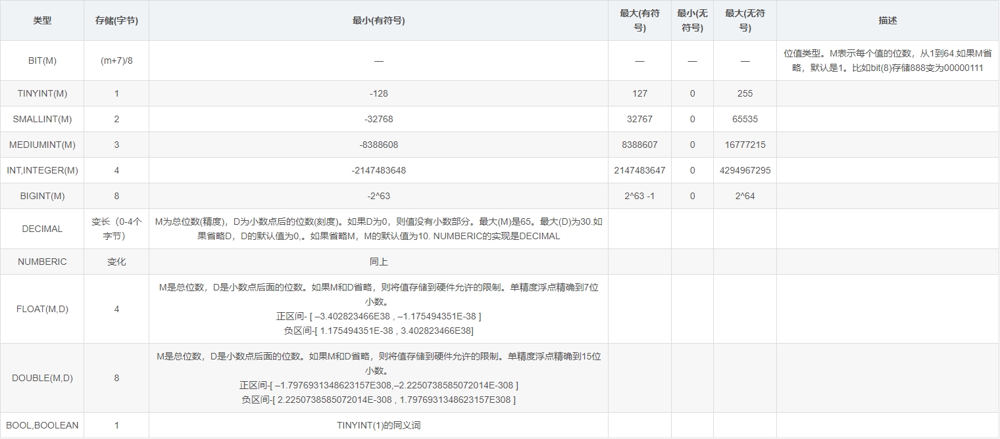

**日期类å‹**

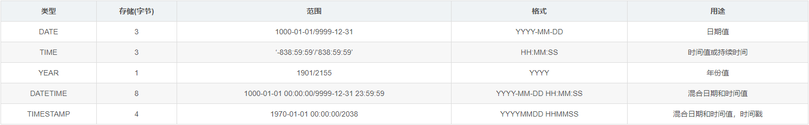

**字符类å‹**


## 8.æ•°æ®çš„å¢åˆ æ”¹æŸ¥
```plsql
-- æ’入一行新数æ®ï¼š
INSERT INTO test (full_name, age) VALUES ('Alice Johnson', 40);

-- 查询所有数æ®ï¼š
SELECT * FROM test;

-- æ’入测试数æ®åˆ° "test" 表中
INSERT INTO test (full_name, age) VALUES
('John Doe', 30),
('Jane Smith', 25),
('Michael Johnson', 35);

-- æ ¹æ®æ¡ä»¶æŸ¥è¯¢æ•°æ®ï¼š
SELECT * FROM test WHERE age > 30;

-- 使用èšåˆå‡½æ•°æŸ¥è¯¢æ•°æ®ç»Ÿè®¡ï¼š
SELECT COUNT(*) AS total_rows FROM test;

-- æ›´æ–°æ•°æ®ï¼š
UPDATE test SET age = 45 WHERE full_name = 'Michael Johnson';

-- 删除数æ®ï¼š
DELETE FROM test WHERE full_name = 'Alice Johnson';
```

## 9.æ•°æ®çš„导入ä¸å¯¼å‡º
使用 HeidiSQL 导出é常的简å•ï¼Œé€‰ä¸­è¡¨å³é”®ï¼Œç„¶å选中需è¦å¯¼å‡ºçš„æ•°æ®ä¸ä¿å­˜ç›®å½•å°±å¯ä»¥äº†

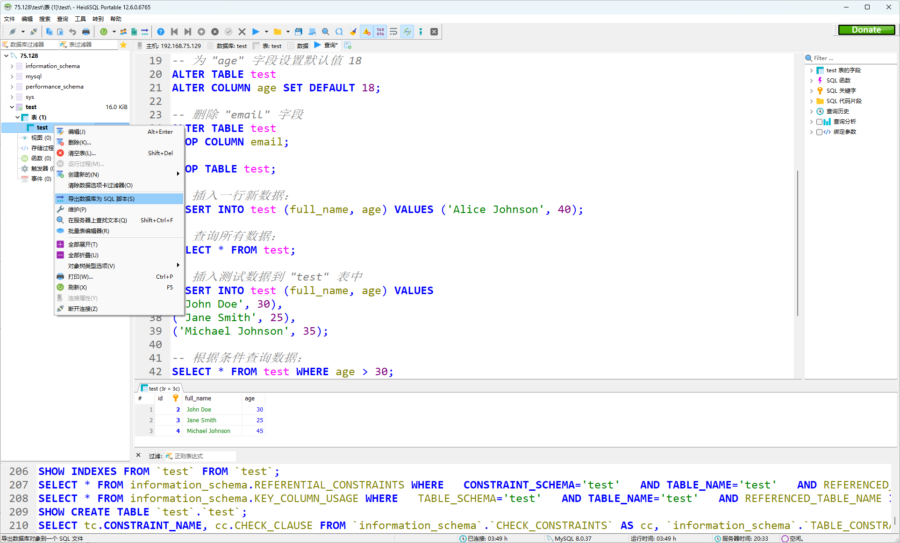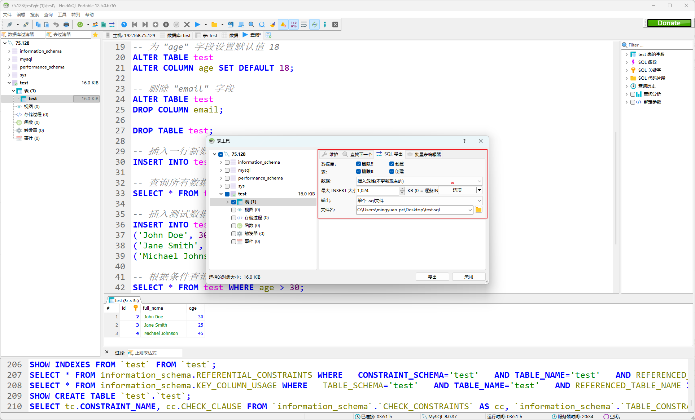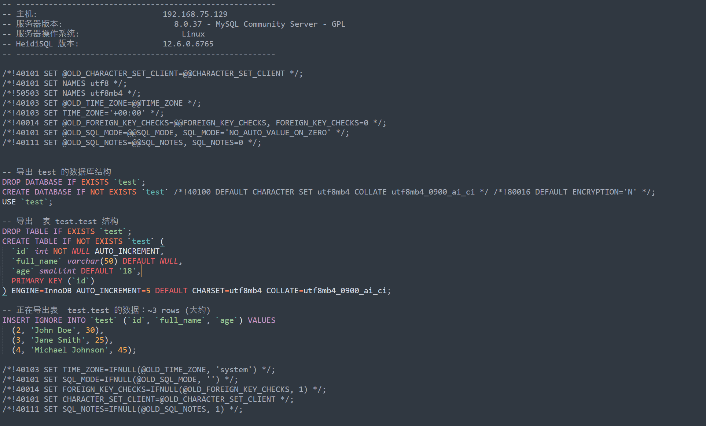

## 10.常用语å¥
```plsql
-- 补充测试数æ®
INSERT IGNORE INTO `test` (`full_name`, `age`) VALUES
    ('Emily Johnson', 28),
    ('David Lee', 35),
    ('Sophia Brown', 32),
    ('William Taylor', 35),
    ('Sophia Brown', 32),
    ('Sophia Brown', 32),
    ('Sophia Brown', 32),
    ('Sophia Brown', 32),
    ('William Taylor', 40),
    ('Olivia Wilson', 27),
    ('Michael Johnson', 32),
    ('Sophia Garcia', 25),
    ('Ethan Martinez', 38),
    ('Olivia Wilson', 27);

-- æŸ¥è¯¢å¹´é¾„å¤§äº 30 å²çš„用户信æ¯ï¼š
SELECT *
FROM test
WHERE age > 30;

-- 查询姓å为 'Jane Smith' 或 'Sophia Brown' 的用户信æ¯ï¼š
SELECT *
FROM test
WHERE full_name IN ('Jane Smith', 'Sophia Brown');

-- 查询年龄在 25 到 35 å²ä¹‹é—´çš„用户信æ¯ï¼š
SELECT *
FROM test
WHERE age BETWEEN 25 AND 35;

-- 查询姓å以 'J' 开头的用户信æ¯ï¼š
SELECT *
FROM test
WHERE full_name LIKE 'J%';

-- 查询年龄ä¸ç­‰äº 25 å²çš„用户信æ¯ï¼š
SELECT *
FROM test
WHERE age != 25;

-- èšåˆå‡½æ•° COUNT：计算行数或é空值的数é‡ã€‚
SELECT COUNT(*) AS total_rows
FROM test;

-- DISTINCT：用äºè¿”å›å”¯ä¸€ä¸åŒçš„值。
SELECT DISTINCT age
FROM test;

-- LIMIT：用äºé™åˆ¶è¿”å›çš„行数。
SELECT *
FROM test
LIMIT 5;

-- SUBSTR：用äºæå–字符串的å­ä¸²
SELECT SUBSTR(full_name, 1, 5) AS short_name
FROM test;

-- æ’åºï¼šæŒ‰å¹´é¾„å‡åºæ’åºï¼Œå¦‚æœå¹´é¾„相åŒï¼Œåˆ™æŒ‰å§“åæ’åºã€‚
SELECT *
FROM test
ORDER BY age ASC, full_name ASC;

-- 分组：按年龄分组，并统计æ¯ä¸ªå¹´é¾„组中的用户数é‡ã€‚
SELECT age, COUNT(*) as count
FROM test
GROUP BY age;

-- 对年龄进行分组，并筛选出年龄大äºç­‰äº 30 å²çš„组
SELECT age, COUNT(*) AS count
FROM test
GROUP BY age
HAVING age >= 30;

-- 正则匹é…
-- 匹é…姓åä¸­åŒ…å« "Doe" 的用户信æ¯ï¼š
SELECT *
FROM test
WHERE full_name REGEXP 'Doe';

-- 匹é…年龄是两ä½æ•°ä¸”第二ä½æ˜¯ 5 的用户信æ¯ï¼š
SELECT *
FROM test
WHERE age REGEXP '^[0-9]5$';

-- 匹é…å…¨å以 "J" 开头并以 "n" 结尾的用户信æ¯ï¼š
SELECT *
FROM test
WHERE full_name REGEXP '^J.*h$';

-- 匹é…姓å中包å«å­—æ¯ "a" 或 "A" 的用户信æ¯ï¼š
SELECT *
FROM test
WHERE full_name REGEXP '[aA]';

-- 匹é…姓å中包å«ä¸¤ä¸ªè¿ç»­å…ƒéŸ³çš„用户信æ¯ï¼š
SELECT *
FROM test
WHERE full_name REGEXP '[aeiou]{2}';
```

## 11.å­æŸ¥è¯¢
<font style="color:rgb(36, 41, 47);">å­æŸ¥è¯¢æ˜¯ä¸€ç§åœ¨ä¸€ä¸ª SQL 语å¥ä¸­åµŒå…¥å¦ä¸€ä¸ªæŸ¥è¯¢çš„æ–¹å¼ã€‚å­æŸ¥è¯¢å¯ä»¥ç”¨äºä»è¡¨ä¸­é€‰æ‹©æ•°æ®ï¼Œç„¶å在外层查询中使用这些数æ®è¿›è¡Œè¿›ä¸€æ­¥æ“作。下é¢æ˜¯å‡ ä¸ªå¸¸è§çš„å­æŸ¥è¯¢ç¤ºä¾‹ï¼Œæ¶µç›–ä¸åŒçš„场景。</font>

```plsql
-- å­æŸ¥è¯¢ä¸ WHERE å­å¥ï¼šæŸ¥æ‰¾å¹´é¾„大äºè¡¨ä¸­å¹³å‡å¹´é¾„的所有用户。  用在whereå­å¥ä¸­
SELECT full_name, age
FROM test
WHERE age > (SELECT AVG(age) FROM test);

-- å­æŸ¥è¯¢ä¸ IN å­å¥ï¼šæŸ¥æ‰¾å¹´é¾„为 32 的所有用户。   用在查询结æœé›†ä¸­
SELECT full_name, SELECT AVG(age) FROM test
FROM test
WHERE age IN (SELECT DISTINCT age FROM test WHERE age = 32);

-- å­æŸ¥è¯¢ä¸ EXISTS å­å¥ï¼šæŸ¥æ‰¾æ˜¯å¦å­˜åœ¨ç‰¹å®šå¹´é¾„的用户，并返å›è¯¥ç”¨æˆ·çš„姓å。
SELECT full_name, age
FROM test
WHERE EXISTS (SELECT 1 FROM test WHERE age = 38);

-- 用在创建表
CREATE TABLE test1 SELECT * FROM test WHERE age > (SELECT AVG(age) FROM test);  

-- 用在æ’入数æ®
INSERT INTO test1 SELECT *FROM test WHERE age <= (SELECT AVG(age) FROM test);

-- å­æŸ¥è¯¢ä¸ JOIN： 使用å­æŸ¥è¯¢ä»å…¶ä»–表中æå–æ•°æ®å¹¶åŠ å…¥åˆ°ä¸»æŸ¥è¯¢ã€‚
-- å‡è®¾æœ‰å¦ä¸€ä¸ªè¡¨ `user_details` 包å«ç”¨æˆ·çš„详细信æ¯
CREATE TABLE IF NOT EXISTS user_details (
    full_name VARCHAR(50),
    address VARCHAR(100)
);

INSERT IGNORE INTO user_details (`full_name`, `address`) VALUES
    ('Emily Johnson', '123 Elm St'),
    ('David Lee', '456 Oak St'),
    ('Sophia Brown', '789 Pine St');

-- 使用å­æŸ¥è¯¢è¿›è¡Œè”æ¥  用在è”表中
SELECT t.full_name, t.age, ud.address
FROM test AS t
JOIN (SELECT full_name, address FROM user_details) AS ud
ON t.full_name = ud.full_name;

```

## 12.表关è”
```plsql
-- 内è¿æ¥ (INNER JOIN)：内è¿æ¥è¿”å›ä¸¤ä¸ªè¡¨ä¸­åŒ¹é…行的交集。
SELECT t.full_name, t.age, ud.address
FROM test AS t
INNER JOIN user_details AS ud ON t.full_name = ud.full_name;

-- å·¦è¿æ¥ (LEFT JOIN)：左è¿æ¥è¿”å›å·¦è¡¨ä¸­çš„所有行，以åŠå³è¡¨ä¸­åŒ¹é…的行（如æœæœ‰çš„è¯ï¼‰ã€‚
SELECT t.full_name, t.age, ud.address
FROM test AS t
LEFT JOIN user_details AS ud ON t.full_name = ud.full_name;

-- å³è¿æ¥ (RIGHT JOIN)：å³è¿æ¥è¿”å›å³è¡¨ä¸­çš„所有行，以åŠå·¦è¡¨ä¸­åŒ¹é…的行（如æœæœ‰çš„è¯ï¼‰ã€‚
SELECT t.full_name, t.age, ud.address
FROM test AS t
RIGHT JOIN user_details AS ud ON t.full_name = ud.full_name;

-- 笛å¡å°”积查询： MySQL å°†è¿”å› test 中的æ¯ä¸€è¡Œä¸ user_details 中的æ¯ä¸€è¡Œçš„组åˆ
SELECT * FROM test AS t, user_details AS ud;
```

## 13.索引
```plsql
-- 创建å•åˆ—索引：
-- 创建å•åˆ—索引在 full_name 列上
CREATE INDEX idx_full_name ON test (full_name);

-- 创建å•åˆ—索引在 age 列上
CREATE INDEX idx_age ON test (age);

-- 创建多列索引：
-- 创建多列索引在 full_name 和 age 列上
CREATE INDEX idx_full_name_age ON test (full_name, age);

-- 测试SQL 建立索引å‰å，分æ执行
SELECT * FROM test WHERE full_name = 'David Lee';

SELECT * FROM test WHERE full_name = 'David Lee' AND age = 35;

-- 删除 full_name 列上的索引
DROP INDEX idx_full_name ON test;

-- 删除 age 列上的索引
DROP INDEX idx_age ON test;

-- 删除 full_name 和 age 列上的多列索引
DROP INDEX idx_full_name_age ON test;
```

## å¸¸è§ MySQL 命令åˆé›†
```plsql
è¿æ¥åˆ° MySQL æœåŠ¡å™¨ï¼š
mysql -u 用户å -p

创建数æ®åº“：
CREATE DATABASE æ•°æ®åº“å;

删除数æ®åº“：
DROP DATABASE æ•°æ®åº“å;

使用数æ®åº“：
USE æ•°æ®åº“å;

显示数æ®åº“列表：
SHOW DATABASES;

显示表列表：
SHOW TABLES;

创建表：
CREATE TABLE 表å (
  列å1 æ•°æ®ç±»å‹1,
  列å2 æ•°æ®ç±»å‹2,
  ...
);

删除表：
DROP TABLE 表å;

æ’入数æ®ï¼š
INSERT INTO 表å (列1, 列2, 列3, ...) VALUES (值1, 值2, 值3, ...);
查询数æ®ï¼š
SELECT 列1, 列2, ... FROM 表å WHERE æ¡ä»¶;

æ›´æ–°æ•°æ®ï¼š
UPDATE 表å SET 列1 = 值1, 列2 = 值2 WHERE æ¡ä»¶;

删除数æ®ï¼š
DELETE FROM 表å WHERE æ¡ä»¶;
```

## Windows 安装 msi 文件完整图示：


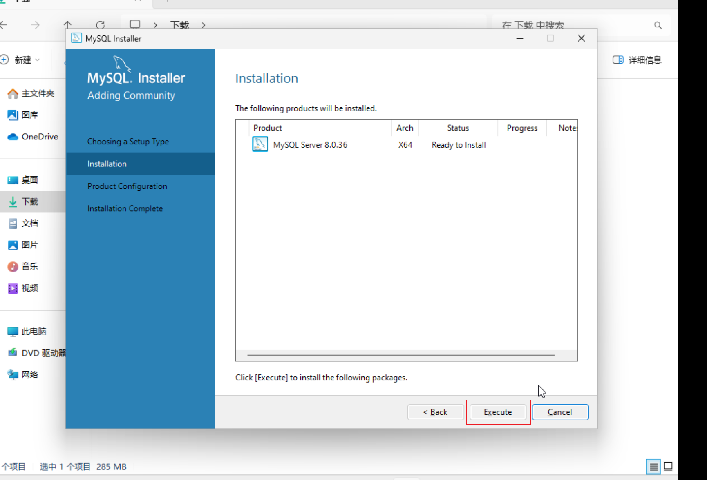

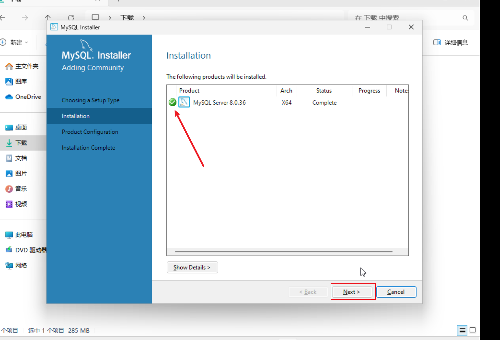

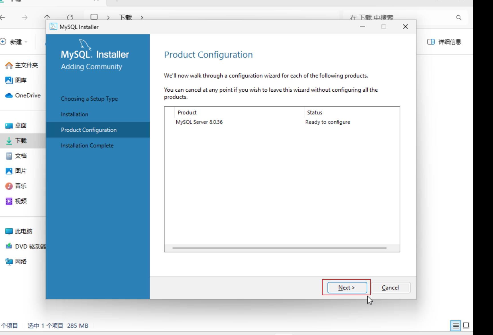

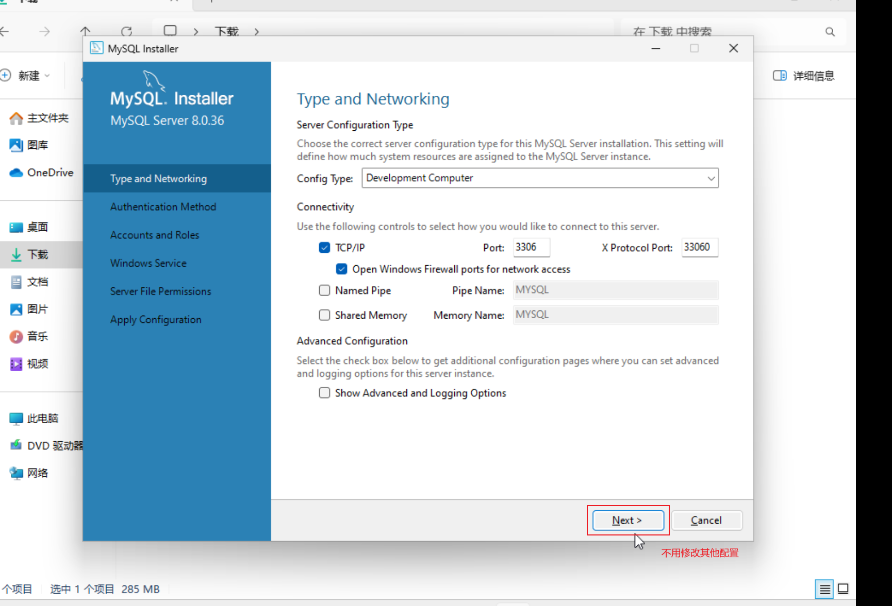

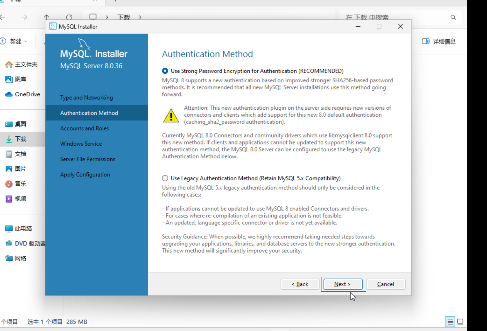

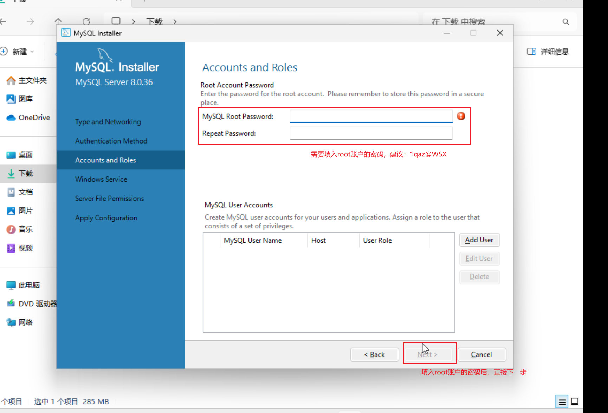

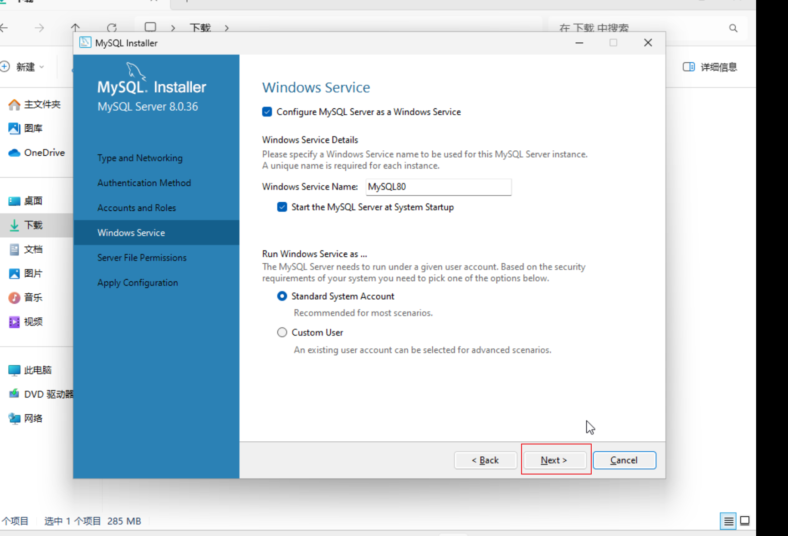

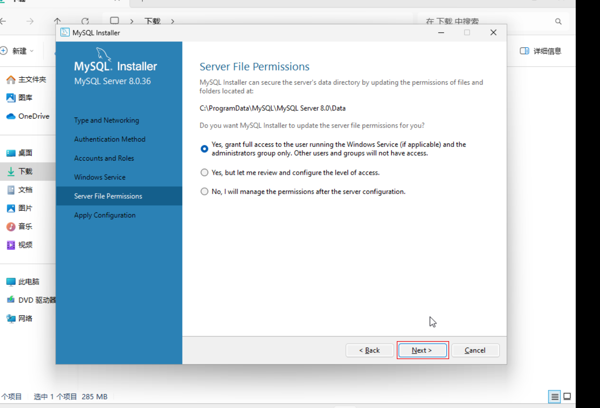

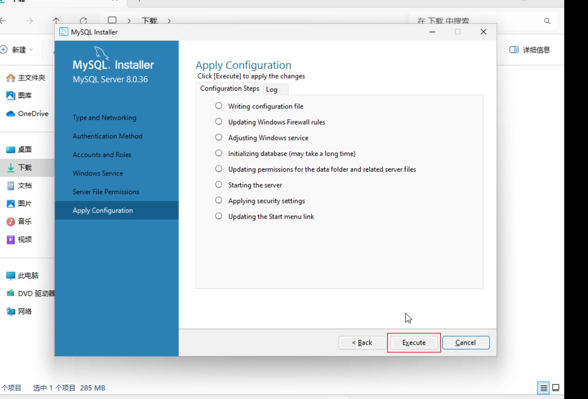

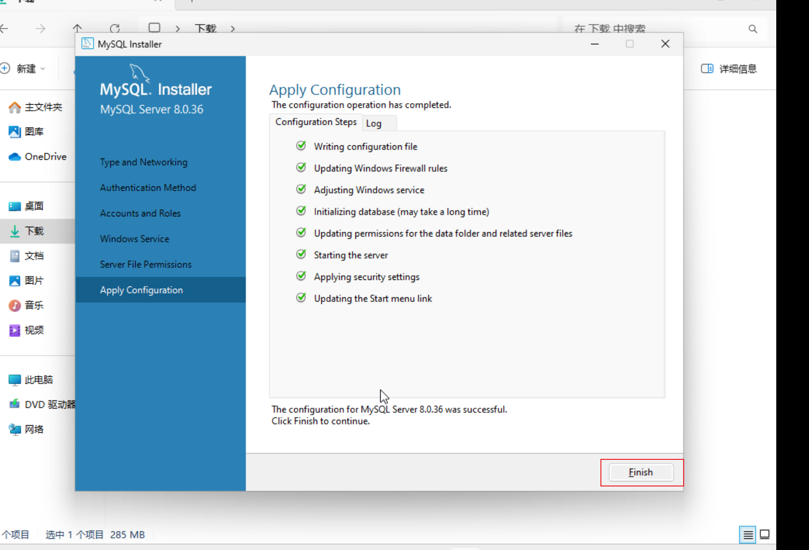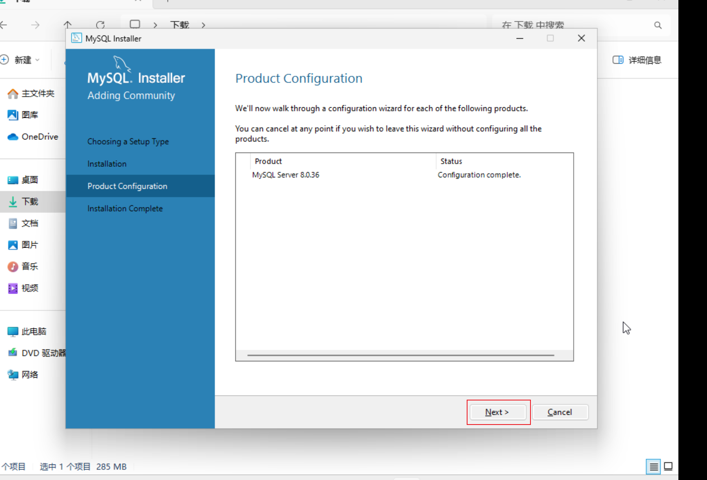

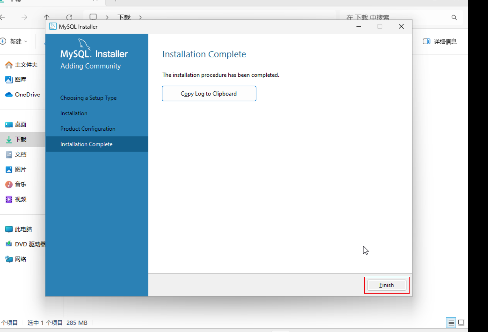

