## <font style="color:rgb(51, 51, 51);">创建索引有哪些注意点</font>
<font style="color:rgb(102, 102, 102);">索引虽然是sql性能优化的利器，但是索引的维护也是需要成本的，所以创建索引，也要注意：</font>

1. <font style="color:rgb(102, 102, 102);">索引应该建在查询应用频繁的字段，比如where 判断、 order 排序和 join 的(on)字段上创建索引。</font>
2. <font style="color:rgb(102, 102, 102);">索引的个数应该适量，索引需要占用空间，更新时候也需要维护。</font>
3. <font style="color:rgb(102, 102, 102);">区分度低的字段，例如性别，不要建索引。</font>
4. <font style="color:rgb(102, 102, 102);">频繁更新的值，不要作为索引，维护索引文件需要成本；还会导致页分裂，IO次数增多。</font>
5. <font style="color:rgb(102, 102, 102);">联合索引把散列性高(区分度高)的值放在前面为了更好的满足最左前缀匹配原则</font>
6. <font style="color:rgb(102, 102, 102);">尽可能用联合索引代替多个单列索引（对于单列索引，MySQL基本只能使用一个索引，所以经常使用多个条件查询时更适合使用联合索引）</font>
7. <font style="color:rgb(102, 102, 102);">过长的字段，使用前缀索引。当字段值比较长的时候，建立索引会消耗很多的空间，搜索起来也会很慢。我们可以通过截取字段的前面一部分内容建立索引，这个就叫前缀索引。</font>
8. <font style="color:rgb(102, 102, 102);">不建议用无序的值(例如身份证、UUID )作为索引，在插入时会造成叶子节点频繁分裂，出现磁盘存储的碎片化</font>

<font style="color:rgb(102, 102, 102);"></font>

## <font style="color:rgb(51, 51, 51);">索引哪些情况下会失效呢</font>
+ <font style="color:rgb(102, 102, 102);">查询条件包含or，可能导致索引失效</font>
+ <font style="color:rgb(102, 102, 102);">如果字段类型是字符串，where时一定用引号括起来，否则会因为隐式类型转换，索引失效</font>
+ <font style="color:rgb(102, 102, 102);">like通配符可能导致索引失效。</font>
+ <font style="color:rgb(102, 102, 102);">联合索引，查询时的条件列不是联合索引中的第一个列，索引失效。</font>
+ <font style="color:rgb(102, 102, 102);">在索引列上使用mysql的内置函数，索引失效。</font>
+ <font style="color:rgb(102, 102, 102);">对索引列运算（如，+、-、*、/），索引失效。</font>
+ <font style="color:rgb(102, 102, 102);">索引字段上使用（！= 或者 < >，not in）时，可能会导致索引失效。</font>
+ <font style="color:rgb(102, 102, 102);">索引字段上使用is null， is not null，可能导致索引失效。</font>
+ <font style="color:rgb(102, 102, 102);">左连接查询或者右连接查询查询关联的字段编码格式不一样，可能导致索引失效。</font>
+ <font style="color:rgb(102, 102, 102);">MySQL优化器估计使用全表扫描要比使用索引快,则不使用索引。</font>


## <font style="color:rgb(51, 51, 51);">解释下 MySQL 事务的四大特性ACID以及实现原理</font>
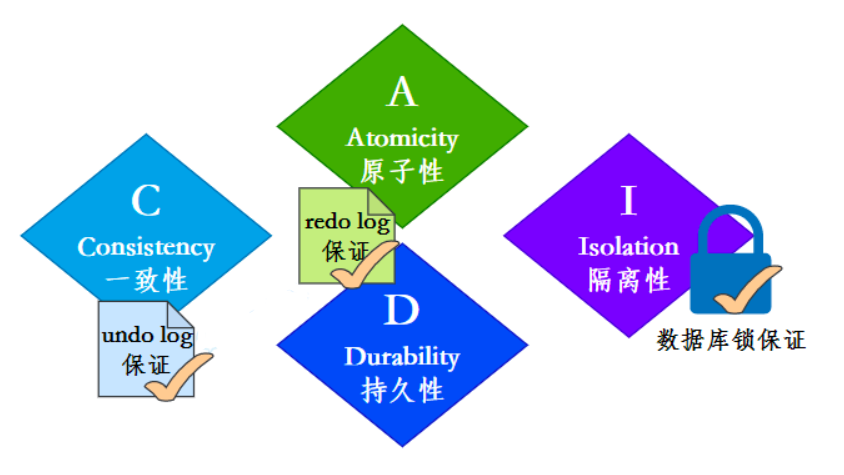

<font style="color:rgb(136, 136, 136);">事务四大特性</font>

**ACID四大特性：**

+ <font style="color:rgb(1, 1, 1);">原子性(</font><font style="color:rgb(51, 51, 51);">Atomicity</font><font style="color:rgb(1, 1, 1);">)：事务作为一个整体被执行，包含在其中的对数据库的操作要么全部被执行，要么都不执行。</font>
+ <font style="color:rgb(1, 1, 1);">一致性(</font><font style="color:rgb(51, 51, 51);">Consistency</font><font style="color:rgb(1, 1, 1);">)：指在事务开始之前和事务结束以后，数据不会被破坏，假如 A 账户给 B 账户转 10 块钱，不管成功与否，A 和 B 的总金额是不变的。</font>
+ <font style="color:rgb(1, 1, 1);">隔离性(</font><font style="color:rgb(51, 51, 51);">Isolation</font><font style="color:rgb(1, 1, 1);">)：多个事务并发访问时，事务之间是相互隔离的，即一个事务不影响其它事务运行效果。</font>
+ <font style="color:rgb(1, 1, 1);">持久性(</font><font style="color:rgb(51, 51, 51);">Durability</font><font style="color:rgb(1, 1, 1);">)：表示事务完成以后，该事务对数据库所作的操作更改，将持久地保存在数据库之中。</font>

**ACID实现原理：**

+ <font style="color:rgb(1, 1, 1);">事务的</font><font style="color:rgb(22, 94, 202);">隔离性</font><font style="color:rgb(1, 1, 1);">是通过数据库锁以及MVCC机制实现的。</font>
+ <font style="color:rgb(1, 1, 1);">事务的</font><font style="color:rgb(22, 94, 202);">一致性</font><font style="color:rgb(1, 1, 1);">由undo log来保证：undo log是逻辑日志，记录了事务的insert、update、delete操作，回滚的时候做相反的delete、update、insert操作来恢复数据。</font>
+ <font style="color:rgb(1, 1, 1);">事务的</font><font style="color:rgb(22, 94, 202);">原子性</font><font style="color:rgb(1, 1, 1);">和</font><font style="color:rgb(22, 94, 202);">持久性</font><font style="color:rgb(1, 1, 1);">由redo log来保证：redo log被称作重做日志，是物理日志，事务提交的时候，必须先将事务的所有日志写入redo log持久化，到事务的提交操作才算完成。</font>

## <font style="color:rgb(51, 51, 51);"></font>
## <font style="color:rgb(51, 51, 51);">事务的各个隔离级别都是如何实现的</font>
**<font style="color:rgb(22, 94, 202);">读未提交</font>**

<font style="color:rgb(102, 102, 102);">读未提交，就不用多说了，采取的是读不加锁原理。</font>

+ **<font style="color:rgb(1, 1, 1);">事务读不加锁，不阻塞其他事务的读和写</font>**
+ **<font style="color:rgb(1, 1, 1);">事务写阻塞其他事务写，但不阻塞其他事务读；</font>**

**<font style="color:rgb(22, 94, 202);">读已提交&可重复读</font>**

<font style="color:rgb(102, 102, 102);">读取已提交和可重复读级别利用了</font><font style="color:rgb(92, 157, 255);">ReadView</font><font style="color:rgb(102, 102, 102);">和</font><font style="color:rgb(92, 157, 255);">MVCC</font><font style="color:rgb(102, 102, 102);">，也就是每个事务只能读取它能看到的版本（ReadView）。</font>

+ **<font style="color:rgb(1, 1, 1);">READ COMMITTED：每次读取数据前都生成一个ReadView</font>**
+ **<font style="color:rgb(1, 1, 1);">REPEATABLE READ ：在事务里第一次读取数据时生成一个ReadView</font>**

**<font style="color:rgb(22, 94, 202);">串行化</font>**

<font style="color:rgb(102, 102, 102);">串行化的实现采用的是读写都加锁的原理。</font>

<font style="color:rgb(102, 102, 102);">串行化的情况下，对于同一行事务，</font><font style="color:rgb(92, 157, 255);">写</font><font style="color:rgb(102, 102, 102);">会加</font><font style="color:rgb(92, 157, 255);">写锁</font><font style="color:rgb(102, 102, 102);">，</font><font style="color:rgb(92, 157, 255);">读</font><font style="color:rgb(102, 102, 102);">会加</font><font style="color:rgb(92, 157, 255);">读锁</font><font style="color:rgb(102, 102, 102);">。当出现读写锁冲突的时候，后访问的事务必须等前一个事务执行完成，才能继续执行。</font>

<font style="color:rgb(102, 102, 102);"></font>

<font style="color:rgb(102, 102, 102);"></font>

## <font style="color:rgb(51, 51, 51);">Mysql主从复制原理了解吗</font>
+ <font style="color:rgb(1, 1, 1);">master数据写入，更新binlog</font>
+ <font style="color:rgb(1, 1, 1);">master创建一个dump线程向slave推送binlog</font>
+ <font style="color:rgb(1, 1, 1);">slave连接到master的时候，会创建一个IO线程接收binlog，并记录到relay log中继日志中</font>
+ <font style="color:rgb(1, 1, 1);">slave再开启一个sql线程读取relay log事件并在slave执行，完成同步</font>
+ <font style="color:rgb(1, 1, 1);">slave记录自己的binglog</font>

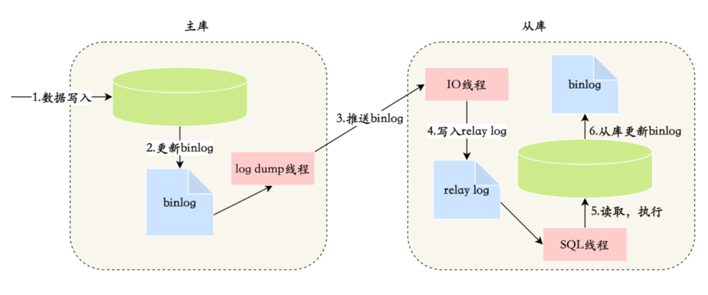

<font style="color:rgb(136, 136, 136);">主从复制</font>

## <font style="color:rgb(51, 51, 51);">Mysql主从同步延迟怎么处理</font>
**<font style="color:rgb(22, 94, 202);">主从同步延迟的原因</font>**

<font style="color:rgb(102, 102, 102);">当数据库主库有较大更新并发操作时，可能会导致主从同步延迟，因为从库里面读取 binlog 的线程仅有一个，当某个 SQL 在从库上执行的时间稍长 或者由于某个 SQL 要进行锁表就会导致主从同步延迟，主库的 SQL 大量积压，未被同步到从库里。这就导致了主从不一致， 也就是主从延迟。</font>

**<font style="color:rgb(22, 94, 202);">主从同步延迟的解决办法</font>**

<font style="color:rgb(102, 102, 102);">解决主从复制延迟有几种常见的方法:</font>

1. **<font style="color:rgb(1, 1, 1);">写操作后的读操作指定发给数据库主库</font>**

<font style="color:rgb(102, 102, 102);">例如，注册账号完成后，登录时读取账号的读操作也发给数据库主库。这种方式和业务强绑定，对业务的侵入和影响较大，如果哪个新来的程序员不知道这样写代码，就会导致一个bug。</font>

2. **<font style="color:rgb(1, 1, 1);">读从库失败后再读一次主库</font>**

<font style="color:rgb(102, 102, 102);">这就是通常所说的 "二次读取" ，二次读取和业务无绑定，只需要对底层数据库访问的 API 进行封装即可，实现代价较小，不足之处在于如果有很多二次读取，将大大增加主库的读操作压力。例如，黑客暴力破解账号，会导致大量的二次读取操作，主库可能顶不住读操作的压力从而崩溃。</font>

3. **<font style="color:rgb(1, 1, 1);">关键业务读写操作全部指向主库，非关键业务采用读写分离</font>**

<font style="color:rgb(102, 102, 102);">例如，对于一个用户管理系统来说，注册 + 登录的业务读写操作全部访问主库，用户的介绍、爰好、等级等业务，可以采用读写分离，因为即使用户改了自己的自我介绍，在查询时却看到了自我介绍还是旧的，业务影响与不能登录相比就小很多，业务上一般可以接受。</font>


## <font style="color:rgb(51, 51, 51);">水平分表有哪几种路由方式</font>
<font style="color:rgb(102, 102, 102);">什么是路由呢？就是数据应该分到哪一张表。</font>

<font style="color:rgb(102, 102, 102);">水平分表主要有三种路由方式：</font>

+ **<font style="color:rgb(22, 94, 202);">范围路由</font>****<font style="color:rgb(1, 1, 1);">：选取有序的数据列 （例如，整型、时间戳等） 作为路由的条件，不同分段分散到不同的数据库表中。</font>**

<font style="color:rgb(102, 102, 102);">我们可以观察一些支付系统，发现只能查一年范围内的支付记录，这个可能就是支付公司按照时间进行了分表。</font>

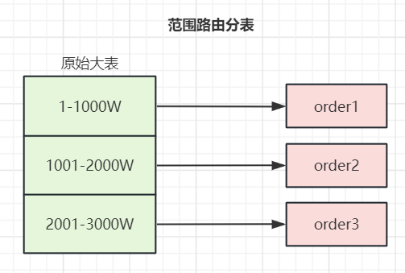

<font style="color:rgb(136, 136, 136);">范围路由</font>

<font style="color:rgb(102, 102, 102);">范围路由设计的复杂点主要体现在</font>**<font style="color:rgb(102, 102, 102);">分段大小的选取</font>**<font style="color:rgb(102, 102, 102);">上，分段太小会导致切分后子表数量过多，增加维护复杂度；分段太大可能会导致单表依然存在性能问题，一般建议分段大小在 100 万至1000 万之间，具体需要根据业务选取合适的分段大小。</font>

<font style="color:rgb(102, 102, 102);">范围路由的优点是可以随着数据的增加平滑地扩充新的表。例如，现在的用户是 100 万，如果增加到 1100 万，只需要增加新的表就可以了，原有的数据不需要动。范围路由的一个比较隐含的缺点是分布不均匀，假如按照  1000 万来进行分表，有可能某个分段实际存储的数据量只有 1000 条，而另外一个分段实际存储的数据量有 1000 万条，还有，可能会导致某一段时间对某一张表的访问过于集中导致性能问题。</font>

+ **<font style="color:rgb(22, 94, 202);">Hash 路由</font>****<font style="color:rgb(1, 1, 1);">：选取某个列 （或者某几个列组合也可以） 的值进行 Hash 运算，然后根据 Hash 结果分散到不同的数据库表中。</font>**

<font style="color:rgb(102, 102, 102);">同样以订单 id  为例，假如我们一开始就规划了 4个数据库表，路由算法可以简单地用 id % 4 的值来表示数据所属的数据库表编号，id 为 12的订单放到编号为 0 的子表中，id为 13的订单放到编号为 1 的子表中。</font>

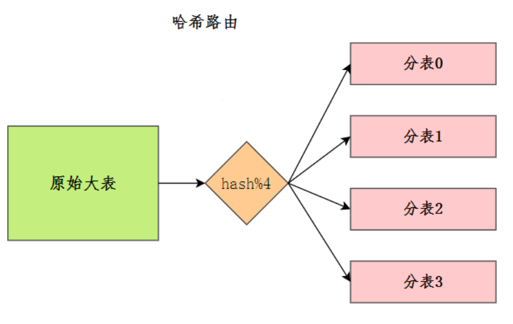

<font style="color:rgb(136, 136, 136);">Hash路由</font>

<font style="color:rgb(102, 102, 102);">Hash 路由设计的复杂点主要体现在</font>**<font style="color:rgb(102, 102, 102);">初始表数量</font>**<font style="color:rgb(102, 102, 102);">的选取上，表数量太多维护比较麻烦，表数量太少又可能导致单表性能存在问题。而用了 Hash 路由后，增加子表数量是非常麻烦的，所有数据都要重分布。Hash 路由的优缺点和范围路由基本相反，Hash 路由的优点是表数据分布比较均匀，不会出现对某张表过于集中访问的问题，缺点是扩充新的表很麻烦，所有数据都要重分布。</font>

+ **<font style="color:rgb(22, 94, 202);">配置路由</font>****<font style="color:rgb(1, 1, 1);">：配置路由就是路由表，用一张独立的表来记录路由信息。同样以订单id 为例，我们新增一张 order_router 表，这个表包含 order_id 和 table_id 两列 , 根据 order_id 就可以查询对应的 table_id。</font>**

<font style="color:rgb(102, 102, 102);">配置路由设计简单，使用起来非常灵活，尤其是在扩充表的时候，只需要迁移指定的数据，然后修改路由表就可以了。</font>

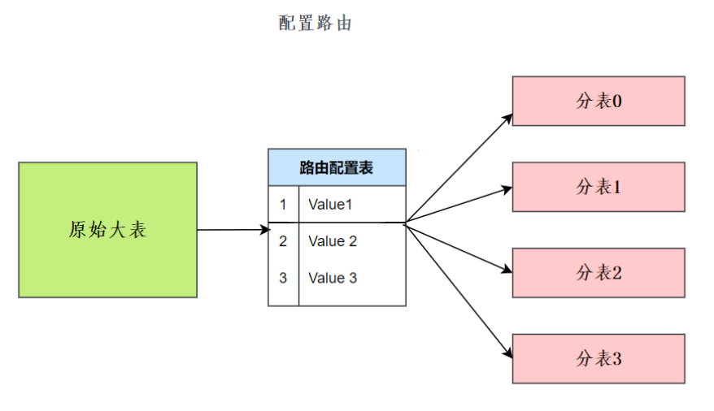

<font style="color:rgb(136, 136, 136);">配置路由</font>

<font style="color:rgb(102, 102, 102);">配置路由的缺点就是必须多查询一次，会影响整体性能；而且路由表本身如果太大（例如，几亿条数据） ，性能同样可能成为瓶颈，如果我们再次将路由表分库分表，则又面临一个死循环式的路由算法选择问题。</font>

<font style="color:rgb(102, 102, 102);"></font>

## <font style="color:rgb(51, 51, 51);">分库分表后如何实现不停机扩容</font>
<font style="color:rgb(102, 102, 102);">实际上，不停机扩容，实操起来是个非常麻烦而且很有风险的操作，当然，面试回答起来就简单很多。</font>

+ **<font style="color:rgb(22, 94, 202);">第一阶段：在线双写，查询走老库</font>**
    1. **<font style="color:rgb(102, 102, 102);">建立好新的库表结构，数据写入老库的同时，也写入拆分的新库</font>**
    2. **<font style="color:rgb(102, 102, 102);">数据迁移，使用数据迁移程序，将旧库中的历史数据迁移到新库</font>**
    3. **<font style="color:rgb(102, 102, 102);">使用定时任务，新旧库的数据对比，把差异补齐</font>**

**<font style="color:rgb(136, 136, 136);">第一阶段</font>**

+ **<font style="color:rgb(22, 94, 202);">第二阶段：在线双写，查询走新库</font>**
    1. **<font style="color:rgb(102, 102, 102);">完成了历史数据的同步和校验</font>**
    2. **<font style="color:rgb(102, 102, 102);">把对数据的读切换到新库</font>**

**<font style="color:rgb(136, 136, 136);">第二阶段</font>**

+ **<font style="color:rgb(22, 94, 202);">第三阶段：旧库下线</font>**
    1. **<font style="color:rgb(1, 1, 1);">旧库不再写入新的数据</font>**
    2. **<font style="color:rgb(1, 1, 1);">经过一段时间，确定旧库没有请求之后，就可以下线老库</font>**

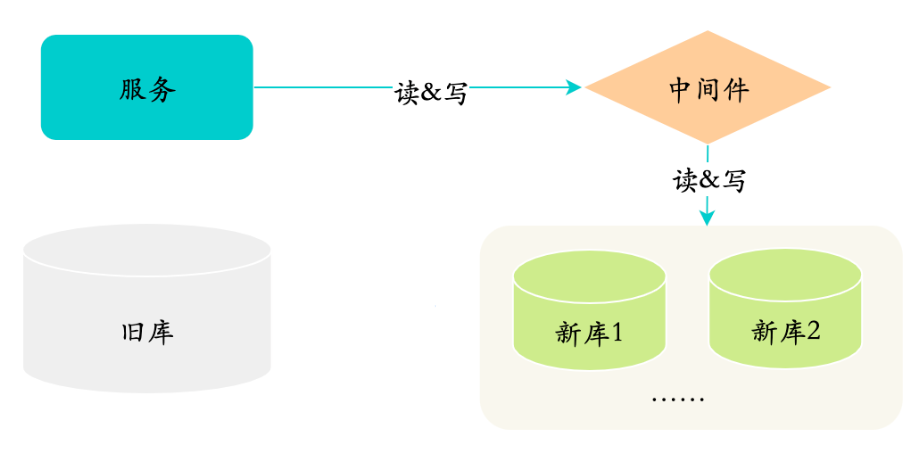

<font style="color:rgb(136, 136, 136);">第三阶段</font>

<font style="color:rgb(136, 136, 136);"></font>

## <font style="color:rgb(51, 51, 51);">分库分表会带来什么问题</font>
**<font style="color:rgb(102, 102, 102);">从分库的角度来讲：</font>**

+ **<font style="color:rgb(22, 94, 202);">事务的问题</font>**

<font style="color:rgb(102, 102, 102);">使用关系型数据库，有很大一点在于它保证事务完整性。</font>

<font style="color:rgb(102, 102, 102);">而分库之后单机事务就用不上了，必须使用分布式事务来解决。</font>

+ **<font style="color:rgb(22, 94, 202);">跨库 JOIN 问题</font>**

<font style="color:rgb(102, 102, 102);">在一个库中的时候我们还可以利用 JOIN 来连表查询，而跨库了之后就无法使用 JOIN 了。</font>

<font style="color:rgb(102, 102, 102);">此时的解决方案就是</font>**<font style="color:rgb(22, 94, 202);">在业务代码中进行关联</font>**<font style="color:rgb(102, 102, 102);">，也就是先把一个表的数据查出来，然后通过得到的结果再去查另一张表，然后利用代码来关联得到最终的结果。</font>

<font style="color:rgb(102, 102, 102);">这种方式实现起来稍微比较复杂，不过也是可以接受的。</font>

<font style="color:rgb(102, 102, 102);">还有可以</font>**<font style="color:rgb(22, 94, 202);">适当的冗余一些字段</font>**<font style="color:rgb(102, 102, 102);">。比如以前的表就存储一个关联 ID，但是业务时常要求返回对应的 Name 或者其他字段。这时候就可以把这些字段冗余到当前表中，来去除需要关联的操作。</font>

<font style="color:rgb(102, 102, 102);">还有一种方式就是</font>**<font style="color:rgb(22, 94, 202);">数据异构</font>**<font style="color:rgb(102, 102, 102);">，通过binlog同步等方式，把需要跨库join的数据同步到</font>**<font style="color:rgb(102, 102, 102);">ES的大宽表</font>**<font style="color:rgb(102, 102, 102);">里去，通过ES直接查询，效率很高。</font>

**<font style="color:rgb(102, 102, 102);">从分表的角度来看：</font>**

+ **<font style="color:rgb(22, 94, 202);">跨节点的 count,order by,group by 以及聚合函数问题</font>**

<font style="color:rgb(102, 102, 102);">只能由业务代码来实现或者用中间件将各表中的数据汇总、排序、分页然后返回。</font>

+ **<font style="color:rgb(22, 94, 202);">数据迁移，容量规划，扩容等问题</font>**

<font style="color:rgb(102, 102, 102);">数据的迁移，容量如何规划，未来是否可能再次需要扩容，等等，都是需要考虑的问题。</font>

+ **<font style="color:rgb(22, 94, 202);">ID 问题</font>**

<font style="color:rgb(102, 102, 102);">数据库表被切分后，不能再依赖数据库自身的主键自增生成机制，所以需要一些手段来保证全局主键唯一。</font>

1. <font style="color:rgb(1, 1, 1);">还是自增，只不过自增步长设置一下。比如现在有三张表，步长设置为3，三张表 ID 初始值分别是1、2、3。这样第一张表的 ID 增长是 1、4、7。第二张表是2、5、8。第三张表是3、6、9，这样就不会重复了。</font>
2. <font style="color:rgb(1, 1, 1);">UUID，这种最简单，但是不连续的主键插入会导致严重的页分裂，性能比较差。</font>
3. <font style="color:rgb(1, 1, 1);">分布式 ID，比较出名的就是 Twitter 开源的 sonwflake 雪花算法</font>

<font style="color:rgb(1, 1, 1);"></font>

## <font style="color:rgb(51, 51, 51);">MySQL 数据库 cpu 飙升怎么解决</font>
<font style="color:rgb(102, 102, 102);">排查过程：</font>

<font style="color:rgb(102, 102, 102);">（1）使用 top 命令观察，确定是 mysqld 导致还是其他原因。</font>

<font style="color:rgb(102, 102, 102);">（2）如果是 mysqld 导致的，show processlist，查看 session 情况，确定是不是有消耗资源的 sql 在运行。</font>

<font style="color:rgb(102, 102, 102);">（3）找出消耗高的 sql，看看执行计划是否准确， 索引是否缺失，数据量是否太大。</font>

<font style="color:rgb(102, 102, 102);">处理：</font>

<font style="color:rgb(102, 102, 102);">（1）kill 掉这些线程 (同时观察 cpu 使用率是否下降)，</font>

<font style="color:rgb(102, 102, 102);">（2）进行相应的调整 (比如说加索引、改 sql、改内存参数)</font>

<font style="color:rgb(102, 102, 102);">（3）重新跑这些 SQL。</font>

<font style="color:rgb(102, 102, 102);">其他情况：</font>

<font style="color:rgb(102, 102, 102);">也有可能是每个 sql 消耗资源并不多，但是突然之间，有大量的 session 连进来导致 cpu 飙升，这种情况就需要跟应用一起来分析为何连接数会激增，再做出相应的调整，比如说限制连接数等。</font>


## <font style="color:rgb(51, 51, 51);">启动线程为什么是运行start()方法而不是run()方法</font>
<font style="color:rgb(74, 74, 74);">JVM执行start方法，会先创建一条线程，由创建出来的新线程去执行thread的run方法，这才起到多线程的效果。如果直接调用Thread的run()方法，那么run方法还是运行在主线程中，相当于顺序执行，就起不到多线程的效果。</font>


<font style="color:rgb(136, 136, 136);">start方法</font>

<font style="color:rgb(74, 74, 74);"></font>

## 守护线程了解吗
<font style="color:rgb(74, 74, 74);">Java中的线程分为两类，分别为 daemon 线程（守护线程）和 user 线程（用户线程）。</font>

<font style="color:rgb(74, 74, 74);">在JVM 启动时会调用 main 函数，main函数所在的钱程就是一个用户线程。其实在 JVM 内部同时还启动了很多守护线程， 比如垃圾回收线程。</font>

<font style="color:rgb(74, 74, 74);">那么守护线程和用户线程有什么区别呢？区别之一是当最后一个非守护线程束时， JVM会正常退出，而不管当前是否存在守护线程，也就是说守护线程是否结束并不影响 JVM退出。换而言之，只要有一个用户线程还没结束，正常情况下JVM就不会退出。</font>

## 
## 线程间有哪些通信方式
+ **<font style="color:rgb(74, 74, 74);">volatile和synchronized关键字</font>**

<font style="color:rgb(74, 74, 74);">关键字volatile可以用来修饰字段（成员变量），就是告知程序任何对该变量的访问均需要从共享内存中获取，而对它的改变必须同步刷新回共享内存，它能保证所有线程对变量访问的可见性，从而间接实现线程之间数据的通信。</font>

<font style="color:rgb(74, 74, 74);">关键字synchronized可以修饰方法或者以同步块的形式来进行使用，它主要确保多个线程在同一个时刻，只能有一个线程处于方法或者同步块中，它保证了线程对变量访问的可见性和排他性。</font>

+ **<font style="color:rgb(74, 74, 74);">等待/通知机制</font>**

<font style="color:rgb(74, 74, 74);">可以通过Java内置的等待/通知机制（wait()/notify()）实现一个线程修改一个对象的值，而另一个线程感知到了变化，然后进行相应的操作。</font>

+ **<font style="color:rgb(74, 74, 74);">管道输入/输出流</font>**

<font style="color:rgb(74, 74, 74);">管道输入/输出流和普通的文件输入/输出流或者网络输入/输出流不同之处在于，它主要用于线程之间的数据传输，而传输的媒介为内存。</font>

<font style="color:rgb(74, 74, 74);">管道输入/输出流主要包括了如下4种具体实现：PipedOutputStream、PipedInputStream、 PipedReader和PipedWriter，前两种面向字节，而后两种面向字符。</font>

+ **<font style="color:rgb(74, 74, 74);">使用Thread.join()</font>**

<font style="color:rgb(74, 74, 74);">如果一个线程A执行了thread.join()语句，其含义是：当前线程A等待thread线程运行结束之后再继续往下运行，这意味着thread线程执行修改的数据是肯定可以被线程A读取到的。</font>

# 
## ThreadLocal是什么
<font style="color:rgb(74, 74, 74);">ThreadLocal，也就是线程本地变量。如果你创建了一个ThreadLocal变量，那么访问这个变量的每个线程都会有这个变量的一个本地拷贝，多个线程操作这个变量的时候，实际是操作自己本地内存里面的变量，从而起到线程隔离的作用，避免了线程安全问题。</font>

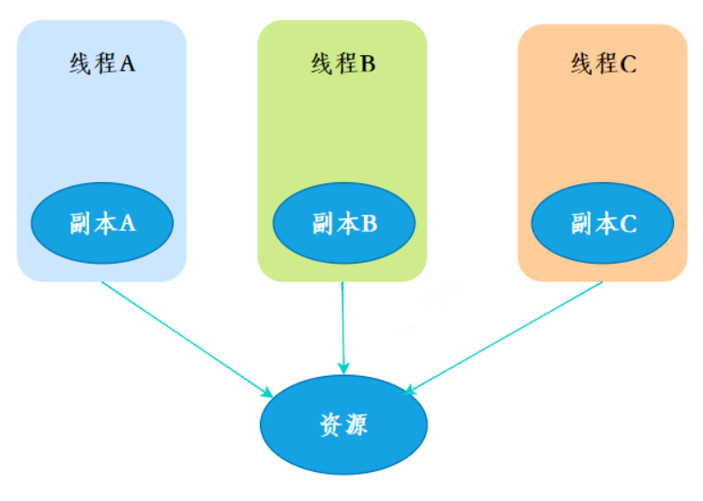

<font style="color:rgb(136, 136, 136);">ThreadLocal线程副本</font>

+ <font style="color:rgb(1, 1, 1);">创建</font>

<font style="color:rgb(74, 74, 74);">创建了一个ThreadLoca变量localVariable，任何一个线程都能并发访问localVariable。</font>

```plain
//创建一个ThreadLocal变量
public static ThreadLocal<String> localVariable = new ThreadLocal<>();
```

+ <font style="color:rgb(1, 1, 1);">写入</font>

<font style="color:rgb(74, 74, 74);">线程可以在任何地方使用localVariable，写入变量。</font>

```plain
localVariable.set("test”);
```

+ <font style="color:rgb(1, 1, 1);">读取</font>

<font style="color:rgb(74, 74, 74);">线程在任何地方读取的都是它之前写入的变量值，而不会被其他线程的操作影响。</font>

```plain
localVariable.get();
```

## 
## ThreadLocal有哪些应用场景
#### <font style="color:rgb(112, 112, 112);">1.线程池技术</font>
<font style="color:rgb(42, 42, 42);">使用线程池执行多个任务时，为了避免线程间数据冲突，可以使用ThreadLocal存储每个线程独有的数据，这样就可以安全地在多个线程间共享线程池。</font>

#### <font style="color:rgb(112, 112, 112);">2.Web应用程序</font>
<font style="color:rgb(42, 42, 42);">在Web应用中，每个请求通常都会被分配到不同的线程处理，ThreadLocal可以用来存储当前请求的上下文信息，比如用户ID、请求时间等，这些信息可以在同一个请求处理过程中多次使用，特别是一个请求嵌套调用很多方法的时候可以使用，但是不同请求之间是互相独立的。</font>

#### <font style="color:rgb(112, 112, 112);">3.数据库连接</font>
<font style="color:rgb(42, 42, 42);">在多线程环境下，为了避免每个线程都去创建和销毁数据库连接，可以使用连接池技术。使用ThreadLocal可以将连接池中的数据库连接与当前线程绑定，确保每个线程都能够得到自己独有的数据库连接，避免数据混乱和线程安全问题。</font>

## 
## ThreadLocal怎么实现的
<font style="color:rgb(74, 74, 74);">我们看一下ThreadLocal的set(T)方法，发现先获取到当前线程，再获取</font><font style="color:rgb(40, 202, 113);">ThreadLocalMap</font><font style="color:rgb(74, 74, 74);">，然后把元素存到这个map中。</font>

```plain
public void set(T value) {
        //获取当前线程
        Thread t = Thread.currentThread();
        //获取ThreadLocalMap
        ThreadLocalMap map = getMap(t);
        //讲当前元素存入map
        if (map != null)
            map.set(this, value);
        else
            createMap(t, value);
    }
```

<font style="color:rgb(74, 74, 74);">ThreadLocal实现的秘密都在这个</font><font style="color:rgb(40, 202, 113);">ThreadLocalMap</font><font style="color:rgb(74, 74, 74);">了，可以Thread类中定义了一个类型为</font><font style="color:rgb(40, 202, 113);">ThreadLocal.ThreadLocalMap</font><font style="color:rgb(74, 74, 74);">的成员变量</font><font style="color:rgb(40, 202, 113);">threadLocals</font><font style="color:rgb(74, 74, 74);">。</font>

```plain
public class Thread implements Runnable {
   //ThreadLocal.ThreadLocalMap是Thread的属性
   ThreadLocal.ThreadLocalMap threadLocals = null;
}
```

<font style="color:rgb(74, 74, 74);">ThreadLocalMap既然被称为Map，那么毫无疑问它是<key,value>型的数据结构。我们都知道map的本质是一个个<key,value>形式的节点组成的数组，那ThreadLocalMap的节点是什么样的呢？</font>

```plain
static class Entry extends WeakReference<ThreadLocal<?>> {
            /** The value associated with this ThreadLocal. */
            Object value;

            //节点类
            Entry(ThreadLocal<?> k, Object v) {
                //key赋值
                super(k);
                //value赋值
                value = v;
            }
        }
```

<font style="color:rgb(74, 74, 74);">这里的节点，key可以简单低视作ThreadLocal，value为代码中放入的值，当然实际上key并不是ThreadLocal本身，而是它的一个</font>**<font style="color:rgb(74, 74, 74);">弱引用</font>**<font style="color:rgb(74, 74, 74);">，可以看到Entry的key继承了 WeakReference（弱引用），再来看一下key怎么赋值的：</font>

```plain
public WeakReference(T referent) {
        super(referent);
    }
```

<font style="color:rgb(74, 74, 74);">key的赋值，使用的是WeakReference的赋值。</font>

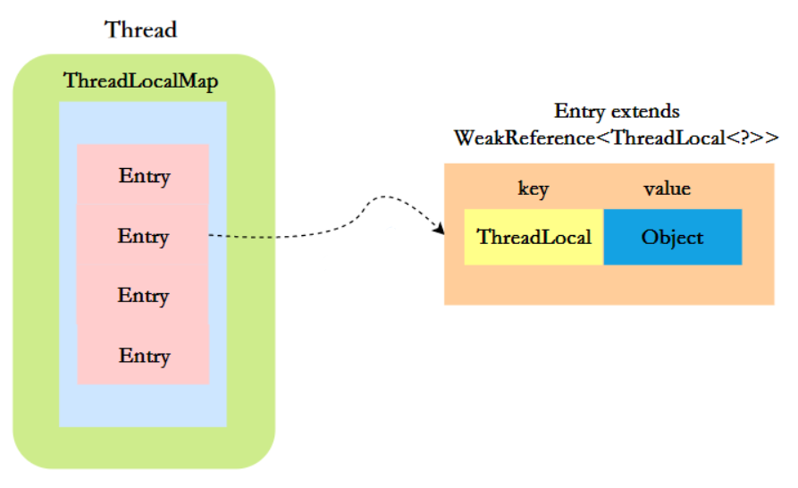

<font style="color:rgb(136, 136, 136);">ThreadLoca结构图</font>

<font style="color:rgb(89, 89, 89);background-color:rgb(251, 249, 253);">所以，怎么回答ThreadLocal原理？要答出这几个点：</font>

+ <font style="color:rgb(1, 1, 1);">Thread类有一个类型为ThreadLocal.ThreadLocalMap的实例变量threadLocals，每个线程都有一个属于自己的ThreadLocalMap。</font>
+ <font style="color:rgb(1, 1, 1);">ThreadLocalMap内部维护着Entry数组，每个Entry代表一个完整的对象，key是ThreadLocal的弱引用，value是ThreadLocal的泛型值。</font>
+ <font style="color:rgb(1, 1, 1);">每个线程在往ThreadLocal里设置值的时候，都是往自己的ThreadLocalMap里存，读也是以某个ThreadLocal作为引用，在自己的map里找对应的key，从而实现了线程隔离。</font>
+ <font style="color:rgb(1, 1, 1);">ThreadLocal本身不存储值，它只是作为一个key来让线程往ThreadLocalMap里存取值。</font>

## 
## ThreadLocal 内存泄露是怎么回事
<font style="color:rgb(74, 74, 74);">我们先来分析一下使用ThreadLocal时的内存，我们都知道，在JVM中，栈内存线程私有，存储了对象的引用，堆内存线程共享，存储了对象实例。</font>

<font style="color:rgb(74, 74, 74);">所以呢，栈中存储了ThreadLocal、Thread的引用，堆中存储了它们的具体实例。</font>

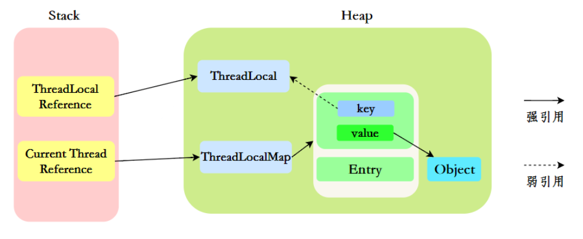

<font style="color:rgb(136, 136, 136);">ThreadLocal内存分配</font>

<font style="color:rgb(74, 74, 74);">ThreadLocalMap中使用的 key 为 ThreadLocal 的弱引用。</font>

<font style="color:rgb(89, 89, 89);background-color:rgb(251, 249, 253);">“弱引用：只要垃圾回收机制一运行，不管JVM的内存空间是否充足，都会回收该对象占用的内存。”</font>

<font style="color:rgb(74, 74, 74);">那么现在问题就来了，弱引用很容易被回收，如果ThreadLocal（ThreadLocalMap的Key）被垃圾回收器回收了，但是ThreadLocalMap生命周期和Thread是一样的，它这时候如果不被回收，就会出现这种情况：ThreadLocalMap的key没了，value还在，这就会</font>**<font style="color:rgb(74, 74, 74);">造成了内存泄漏问题</font>**<font style="color:rgb(74, 74, 74);">。</font>

<font style="color:rgb(89, 89, 89);background-color:rgb(251, 249, 253);">那怎么解决内存泄漏问题呢？</font>

<font style="color:rgb(74, 74, 74);">很简单，使用完ThreadLocal后，及时调用remove()方法释放内存空间。</font>

```plain
ThreadLocal<String> localVariable = new ThreadLocal();
try {
    localVariable.set("鄙人三某”);
    ……
} finally {
    localVariable.remove();
}
```

<font style="color:rgb(89, 89, 89);background-color:rgb(251, 249, 253);">那为什么key还要设计成弱引用？</font>

<font style="color:rgb(74, 74, 74);">key设计成弱引用同样是为了防止内存泄漏。</font>

<font style="color:rgb(74, 74, 74);">假如key被设计成强引用，如果ThreadLocal Reference被销毁，此时它指向ThreadLoca的强引用就没有了，但是此时key还强引用指向ThreadLoca，就会导致ThreadLocal不能被回收，这时候就发生了内存泄漏的问题。</font>

## 
## ThreadLocalMap的结构了解吗
<font style="color:rgb(74, 74, 74);">ThreadLocalMap虽然被叫做Map，其实它是没有实现Map接口的，但是结构还是和HashMap比较类似的，主要关注的是两个要素：</font><font style="color:rgb(40, 202, 113);">元素数组</font><font style="color:rgb(74, 74, 74);">和</font><font style="color:rgb(40, 202, 113);">散列方法</font><font style="color:rgb(74, 74, 74);">。</font>

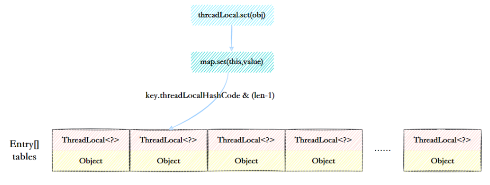

<font style="color:rgb(136, 136, 136);">ThreadLocalMap结构示意图</font>

+ <font style="color:rgb(74, 74, 74);">元素数组</font><font style="color:rgb(74, 74, 74);">一个table数组，存储Entry类型的元素，Entry是ThreaLocal弱引用作为key，Object作为value的结构。</font>

```plain
private Entry[] table;
```

+ <font style="color:rgb(74, 74, 74);">散列方法</font><font style="color:rgb(74, 74, 74);">散列方法就是怎么把对应的key映射到table数组的相应下标，ThreadLocalMap用的是哈希取余法，取出key的threadLocalHashCode，然后和table数组长度减一&运算（相当于取余）。</font>

```plain
int i = key.threadLocalHashCode & (table.length - 1);
```

<font style="color:rgb(74, 74, 74);">这里的threadLocalHashCode计算有点东西，每创建一个ThreadLocal对象，它就会新增</font><font style="color:rgb(40, 202, 113);">0x61c88647</font><font style="color:rgb(74, 74, 74);">，这个值很特殊，它是</font>**<font style="color:rgb(74, 74, 74);">斐波那契数</font>**<font style="color:rgb(74, 74, 74);"> </font><font style="color:rgb(74, 74, 74);"> 也叫</font><font style="color:rgb(74, 74, 74);"> </font>**<font style="color:rgb(74, 74, 74);">黄金分割数</font>**<font style="color:rgb(74, 74, 74);">。</font><font style="color:rgb(40, 202, 113);">hash</font><font style="color:rgb(74, 74, 74);">增量为 这个数字，带来的好处就是</font><font style="color:rgb(74, 74, 74);"> </font><font style="color:rgb(40, 202, 113);">hash</font><font style="color:rgb(74, 74, 74);"> </font>**<font style="color:rgb(74, 74, 74);">分布非常均匀</font>**<font style="color:rgb(74, 74, 74);">。</font>

```plain
private static final int HASH_INCREMENT = 0x61c88647;
    
    private static int nextHashCode() {
        return nextHashCode.getAndAdd(HASH_INCREMENT);
    }
```

## 
## ThreadLocalMap怎么解决Hash冲突的
<font style="color:rgb(74, 74, 74);">我们可能都知道HashMap使用了链表来解决冲突，也就是所谓的链地址法。</font>

<font style="color:rgb(74, 74, 74);">ThreadLocalMap没有使用链表，自然也不是用链地址法来解决冲突了，它用的是另外一种方式——</font>**<font style="color:rgb(74, 74, 74);">开放定址法</font>**<font style="color:rgb(74, 74, 74);">。开放定址法是什么意思呢？简单来说，就是这个坑被人占了，那就接着去找空着的坑。</font>

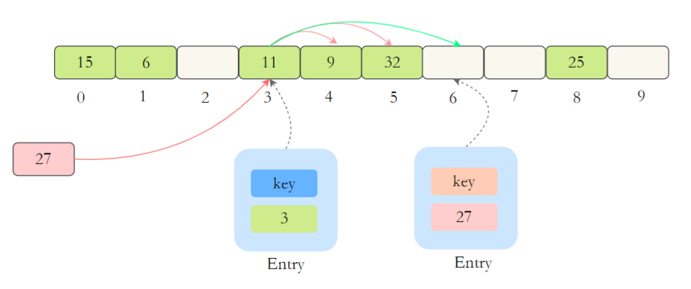

<font style="color:rgb(136, 136, 136);">ThreadLocalMap解决冲突</font>

<font style="color:rgb(74, 74, 74);">如上图所示，如果我们插入一个value=27的数据，通过 hash计算后应该落入第 4 个槽位中，而槽位 4 已经有了 Entry数据，而且Entry数据的key和当前不相等。此时就会线性向后查找，一直找到 Entry为 null的槽位才会停止查找，把元素放到空的槽中。</font>

<font style="color:rgb(74, 74, 74);">在get的时候，也会根据ThreadLocal对象的hash值，定位到table中的位置，然后判断该槽位Entry对象中的key是否和get的key一致，如果不一致，就判断下一个位置。</font>

## 
## ThreadLocalMap扩容机制了解吗
<font style="color:rgb(74, 74, 74);">在ThreadLocalMap.set()方法的最后，如果执行完启发式清理工作后，未清理到任何数据，且当前散列数组中</font><font style="color:rgb(40, 202, 113);">Entry</font><font style="color:rgb(74, 74, 74);">的数量已经达到了列表的扩容阈值</font><font style="color:rgb(40, 202, 113);">(len*2/3)</font><font style="color:rgb(74, 74, 74);">，就开始执行</font><font style="color:rgb(40, 202, 113);">rehash()</font><font style="color:rgb(74, 74, 74);">逻辑：</font>

```plain
if (!cleanSomeSlots(i, sz) && sz >= threshold)
    rehash();
```

<font style="color:rgb(74, 74, 74);">再着看rehash()具体实现：这里会先去清理过期的Entry，然后还要根据条件判断</font><font style="color:rgb(40, 202, 113);">size >= threshold - threshold / 4</font><font style="color:rgb(74, 74, 74);"> </font><font style="color:rgb(74, 74, 74);">也就是</font><font style="color:rgb(40, 202, 113);">size >= threshold* 3/4</font><font style="color:rgb(74, 74, 74);">来决定是否需要扩容。</font>

```plain
private void rehash() {
    //清理过期Entry
    expungeStaleEntries();

    //扩容
    if (size >= threshold - threshold / 4)
        resize();
}

//清理过期Entry
private void expungeStaleEntries() {
    Entry[] tab = table;
    int len = tab.length;
    for (int j = 0; j < len; j++) {
        Entry e = tab[j];
        if (e != null && e.get() == null)
            expungeStaleEntry(j);
    }
}
```

<font style="color:rgb(74, 74, 74);">接着看看具体的</font><font style="color:rgb(40, 202, 113);">resize()</font><font style="color:rgb(74, 74, 74);">方法，扩容后的</font><font style="color:rgb(40, 202, 113);">newTab</font><font style="color:rgb(74, 74, 74);">的大小为老数组的两倍，然后遍历老的table数组，散列方法重新计算位置，开放地址解决冲突，然后放到新的</font><font style="color:rgb(40, 202, 113);">newTab</font><font style="color:rgb(74, 74, 74);">，遍历完成之后，</font><font style="color:rgb(40, 202, 113);">oldTab</font><font style="color:rgb(74, 74, 74);">中所有的</font><font style="color:rgb(40, 202, 113);">entry</font><font style="color:rgb(74, 74, 74);">数据都已经放入到</font><font style="color:rgb(40, 202, 113);">newTab</font><font style="color:rgb(74, 74, 74);">中了，然后table引用指向</font><font style="color:rgb(40, 202, 113);">newTab</font>


<font style="color:rgb(136, 136, 136);">ThreadLocalMap扩容</font>

<font style="color:rgb(74, 74, 74);">具体代码：</font>

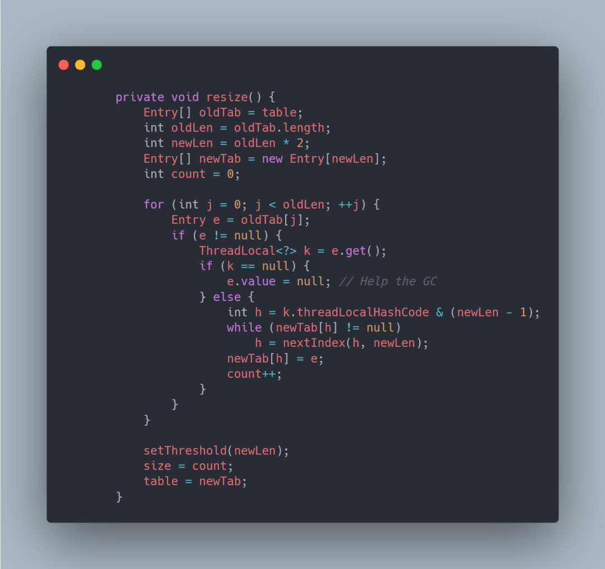

<font style="color:rgb(136, 136, 136);">ThreadLocalMap resize</font>

## 
## 父子线程怎么共享数据
<font style="color:rgb(74, 74, 74);">父线程能用ThreadLocal来给子线程传值吗？毫无疑问，不能。那该怎么办？</font>

<font style="color:rgb(74, 74, 74);">这时候可以用到另外一个类——</font><font style="color:rgb(40, 202, 113);">InheritableThreadLocal</font><font style="color:rgb(74, 74, 74);">。</font>

<font style="color:rgb(74, 74, 74);">使用起来很简单，在主线程的InheritableThreadLocal实例设置值，在子线程中就可以拿到了。</font>

```plain
public class InheritableThreadLocalTest {
    
    public static void main(String[] args) {
        final ThreadLocal threadLocal = new InheritableThreadLocal();
        // 主线程
        threadLocal.set("main");
        //子线程
        Thread t = new Thread() {
            @Override
            public void run() {
                super.run();
                System.out.println("主线程数据：" + threadLocal.get());
            }
        };
        t.start();
    }
}
```

<font style="color:rgb(89, 89, 89);background-color:rgb(251, 249, 253);">那原理是什么呢？</font>

<font style="color:rgb(74, 74, 74);">原理很简单，在Thread类里还有另外一个变量：</font>

```plain
ThreadLocal.ThreadLocalMap inheritableThreadLocals = null;
```

<font style="color:rgb(74, 74, 74);">在Thread.init的时候，如果父线程的</font><font style="color:rgb(40, 202, 113);">inheritableThreadLocals</font><font style="color:rgb(74, 74, 74);">不为空，就把它赋给当前线程（子线程）的</font><font style="color:rgb(40, 202, 113);">inheritableThreadLocals</font><font style="color:rgb(74, 74, 74);">。</font>

```plain
if (inheritThreadLocals && parent.inheritableThreadLocals != null)
            this.inheritableThreadLocals =
                ThreadLocal.createInheritedMap(parent.inheritableThreadLocals);
```

  
 


=========================================================


## 现在有哪些流行的微服务解决方案
<font style="color:rgb(0, 0, 0);">目前最主流的微服务开源解决方案有三种：</font>

1. <font style="color:black;">Dubbo：</font><font style="color:rgb(136, 136, 136);">Dubbo工作原理图-来源官网</font>
    - <font style="color:rgb(1, 1, 1);">Dubbo 是一个高性能、轻量级的 Java 微服务框架，最初由阿里巴巴（Alibaba）开发并于2011年开源。它提供了服务注册与发现、负载均衡、容错、分布式调用等功能，后来一度停止维护，在近两年，又重新开始迭代，并推出了Dubbo3。</font>
    - <font style="color:rgb(1, 1, 1);">Dubbo 使用基于 RPC（Remote Procedure Call）的通信模型，具有较高的性能和可扩展性。它支持多种传输协议（如TCP、HTTP、Redis）和序列化方式（如JSON、Hessian、Protobuf），可根据需求进行配置。</font>
    - <font style="color:rgb(1, 1, 1);">Dubbo更多地被认为是一个高性能的RPC（远程过程调用）框架，一些服务治理功能依赖于第三方组件实现，比如使用ZooKeeper、Apollo等等。</font>
2. <font style="color:black;">Spring Cloud Netflix：</font>
    - <font style="color:rgb(1, 1, 1);">Spring Cloud Netflix 是 Spring Cloud 的一个子项目，结合了 Netflix 开源的多个组件，但是Netflix自2018年停止维护和更新Netflix OSS项目，包括Eureka、Hystrix等组件，所以Spring Cloud Netflix也逐渐进入了维护模式。</font>
    - <font style="color:rgb(1, 1, 1);">该项目包含了许多流行的 Netflix 组件，如Eureka（服务注册与发现）、Ribbon（客户端负载均衡）、Hystrix（断路器）、Zuul（API 网关）等。它们都是高度可扩展的、经过大规模实践验证的微服务组件。</font>
3. <font style="color:black;">Spring Cloud Alibaba：</font>
    - <font style="color:rgb(1, 1, 1);">Spring Cloud Alibaba 是 Spring Cloud 的另一个子项目，与阿里巴巴的分布式应用开发框架相关。它提供了一整套与 Alibaba 生态系统集成的解决方案。</font>
    - <font style="color:rgb(1, 1, 1);">该项目包括 Nacos（服务注册与发现、配置管理）、Sentinel（流量控制、熔断降级）、RocketMQ（消息队列）等组件，以及与 Alibaba Cloud（阿里云）的集成。它为构建基于 Spring Cloud 的微服务架构提供了丰富的选项。</font>
    - <font style="color:rgb(1, 1, 1);">据说SpringCloud Alibaba项目的发起人已经跑路去了腾讯，并发起了SpringCloud Tecent项目，社区发展存在隐忧。</font>

### <font style="color:black;">这三种方案有什么区别吗</font>
| <font style="color:rgb(248, 248, 248);">特点</font> | <font style="color:rgb(248, 248, 248);">Dubbo</font> | <font style="color:rgb(248, 248, 248);">Spring Cloud Netflix</font> | <font style="color:rgb(248, 248, 248);">Spring Cloud Alibaba</font> |
| :--- | :--- | :--- | :--- |
| <font style="color:rgb(1, 1, 1);">开发语言</font> | <font style="color:rgb(1, 1, 1);">Java</font> | <font style="color:rgb(1, 1, 1);">Java</font> | <font style="color:rgb(1, 1, 1);">Java</font> |
| <font style="color:rgb(1, 1, 1);">服务治理</font> | <font style="color:rgb(1, 1, 1);">提供完整的服务治理功能</font> | <font style="color:rgb(1, 1, 1);">提供部分服务治理功能</font> | <font style="color:rgb(1, 1, 1);">提供完整的服务治理功能</font> |
| <font style="color:rgb(1, 1, 1);">服务注册与发现</font> | <font style="color:rgb(1, 1, 1);">ZooKeeper/Nacos</font> | <font style="color:rgb(1, 1, 1);">Eureka/Consul</font> | <font style="color:rgb(1, 1, 1);">Nacos</font> |
| <font style="color:rgb(1, 1, 1);">负载均衡</font> | <font style="color:rgb(1, 1, 1);">自带负载均衡策略</font> | <font style="color:rgb(1, 1, 1);">Ribbon</font> | <font style="color:rgb(1, 1, 1);">Ribbon\Dubbo负载均衡策略</font> |
| <font style="color:rgb(1, 1, 1);">服务调用</font> | <font style="color:rgb(1, 1, 1);">RPC方式</font> | <font style="color:rgb(1, 1, 1);">RestTemplate/Feign</font> | <font style="color:rgb(1, 1, 1);">Feign/RestTemplate/Dubbo</font> |
| <font style="color:rgb(1, 1, 1);">熔断器</font> | <font style="color:rgb(1, 1, 1);">Sentinel</font> | <font style="color:rgb(1, 1, 1);">Hystrix</font> | <font style="color:rgb(1, 1, 1);">Sentinel/Resilience4j</font> |
| <font style="color:rgb(1, 1, 1);">配置中心</font> | <font style="color:rgb(1, 1, 1);">Apollo</font> | <font style="color:rgb(1, 1, 1);">Spring Cloud Config</font> | <font style="color:rgb(1, 1, 1);">Nacos Config</font> |
| <font style="color:rgb(1, 1, 1);">API网关</font> | <font style="color:rgb(1, 1, 1);">Higress/APISIX</font> | <font style="color:rgb(1, 1, 1);">Zuul/Gateway</font> | <font style="color:rgb(1, 1, 1);">Spring Cloud Gateway</font> |
| <font style="color:rgb(1, 1, 1);">分布式事务</font> | <font style="color:rgb(1, 1, 1);">Seata</font> | <font style="color:rgb(1, 1, 1);">不支持分布式事务</font> | <font style="color:rgb(1, 1, 1);">Seata</font> |
| <font style="color:rgb(1, 1, 1);">限流和降级</font> | <font style="color:rgb(1, 1, 1);">Sentinel</font> | <font style="color:rgb(1, 1, 1);">Hystrix</font> | <font style="color:rgb(1, 1, 1);">Sentinel</font> |
| <font style="color:rgb(1, 1, 1);">分布式追踪和监控</font> | <font style="color:rgb(1, 1, 1);">Skywalking</font> | <font style="color:rgb(1, 1, 1);">Spring Cloud Sleuth + Zipkin</font> | <font style="color:rgb(1, 1, 1);">SkyWalking或Sentinel Dashboard</font> |
| <font style="color:rgb(1, 1, 1);">微服务网格</font> | <font style="color:rgb(1, 1, 1);">Dubbo Mesh</font> | <font style="color:rgb(1, 1, 1);">不支持微服务网格</font> | <font style="color:rgb(1, 1, 1);">Service Mesh（Nacos+Dubbo Mesh）</font> |
| <font style="color:rgb(1, 1, 1);">社区活跃度</font> | <font style="color:rgb(1, 1, 1);">相对较高</font> | <font style="color:rgb(1, 1, 1);">目前较低</font> | <font style="color:rgb(1, 1, 1);">相对较高</font> |
| <font style="color:rgb(1, 1, 1);">孵化和成熟度</font> | <font style="color:rgb(1, 1, 1);">孵化较早，成熟度较高</font> | <font style="color:rgb(1, 1, 1);">成熟度较高</font> | <font style="color:rgb(1, 1, 1);">孵化较新，但迅速发展</font> |


    - 

<font style="color:black;"></font>

## 说下微服务有哪些组件
<font style="color:rgb(0, 0, 0);">微服务给系统开发带来了一些问题和挑战，如服务调用的复杂性、分布式事务的处理、服务的动态管理等。为了更好地解决这些问题和挑战，各种微服务治理的组件应运而生，充当微服务架构的基石和支撑。</font>

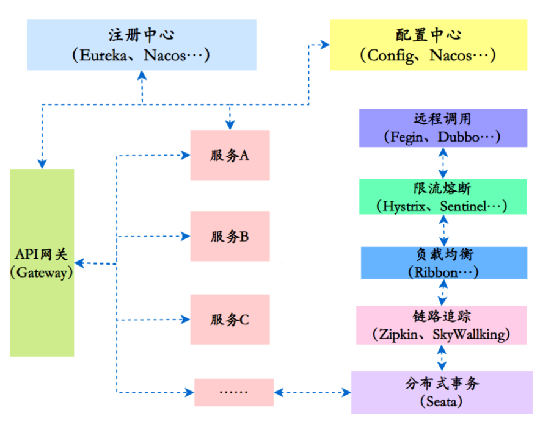

<font style="color:rgb(136, 136, 136);">微服务组件示意图</font>

<font style="color:rgb(0, 0, 0);">微服务的各个组件和常见实现：</font>

1. <font style="color:rgb(1, 1, 1);">注册中心：用于服务的注册与发现，管理微服务的地址信息。常见的实现包括：</font>
    - <font style="color:rgb(1, 1, 1);">Spring Cloud Netflix：Eureka、Consul</font>
    - <font style="color:rgb(1, 1, 1);">Spring Cloud Alibaba：Nacos</font>
2. <font style="color:rgb(1, 1, 1);">配置中心：用于集中管理微服务的配置信息，可以动态修改配置而不需要重启服务。常见的实现包括：</font>
    - <font style="color:rgb(1, 1, 1);">Spring Cloud Netflix：Spring Cloud Config</font>
    - <font style="color:rgb(1, 1, 1);">Spring Cloud Alibaba：Nacos Config</font>
3. <font style="color:rgb(1, 1, 1);">远程调用：用于在不同的微服务之间进行通信和协作。常见的实现包括：</font>
    - <font style="color:rgb(1, 1, 1);">RESTful API：如RestTemplate、Feign</font>
    - <font style="color:rgb(1, 1, 1);">RPC（远程过程调用）：如Dubbo、gRPC</font>
4. <font style="color:rgb(1, 1, 1);">API网关：作为微服务架构的入口，统一暴露服务，并提供路由、负载均衡、安全认证等功能。常见的实现包括：</font>
    - <font style="color:rgb(1, 1, 1);">Spring Cloud Netflix：Zuul</font>
    - <font style="color:rgb(1, 1, 1);">Spring Cloud Alibaba：Gateway、Apisix等</font>
5. <font style="color:rgb(1, 1, 1);">分布式事务：保证跨多个微服务调用的事务一致性。常见的实现包括：</font>
    - <font style="color:rgb(1, 1, 1);">Spring Cloud Alibaba：Seata</font>
6. <font style="color:rgb(1, 1, 1);">熔断器：用于防止微服务之间的故障扩散，提高系统的容错能力。常见的实现包括：</font>
    - <font style="color:rgb(1, 1, 1);">Spring Cloud Netflix：Hystrix</font>
    - <font style="color:rgb(1, 1, 1);">Spring Cloud Alibaba：Sentinel、Resilience4j</font>
7. <font style="color:rgb(1, 1, 1);">限流和降级：用于防止微服务过载，对请求进行限制和降级处理。常见的实现包括：</font>
    - <font style="color:rgb(1, 1, 1);">Spring Cloud Netflix：Hystrix</font>
    - <font style="color:rgb(1, 1, 1);">Spring Cloud Alibaba：Sentinel</font>
8. <font style="color:rgb(1, 1, 1);">分布式追踪和监控：用于跟踪和监控微服务的请求流程和性能指标。常见的实现包括：</font>
    - <font style="color:rgb(1, 1, 1);">Spring Cloud Netflix：Spring Cloud Sleuth + Zipkin</font>
    - <font style="color:rgb(1, 1, 1);">Spring Cloud Alibaba：SkyWalking、Sentinel Dashboard</font>


<font style="color:rgb(0, 0, 0);"></font>

## 能说下HTTP和RPC的区别吗
<font style="color:rgb(0, 0, 0);">严格来讲，HTTP和RPC不是一个层面的东西：</font>


<font style="color:rgb(136, 136, 136);">HTTP和RPC</font>

+ <font style="color:rgb(1, 1, 1);">HTTP（Hypertext Transfer Protocol）是一种应用层协议，主要强调的是网络通信；</font>
+ <font style="color:rgb(1, 1, 1);">RPC（Remote Procedure Call，远程过程调用）是一种用于分布式系统之间通信的协议，强调的是服务之间的远程调用。</font>

<font style="color:rgb(0, 0, 0);">一些RPC框架比如gRPC，底层传输协议其实也是用的HTTP2，包括Dubbo3，也兼容了gRPC，使用了HTTP2作为传输层的协议。</font>

<font style="color:rgb(0, 0, 0);"></font>

## 说说有哪些负载均衡算法
<font style="color:rgb(0, 0, 0);">常见的负载均衡算法包含以下几种：</font>

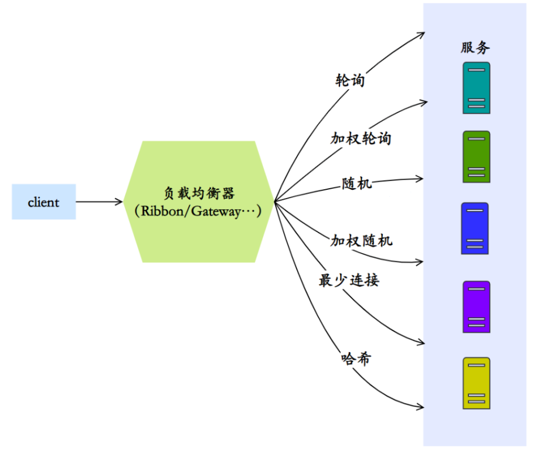

<font style="color:rgb(136, 136, 136);">常见负载均衡算法</font>

1. **<font style="color:black;">轮询算法（Round Robin）</font>**<font style="color:rgb(1, 1, 1);">：轮询算法是最简单的负载均衡算法之一。它按照顺序将请求依次分配给每个后端服务器，循环往复。当请求到达时，负载均衡器按照事先定义的顺序选择下一个服务器。轮询算法适用于后端服务器具有相同的处理能力和性能的场景。</font>
2. **<font style="color:black;">加权轮询算法（Weighted Round Robin）</font>**<font style="color:rgb(1, 1, 1);">：加权轮询算法在轮询算法的基础上增加了权重的概念。每个后端服务器都被赋予一个权重值，权重值越高，被选中的概率就越大。这样可以根据服务器的处理能力和性能调整请求的分配比例，使得性能较高的服务器能够处理更多的请求。</font>
3. **<font style="color:black;">随机算法（Random）</font>**<font style="color:rgb(1, 1, 1);">：随机算法将请求随机分配给后端服务器。每个后端服务器有相等的被选中概率，没有考虑服务器的实际负载情况。这种算法简单快速，适用于后端服务器性能相近且无需考虑请求处理能力的场景。</font>
4. **<font style="color:black;">加权随机算法（Weighted Random）</font>**<font style="color:rgb(1, 1, 1);">：加权随机算法在随机算法的基础上引入了权重的概念。每个后端服务器被赋予一个权重值，权重值越高，被选中的概率就越大。这样可以根据服务器的处理能力和性能调整请求的分配比例。</font>
5. **<font style="color:black;">最少连接算法（Least Connection）</font>**<font style="color:rgb(1, 1, 1);">：最少连接算法会根据后端服务器当前的连接数来决定请求的分配。负载均衡器会选择当前连接数最少的服务器进行请求分配，以保证后端服务器的负载均衡。这种算法适用于后端服务器的处理能力不同或者请求的处理时间不同的场景。</font>
6. **<font style="color:black;">哈希算法（Hash）</font>**<font style="color:rgb(1, 1, 1);">：哈希算法会根据请求的某个特定属性（如客户端IP地址、请求URL等）计算哈希值，然后根据哈希值选择相应的后端服务器。</font>

<font style="color:rgb(1, 1, 1);"></font>

## Seata支持哪些模式的分布式事务
<font style="color:rgb(0, 0, 0);">Seata支持以下几种模式的分布式事务：</font>

1. <font style="color:rgb(1, 1, 1);">AT模式：AT模式是Seata默认支持的模式，也是最常用的模式之一。在AT模式下，Seata通过在业务代码中嵌入事务上下文，实现对分布式事务的管理。Seata会拦截并解析业务代码中的SQL语句，通过对数据库连接进行拦截和代理，实现事务的管理和协调。</font>


<font style="color:rgb(136, 136, 136);">AT模式示意图</font>

2. <font style="color:rgb(1, 1, 1);">TCC（Try-Confirm-Cancel）模式：TCC模式是一种基于补偿机制的分布式事务模式。在TCC模式中，业务逻辑需要实现Try、Confirm和Cancel三个阶段的操作。Seata通过调用业务代码中的Try、Confirm和Cancel方法，并在每个阶段记录相关的操作日志，来实现分布式事务的一致性。</font>


<font style="color:rgb(136, 136, 136);">Seata TCC模式</font>

3. <font style="color:rgb(1, 1, 1);">SAGA模式：SAGA模式是一种基于事件驱动的分布式事务模式。在SAGA模式中，每个服务都可以发布和订阅事件，通过事件的传递和处理来实现分布式事务的一致性。Seata提供了与SAGA模式兼容的Saga框架，用于管理和协调分布式事务的各个阶段。</font>


<font style="color:rgb(136, 136, 136);">SAGA模式状态机引擎</font>

4. <font style="color:rgb(1, 1, 1);">XA模式：XA模式是一种基于两阶段提交（Two-Phase Commit）协议的分布式事务模式。在XA模式中，Seata通过与数据库的XA事务协议进行交互，实现对分布式事务的管理和协调。XA模式需要数据库本身支持XA事务，并且需要在应用程序中配置相应的XA数据源。</font>


<font style="color:rgb(136, 136, 136);">XA模式示意图</font>

## **Kafka消息丢失有几种情况？如何解决**
**消息发送端**：

（1）acks=0： 表示producer不需要等待任何broker确认收到消息的回复，就可以继续发送下一条消息。性能最高，但是最容易丢消息。大数据统计报表场景，对性能要求很高，对数据丢失不敏感的情况可以用这种。

（2）acks=1： 至少要等待leader已经成功将数据写入本地log，但是不需要等待所有follower是否成功写入。就可以继续发送下一条消息。这种情况下，如果follower没有成功备份数据，而此时leader又挂掉，则消息会丢失。

（3）acks=-1或all： 这意味着leader需要等待所有备份(min.insync.replicas配置的备份个数)都成功写入日志，这种策略会保证只要有一个备份存活就不会丢失数据。这是最强的数据保证。一般除非是金融级别，或跟钱打交道的场景才会使用这种配置。当然如果min.insync.replicas配置的是1则也可能丢消息，跟acks=1情况类似。

**消息消费端**：

如果消费这边配置的是自动提交，万一消费到数据还没处理完，就自动提交offset了，但是此时你consumer直接宕机了，未处理完的数据丢失了，下次也消费不到了。


## **Kafka消息重复消费有几种情况？如何解决**
**消息发送端**：

发送消息如果配置了重试机制，比如网络抖动时间过长导致发送端发送超时，实际broker可能已经接收到消息，但发送方会重新发送消息

**消息消费端**：

如果消费这边配置的是手动提交，刚拉取了一批数据处理了一部分，但还没来得及提交，服务挂了，下次重启又会拉取相同的一批数据重复处理

一般消费端都是要做**消费幂等**处理的。

****

## Kafka线上消息积压如何解决
1）线上有时因为发送方发送消息速度过快，或者消费方处理消息过慢，可能会导致broker积压大量未消费消息。

此种情况如果积压了上百万未消费消息需要紧急处理，可以修改消费端程序，让其将收到的消息快速转发到其他topic(可以设置很多分区)，然后再启动多个消费者同时消费新主题的不同分区。

2）由于消息数据格式变动或消费者程序有bug，导致消费者一直消费不成功，也可能导致broker积压大量未消费消息。此种情况可以将这些消费不成功的消息转发到其它队列里去(类似**死信队列**)，后面再慢慢分析死信队列里的消息处理问题。


