:::info
<font style="color:rgb(77, 77, 77);">围绕支撑高并发的业务场景怎么设计系统才合理？</font>

<font style="color:rgb(77, 77, 77);">面对超高的并发，首先硬件层面机器要能扛得住，其次架构设计做好微服务的拆分，代码层面各种缓存、削峰、解耦等等问题要处理好，数据库层面做好读写分离、分库分表，稳定性方面要保证有监控，熔断限流降级该有的必须要有，发生问题能及时发现处理。这样从整个系统设计方面就会有一个初步的概念。</font>

:::

### <font style="color:rgb(79, 79, 79);">微服务架构演化</font>
<font style="color:rgb(77, 77, 77);">在互联网早期的时候，单体架构就足以支撑起日常的业务需求，大家的所有业务服务都在一个项目里，部署在一台物理机器上。所有的业务包括你的交易系统、会员信息、库存、商品等等都夹杂在一起，当流量一旦起来之后，单体架构的问题就暴露出来了，机器挂了所有的业务全部无法使用了。</font>


<font style="color:rgb(77, 77, 77);">于是，集群架构的架构开始出现，单机无法抗住的压力，最简单的办法就是水平拓展横向扩容了，这样，通过负载均衡把压力流量分摊到不同的机器上，暂时是解决了单点导致服务不可用的问题。</font>

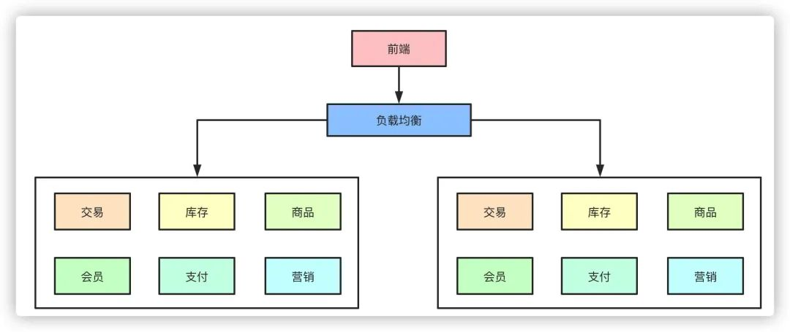

<font style="color:rgb(77, 77, 77);">但是随着业务的发展，在一个项目里维护所有的业务场景使开发和代码维护变得越来越困难，一个简单的需求改动都需要发布整个服务，代码的合并冲突也会变得越来越频繁，同时线上故障出现的可能性越大。微服务的架构模式就诞生了。</font>


<font style="color:rgb(77, 77, 77);">把每个独立的业务拆分开独立部署，开发和维护的成本降低，集群能承受的压力也提高了，再也不会出现一个小小的改动点需要牵一发而动全身了。</font>

<font style="color:rgb(77, 77, 77);">以上的点从高并发的角度而言，似乎都可以归类为通过服务拆分和集群物理机器的扩展提高了整体的系统抗压能力，那么，随之拆分而带来的问题也就是高并发系统需要解决的问题。</font>

### <font style="color:rgb(79, 79, 79);">RPC</font>
<font style="color:rgb(77, 77, 77);">微服务化的拆分带来的好处和便利性是显而易见的，但是与此同时各个微服务之间的通信就需要考虑了。传统HTTP的通信方式对性能是极大的浪费，这时候就需要引入诸如Dubbo类的RPC框架，基于TCP长连接的方式提高整个集群通信的效率。</font>


<font style="color:rgb(77, 77, 77);">我们假设原来来自客户端的QPS是9000的话，那么通过负载均衡策略分散到每台机器就是3000，而HTTP改为RPC之后接口的耗时缩短了，单机和整体的QPS就提升了。而RPC框架本身一般都自带负载均衡、熔断降级的机制，可以更好的维护整个系统的高可用性。</font>

<font style="color:rgb(77, 77, 77);">那么说完RPC，作为基本上国内普遍的选择Dubbo的一些基本原理就是接下来的问题。</font>

#### <font style="color:rgb(79, 79, 79);">Dubbo工作原理</font>
1. <font style="color:rgb(77, 77, 77);">服务启动的时候，provider和consumer根据配置信息，连接到注册中心register，分别向注册中心注册和订阅服务</font>
2. <font style="color:rgb(77, 77, 77);">register根据服务订阅关系，返回provider信息到consumer，同时consumer会把provider信息缓存到本地。如果信息有变更，consumer会收到来自register的推送</font>
3. <font style="color:rgb(77, 77, 77);">consumer生成代理对象，同时根据负载均衡策略，选择一台provider，同时定时向monitor记录接口的调用次数和时间信息</font>
4. <font style="color:rgb(77, 77, 77);">拿到代理对象之后，consumer通过代理对象发起接口调用</font>
5. <font style="color:rgb(77, 77, 77);">provider收到请求后对数据进行反序列化，然后通过代理调用具体的接口实现</font>

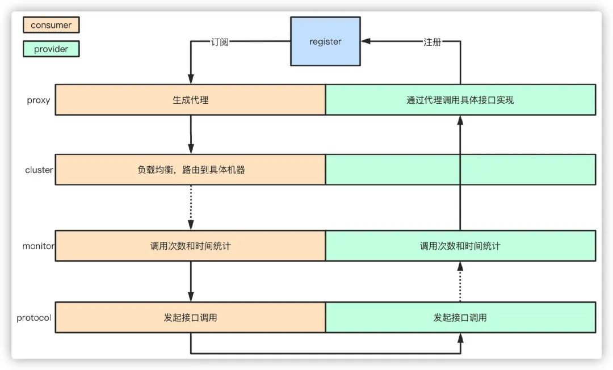

#### <font style="color:rgb(79, 79, 79);">Dubbo负载均衡策略</font>
1. <font style="color:rgb(77, 77, 77);">加权随机：假设我们有一组服务器 servers = [A, B, C]，他们对应的权重为 weights = [5, 3, 2]，权重总和为10。现在把这些权重值平铺在一维坐标值上，[0, 5) 区间属于服务器 A，[5, 8) 区间属于服务器 B，[8, 10) 区间属于服务器 C。接下来通过随机数生成器生成一个范围在 [0, 10) 之间的随机数，然后计算这个随机数会落到哪个区间上就可以了。</font>
2. <font style="color:rgb(77, 77, 77);">最小活跃数：每个服务提供者对应一个活跃数 active，初始情况下，所有服务提供者活跃数均为0。每收到一个请求，活跃数加1，完成请求后则将活跃数减1。在服务运行一段时间后，性能好的服务提供者处理请求的速度更快，因此活跃数下降的也越快，此时这样的服务提供者能够优先获取到新的服务请求。</font>
3. <font style="color:rgb(77, 77, 77);">一致性hash：通过hash算法，把provider的invoke和随机节点生成hash，并将这个 hash 投射到 [0, 2^32 - 1] 的圆环上，查询的时候根据key进行md5然后进行hash，得到第一个节点的值大于等于当前hash的invoker。</font>


<font style="color:rgba(0, 0, 0, 0.75);">图片来自dubbo官方</font>

1. <font style="color:rgba(0, 0, 0, 0.75);">加权轮询：比如服务器 A、B、C 权重比为 5:2:1，那么在8次请求中，服务器 A 将收到其中的5次请求，服务器 B 会收到其中的2次请求，服务器 C 则收到其中的1次请求。</font>

#### <font style="color:rgb(79, 79, 79);">集群容错</font>
1. <font style="color:rgb(77, 77, 77);">Failover Cluster失败自动切换：dubbo的默认容错方案，当调用失败时自动切换到其他可用的节点，具体的重试次数和间隔时间可用通过引用服务的时候配置，默认重试次数为1也就是只调用一次。</font>
2. <font style="color:rgb(77, 77, 77);">Failback Cluster快速失败：在调用失败，记录日志和调用信息，然后返回空结果给consumer，并且通过定时任务每隔5秒对失败的调用进行重试</font>
3. <font style="color:rgb(77, 77, 77);">Failfast Cluster失败自动恢复：只会调用一次，失败后立刻抛出异常</font>
4. <font style="color:rgb(77, 77, 77);">Failsafe Cluster失败安全：调用出现异常，记录日志不抛出，返回空结果</font>
5. <font style="color:rgb(77, 77, 77);">Forking Cluster并行调用多个服务提供者：通过线程池创建多个线程，并发调用多个provider，结果保存到阻塞队列，只要有一个provider成功返回了结果，就会立刻返回结果</font>
6. <font style="color:rgb(77, 77, 77);">Broadcast Cluster广播模式：逐个调用每个provider，如果其中一台报错，在循环调用结束后，抛出异常。</font>

### <font style="color:rgb(79, 79, 79);">消息队列</font>
<font style="color:rgb(77, 77, 77);">对于MQ的作用大家都应该很了解了，削峰填谷、解耦。依赖消息队列，同步转异步的方式，可以降低微服务之间的耦合。</font>

<font style="color:rgb(77, 77, 77);">对于一些不需要同步执行的接口，可以通过引入消息队列的方式异步执行以提高接口响应时间。在交易完成之后需要扣库存，然后可能需要给会员发放积分，本质上，发积分的动作应该属于履约服务，对实时性的要求也不高，我们只要保证最终一致性也就是能履约成功就行了。对于这种同类性质的请求就可以走MQ异步，也就提高了系统抗压能力了。</font>

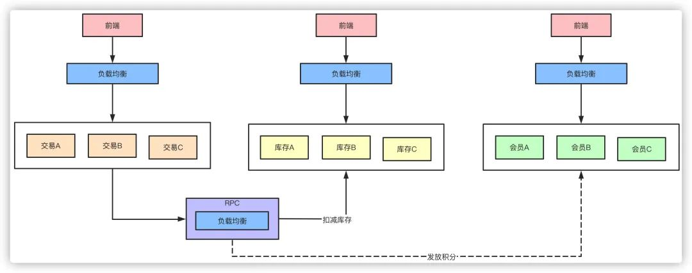

<font style="color:rgb(77, 77, 77);">对于消息队列而言，怎么在使用的时候保证消息的可靠性、不丢失？</font>

#### <font style="color:rgb(79, 79, 79);">消息可靠性</font>
<font style="color:rgb(77, 77, 77);">消息丢失可能发生在生产者发送消息、MQ本身丢失消息、消费者丢失消息3个方面。</font>

**<font style="color:rgb(77, 77, 77);">生产者丢失</font>**

<font style="color:rgb(77, 77, 77);">生产者丢失消息的可能点在于程序发送失败抛异常了没有重试处理，或者发送的过程成功但是过程中网络闪断MQ没收到，消息就丢失了。</font>

<font style="color:rgb(77, 77, 77);">由于同步发送的一般不会出现这样使用方式，所以我们就不考虑同步发送的问题，我们基于异步发送的场景来说。</font>

<font style="color:rgb(77, 77, 77);">异步发送分为两个方式：</font>**<font style="color:rgb(77, 77, 77);">异步有回调和异步无回调</font>**<font style="color:rgb(77, 77, 77);">，无回调的方式，生产者发送完后不管结果可能就会造成消息丢失，而通过异步发送+回调通知+本地消息表的形式我们就可以做出一个解决方案。以下单的场景举例。</font>

1. <font style="color:rgba(0, 0, 0, 0.75);">下单后先保存本地数据和MQ消息表，这时候消息的状态是发送中，如果本地事务失败，那么下单失败，事务回滚。</font>
2. <font style="color:rgba(0, 0, 0, 0.75);">下单成功，直接返回客户端成功，异步发送MQ消息</font>
3. <font style="color:rgba(0, 0, 0, 0.75);">MQ回调通知消息发送结果，对应更新数据库MQ发送状态</font>
4. <font style="color:rgba(0, 0, 0, 0.75);">JOB轮询超过一定时间（时间根据业务配置）还未发送成功的消息去重试</font>
5. <font style="color:rgba(0, 0, 0, 0.75);">在监控平台配置或者JOB程序处理超过一定次数一直发送不成功的消息，告警，人工介入。</font>

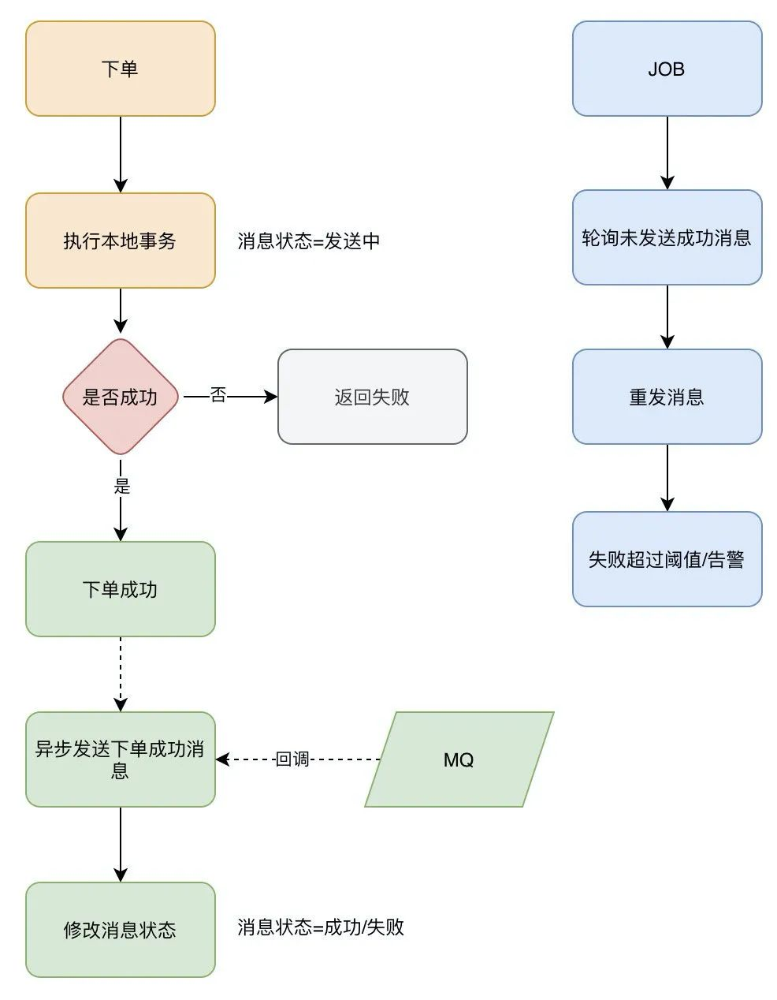

<font style="color:rgb(77, 77, 77);">一般而言，对于大部分场景来说异步回调的形式就可以了，只有那种需要完全保证不能丢失消息的场景我们做一套完整的解决方案。</font>

**<font style="color:rgb(77, 77, 77);">MQ丢失</font>**

<font style="color:rgb(77, 77, 77);">如果生产者保证消息发送到MQ，而MQ收到消息后还在内存中，这时候宕机了又没来得及同步给从节点，就有可能导致消息丢失。</font>

<font style="color:rgb(77, 77, 77);">比如RocketMQ：</font>

<font style="color:rgb(77, 77, 77);">RocketMQ分为同步刷盘和异步刷盘两种方式，默认的是异步刷盘，就有可能导致消息还未刷到硬盘上就丢失了，可以通过设置为同步刷盘的方式来保证消息可靠性，这样即使MQ挂了，恢复的时候也可以从磁盘中去恢复消息。</font>

<font style="color:rgb(77, 77, 77);">比如Kafka也可以通过配置做到：</font>

```plain
`acks=all 只有参与复制的所有节点全部收到消息，才返回生产者成功。这样的话除非所有的节点都挂了，消息才会丢失。
replication.factor=N,设置大于1的数，这会要求每个partion至少有2个副本
min.insync.replicas=N，设置大于1的数，这会要求leader至少感知到一个follower还保持着连接
retries=N，设置一个非常大的值，让生产者发送失败一直重试`
```

<font style="color:rgb(77, 77, 77);">虽然我们可以通过配置的方式来达到MQ本身高可用的目的，但是都对性能有损耗，怎样配置需要根据业务做出权衡。</font>

**<font style="color:rgb(77, 77, 77);">消费者丢失</font>**

<font style="color:rgb(77, 77, 77);">消费者丢失消息的场景：消费者刚收到消息，此时服务器宕机，MQ认为消费者已经消费，不会重复发送消息，消息丢失。</font>

<font style="color:rgb(77, 77, 77);">RocketMQ默认是需要消费者回复ack确认，而kafka需要手动开启配置关闭自动offset。</font>

<font style="color:rgb(77, 77, 77);">消费方不返回ack确认，重发的机制根据MQ类型的不同发送时间间隔、次数都不尽相同，如果重试超过次数之后会进入死信队列，需要手工来处理了。（Kafka没有这些）</font>

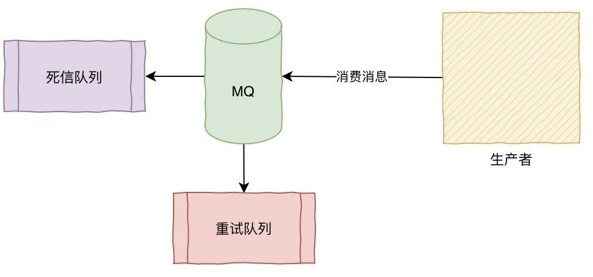

#### <font style="color:rgb(79, 79, 79);">消息的最终一致性</font>
<font style="color:rgb(77, 77, 77);">事务消息可以达到分布式事务的最终一致性，事务消息就是MQ提供的类似XA的分布式事务能力。</font>

<font style="color:rgb(77, 77, 77);">半事务消息就是MQ收到了生产者的消息，但是没有收到二次确认，不能投递的消息。</font>

<font style="color:rgb(77, 77, 77);">实现原理如下：</font>

1. <font style="color:rgba(0, 0, 0, 0.75);">生产者先发送一条半事务消息到MQ</font>
2. <font style="color:rgba(0, 0, 0, 0.75);">MQ收到消息后返回ack确认</font>
3. <font style="color:rgba(0, 0, 0, 0.75);">生产者开始执行本地事务</font>
4. <font style="color:rgba(0, 0, 0, 0.75);">如果事务执行成功发送commit到MQ，失败发送rollback</font>
5. <font style="color:rgba(0, 0, 0, 0.75);">如果MQ长时间未收到生产者的二次确认commit或者rollback，MQ对生产者发起消息回查</font>
6. <font style="color:rgba(0, 0, 0, 0.75);">生产者查询事务执行最终状态</font>
7. <font style="color:rgba(0, 0, 0, 0.75);">根据查询事务状态再次提交二次确认</font>

<font style="color:rgb(77, 77, 77);">最终，如果MQ收到二次确认commit，就可以把消息投递给消费者，反之如果是rollback，消息会保存下来并且在3天后被删除。</font>

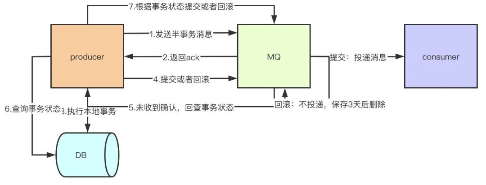

### <font style="color:rgb(79, 79, 79);">数据库</font>
<font style="color:rgb(77, 77, 77);">对于整个系统而言，最终所有的流量的查询和写入都落在数据库上，数据库是支撑系统高并发能力的核心。怎么降低数据库的压力，提升数据库的性能是支撑高并发的基石。主要的方式就是通过读写分离和分库分表来解决这个问题。</font>

<font style="color:rgb(77, 77, 77);">对于整个系统而言，流量应该是一个漏斗的形式。比如我们的日活用户DAU有20万，实际可能每天来到提单页的用户只有3万QPS，最终转化到下单支付成功的QPS只有1万。那么对于系统来说读是大于写的，这时候可以通过读写分离的方式来降低数据库的压力。</font>

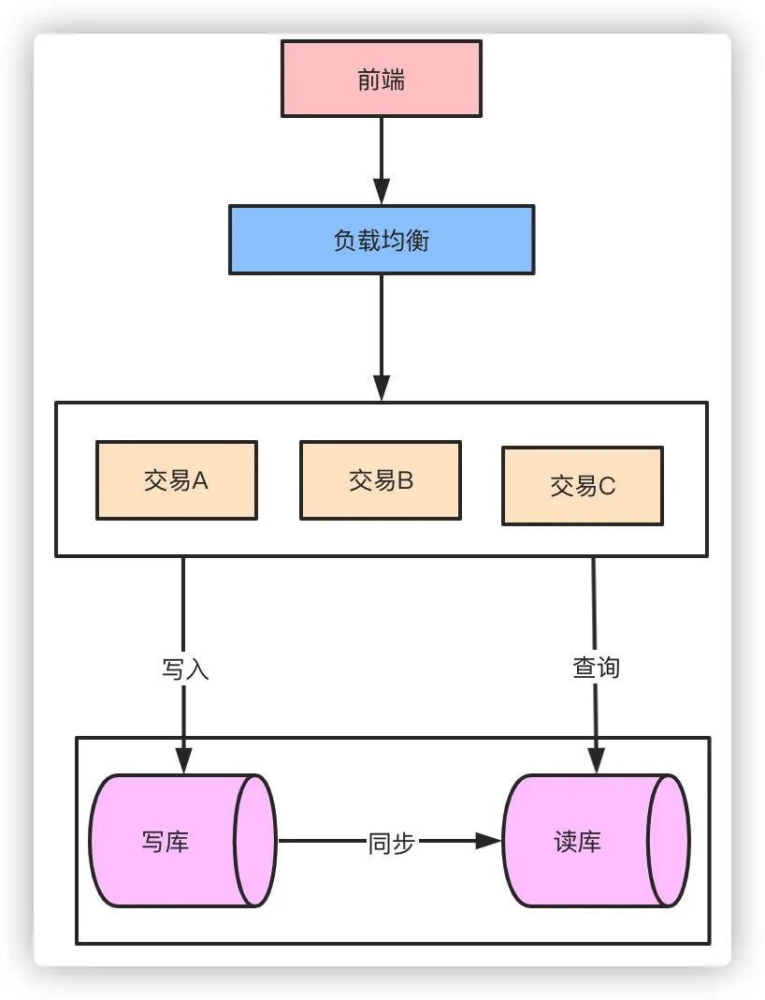

<font style="color:rgb(77, 77, 77);">读写分离也就相当于数据库集群的方式降低了单节点的压力。而面对数据的急剧增长，原来的单库单表的存储方式已经无法支撑整个业务的发展，这时候就需要对数据库进行分库分表了。针对微服务而言垂直的分库本身已经是做过的，剩下大部分都是分表的方案了。</font>

#### <font style="color:rgb(79, 79, 79);">水平分表</font>
<font style="color:rgb(77, 77, 77);">首先根据业务场景来决定使用什么字段作为分表字段(sharding_key)，比如我们现在日订单1000万，我们大部分的场景来源于C端，我们可以用user_id作为sharding_key，数据查询支持到最近3个月的订单，超过3个月的做归档处理，那么3个月的数据量就是9亿，可以分1024张表，那么每张表的数据大概就在100万左右。</font>

<font style="color:rgb(77, 77, 77);">比如用户id为100，那我们都经过hash(100)，然后对1024取模，就可以落到对应的表上了。</font>

#### <font style="color:rgb(79, 79, 79);">分表后的ID唯一性</font>
<font style="color:rgb(77, 77, 77);">因为我们主键默认都是自增的，那么分表之后的主键在不同表就肯定会有冲突了。有几个办法考虑：</font>

1. <font style="color:rgba(0, 0, 0, 0.75);">设定步长，比如1-1024张表我们分别设定1-1024的基础步长，这样主键落到不同的表就不会冲突了。</font>
2. <font style="color:rgba(0, 0, 0, 0.75);">分布式ID，自己实现一套分布式ID生成算法或者使用开源的比如雪花算法这种</font>
3. <font style="color:rgba(0, 0, 0, 0.75);">分表后不使用主键作为查询依据，而是每张表单独新增一个字段作为唯一主键使用，比如订单表订单号是唯一的，不管最终落在哪张表都基于订单号作为查询依据，更新也一样。</font>

#### <font style="color:rgb(79, 79, 79);">主从同步原理</font>
1. <font style="color:rgba(0, 0, 0, 0.75);">master提交完事务后，写入binlog</font>
2. <font style="color:rgba(0, 0, 0, 0.75);">slave连接到master，获取binlog</font>
3. <font style="color:rgba(0, 0, 0, 0.75);">master创建dump线程，推送binglog到slave</font>
4. <font style="color:rgba(0, 0, 0, 0.75);">slave启动一个IO线程读取同步过来的master的binlog，记录到relay log中继日志中</font>
5. <font style="color:rgba(0, 0, 0, 0.75);">slave再开启一个sql线程读取relay log事件并在slave执行，完成同步</font>
6. <font style="color:rgba(0, 0, 0, 0.75);">slave记录自己的binglog</font>

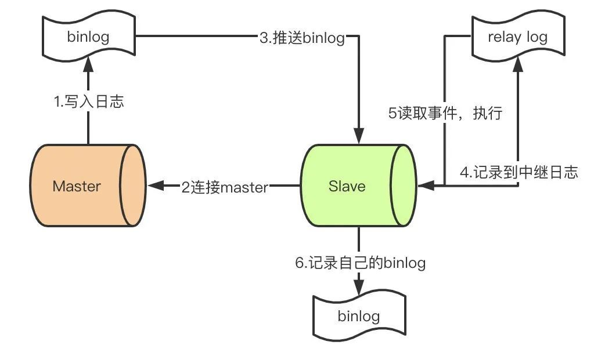

<font style="color:rgb(77, 77, 77);">由于mysql默认的复制方式是异步的，主库把日志发送给从库后不关心从库是否已经处理，这样会产生一个问题就是假设主库挂了，从库处理失败了，这时候从库升为主库后，日志就丢失了。由此产生两个概念。</font>

**<font style="color:rgb(77, 77, 77);">全同步复制</font>**

<font style="color:rgb(77, 77, 77);">主库写入binlog后强制同步日志到从库，所有的从库都执行完成后才返回给客户端，但是很显然这个方式的话性能会受到严重影响。</font>

**<font style="color:rgb(77, 77, 77);">半同步复制</font>**

<font style="color:rgb(77, 77, 77);">和全同步不同的是，半同步复制的逻辑是这样，从库写入日志成功后返回ACK确认给主库，主库收到至少一个从库的确认就认为写操作完成。</font>

### <font style="color:rgb(79, 79, 79);">缓存</font>
<font style="color:rgb(77, 77, 77);">缓存作为高性能的代表，在某些特殊业务可能承担90%以上的热点流量。对于一些活动比如秒杀这种并发QPS可能几十万的场景，引入缓存事先预热可以大幅降低对数据库的压力，10万的QPS对于单机的数据库来说可能就挂了，但是对于如redis这样的缓存来说就完全不是问题。</font>

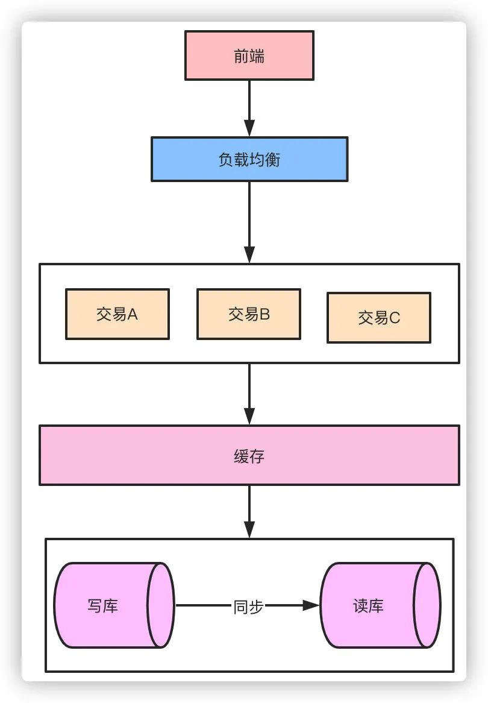

<font style="color:rgb(77, 77, 77);">以秒杀系统举例，活动预热商品信息可以提前缓存提供查询服务，活动库存数据可以提前缓存，下单流程可以完全走缓存扣减，秒杀结束后再异步写入数据库，数据库承担的压力就小的太多了。当然，引入缓存之后就还要考虑缓存击穿、雪崩、热点一系列的问题了。</font>

#### <font style="color:rgb(79, 79, 79);">热key问题</font>
<font style="color:rgb(77, 77, 77);">所谓热key问题就是，突然有几十万的请求去访问redis上的某个特定key，那么这样会造成流量过于集中，达到物理网卡上限，从而导致这台redis的服务器宕机引发雪崩。</font>

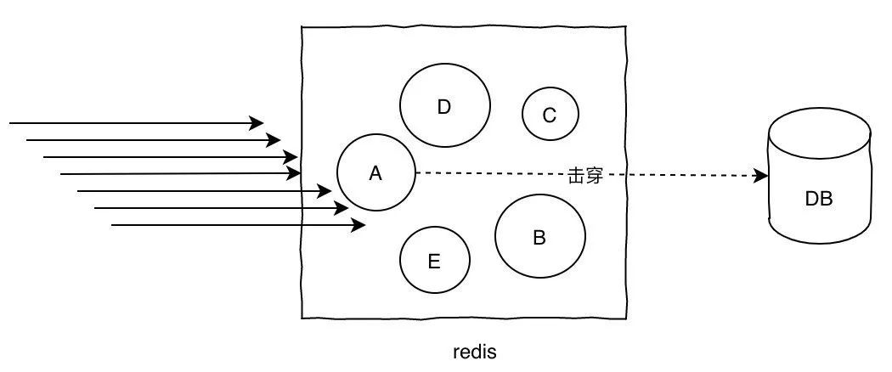

<font style="color:rgb(77, 77, 77);">针对热key的解决方案：</font>

1. <font style="color:rgba(0, 0, 0, 0.75);">提前把热key打散到不同的服务器，降低压力</font>
2. <font style="color:rgba(0, 0, 0, 0.75);">加入二级缓存，提前加载热key数据到内存中，如果redis宕机，走内存查询</font>

#### <font style="color:rgb(79, 79, 79);">缓存击穿</font>
<font style="color:rgb(77, 77, 77);">缓存击穿的概念就是单个key并发访问过高，过期时导致所有请求直接打到db上，这个和热key的问题比较类似，只是说的点在于过期导致请求全部打到DB上而已。</font>

<font style="color:rgb(77, 77, 77);">解决方案：</font>

1. <font style="color:rgba(0, 0, 0, 0.75);">加锁更新，比如请求查询A，发现缓存中没有，对A这个key加锁，同时去数据库查询数据，写入缓存，再返回给用户，这样后面的请求就可以从缓存中拿到数据了。</font>
2. <font style="color:rgba(0, 0, 0, 0.75);">将过期时间组合写在value中，通过异步的方式不断的刷新过期时间，防止此类现象。</font>


#### <font style="color:rgb(79, 79, 79);">缓存穿透</font>
<font style="color:rgb(77, 77, 77);">缓存穿透是指查询不存在缓存中的数据，每次请求都会打到DB，就像缓存不存在一样。</font>

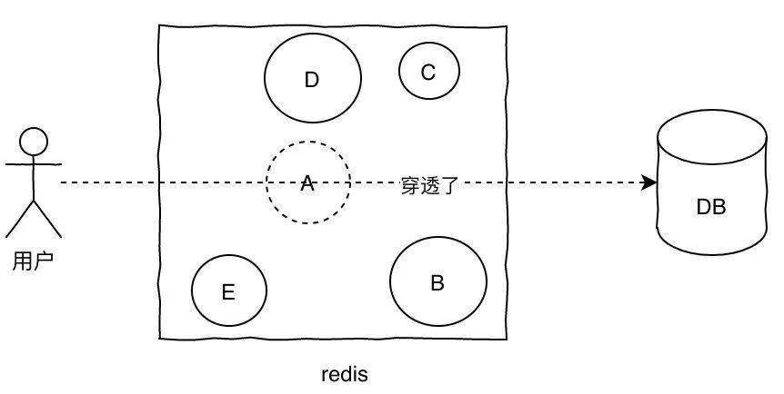

<font style="color:rgb(77, 77, 77);">针对这个问题，加一层布隆过滤器。布隆过滤器的原理是在你存入数据的时候，会通过散列函数将它映射为一个位数组中的K个点，同时把他们置为1。</font>

<font style="color:rgb(77, 77, 77);">这样当用户再次来查询A，而A在布隆过滤器值为0，直接返回，就不会产生击穿请求打到DB了。</font>

<font style="color:rgb(77, 77, 77);">显然，使用布隆过滤器之后会有一个问题就是误判，因为它本身是一个数组，可能会有多个值落到同一个位置，那么理论上来说只要我们的数组长度够长，误判的概率就会越低，这种问题就根据实际情况来就好了。</font>

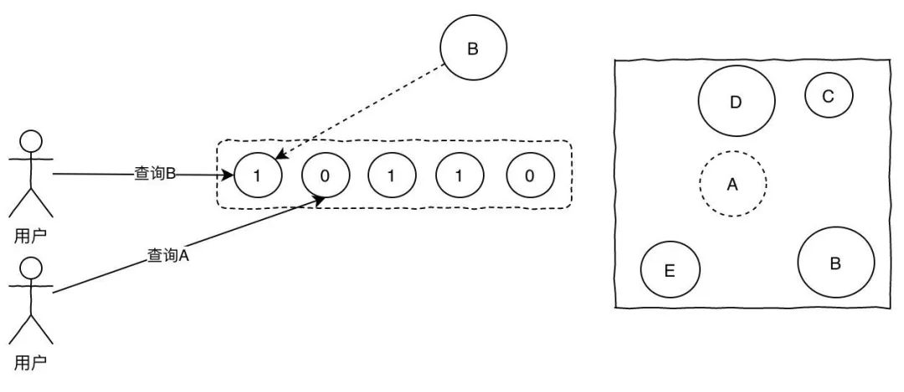

#### <font style="color:rgb(79, 79, 79);">缓存雪崩</font>
<font style="color:rgb(77, 77, 77);">当某一时刻发生大规模的缓存失效的情况，比如你的缓存服务宕机了，会有大量的请求进来直接打到DB上，这样可能导致整个系统的崩溃，称为雪崩。雪崩和击穿、热key的问题不太一样的是，他是指大规模的缓存都过期失效了。</font>

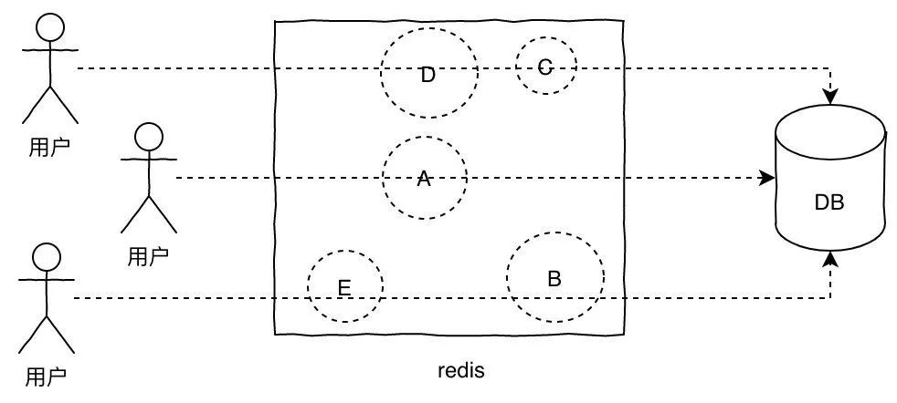

<font style="color:rgb(77, 77, 77);">针对雪崩几个解决方案：</font>

1. <font style="color:rgba(0, 0, 0, 0.75);">针对不同key设置不同的过期时间，避免同时过期</font>
2. <font style="color:rgba(0, 0, 0, 0.75);">限流，如果redis宕机，可以限流，避免同时刻大量请求打崩DB</font>
3. <font style="color:rgba(0, 0, 0, 0.75);">二级缓存，同热key的方案。</font>

### <font style="color:rgb(79, 79, 79);">稳定性</font>


**<font style="color:rgb(77, 77, 77);">熔断</font>**

<font style="color:rgb(77, 77, 77);">比如营销服务挂了或者接口大量超时的异常情况，不能影响下单的主链路，涉及到积分的扣减一些操作可以在事后做补救。</font>

**<font style="color:rgb(77, 77, 77);">限流</font>**

<font style="color:rgb(77, 77, 77);">对突发如大促秒杀类的高并发，如果一些接口不做限流处理，可能直接就把服务打挂了，针对每个接口的压测性能的评估做出合适的限流尤为重要。</font>

**<font style="color:rgb(77, 77, 77);">降级</font>**

<font style="color:rgb(77, 77, 77);">熔断之后实际上可以说就是降级的一种，以熔断的举例来说营销接口熔断之后降级方案就是短时间内不再调用营销的服务，等到营销恢复之后再调用。</font>

**<font style="color:rgb(77, 77, 77);">预案</font>**

<font style="color:rgb(77, 77, 77);">一般来说，就算是有统一配置中心，在业务的高峰期也是不允许做出任何的变更的，但是通过配置合理的预案可以在紧急的时候做一些修改。</font>

**<font style="color:rgb(77, 77, 77);">核对</font>**

<font style="color:rgb(77, 77, 77);">针对各种分布式系统产生的分布式事务一致性或者受到攻击导致的数据异常，非常需要核对平台来做最后的兜底的数据验证。比如下游支付系统和订单系统的金额做核对是否正确，如果收到中间人攻击落库的数据是否保证正确性。</font>

### <font style="color:rgb(79, 79, 79);">总结</font>
<font style="color:rgb(77, 77, 77);">其实可以看到，怎么设计高并发系统这个问题本身他是不难的，无非是基于你知道的知识点，从物理硬件层面到软件的架构、代码层面的优化，使用什么中间件来不断提高系统的抗压能力。但是这个问题本身会带来更多的问题，微服务本身的拆分带来了分布式事务的问题，http、RPC框架的使用带来了通信效率、路由、容错的问题，MQ的引入带来了消息丢失、积压、事务消息、顺序消息的问题，缓存的引入又会带来一致性、雪崩、击穿的问题，数据库的读写分离、分库分表又会带来主从同步延迟、分布式ID、事务一致性的问题，而为了解决这些问题我们又要不断的加入各种措施熔断、限流、降级、离线核对、预案处理等等来防止和追溯这些问题。</font>

